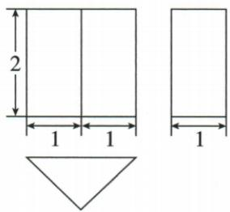

## 讲解

### 判据

三图给实体尺寸、问体积或面积，先还原基本体并明确每个高属于哪一面或整体。

### 流程

1.原俯视三角，主/左长方形共同高2，认三棱柱。2.底三角底2、对应高1，底面积2×1÷2=1。3.柱高是两平行三角底之间的2，体积1×2=2。4.三棱柱不是三棱锥，不乘1/3。5.最后写立方长度单位，原无具体厘米不能臆造单位。

## 例题

### 三棱柱视图底三角面积一乘棱柱高二体积二

> 来源ID Q28-20；第28章投影与视图；301-350/full.md 第4492–4502行。原答案与解析定位：301-350/full.md 第4504–4504行。

例5 如图所示的是一个几何体的三视图,求该几何体的体积.

**原资料答案与解析：**

解析 由三视图可知,该几何体为三棱柱,底面是底边长为2,高为1的等腰三角形,三棱柱的高为2,则该几何体的体积为 $\frac{1}{2}\times2\times1\times2=2$ .

**展开解析（依据原详解补足理由与步骤）：**

俯视为底边2、对应高1的等腰三角，主视与左视共同竖高2，是三棱柱两三角底面间距。底面积=2×1/2=1，再乘棱柱高2，体积2立方长度单位。底三角的高1与棱柱高2作用不同；单位未给，不能擅添厘米。不能把三棱柱当三棱锥而乘1/3。

## 易错

俯视的三角高1与视图竖高2不同；只把三个数字直接乘会漏底三角面积的1/2。
