## 讲解

### 判据

给实物和四个视图，先读主方向箭头和问主/左/俯，逐项排观察方向、遗漏棱与虚实。

### 流程

1.杯口平行面正投影从上看，圆口和把手给D，矩形侧影排除。2.U槽俯视上开槽内边可见用实线，A；机器孔被顶面挡住，两线虚，B。3.茶盒主视正面三个矩形，A；底六边形是俯视不能选。4.对每项指出错在哪里，再核正确项所有原图细节，而非只凭轮廓像。5.按指定尺寸摆放、虚实线表达，不投影纸上装饰文字。

## 例题

### 杯口平行面正投影圆口带杯把逐项D

> 来源ID Q28-04；第28章投影与视图；301-350/full.md 第3995–4004行。原答案与解析定位：301-350/full.md 第4005–4007行。

例4 如图所示,水杯的杯口与投影面平行,太阳光线的方向如箭头所示,它的正投影是（）

**原资料答案与解析：**

解析 根据题意,水杯的杯口与投影面平行,即与光线垂直,则它的正投影是 D.

答案 D

**展开解析（依据原详解补足理由与步骤）：**

正投影的光线垂直投影面，杯口又平行该面，等同从杯口正上方观察。圆口投影仍圆，右侧把手按图投影为外侧短线，D。A/B是侧面的矩形轮廓，分别把把手画在右/左，观察方向不符；C为四边形且漏杯把，不是圆口的正投影。

### U形斜槽俯视上口两实线底部外侧两虚线逐项A

> 来源ID Q28-13；第28章投影与视图；301-350/full.md 第4265–4280行。原答案与解析定位：301-350/full.md 第4282–4282行。

例1 如图所示的几何体,其俯视
图是 ( )

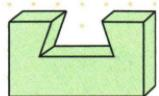

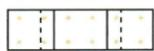  
A

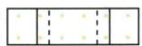  
B

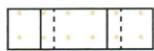  
C

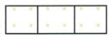  
D

**原资料答案与解析：**

答案 A

**展开解析（依据原详解补足理由与步骤）：**

从上往下看外轮廓是横矩形。原槽两斜侧面使上口窄、下部向两外侧扩大：上口左右边可见，画靠中间的两条实线；槽底两边落在它们外侧，被两侧上部实体挡住，画两条虚线，所以A。B把上口边画成靠外的实线、底边画成靠内虚线，颠倒上下口宽度；C左侧的实虚相对位置颠倒，右侧才正确；D只画上口两实线，漏两条隐藏底边。并非开槽所有内部棱都可见，须分别检查上沿和底沿。

### 机器零件顶部封闭穿孔俯视隐藏两线逐项B

> 来源ID Q28-16；第28章投影与视图；301-350/full.md 第4398–4414行。原答案与解析定位：301-350/full.md 第4416–4418行。

例1 一个机器零件如图水平放置,它的俯视图是

( )

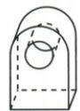

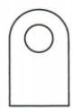  
A

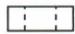  
B

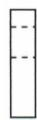  
C

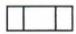  
D

**原资料答案与解析：**

解析 从上面看,是一个矩形,矩形里面有两条纵向的虚线.

答案 B

**展开解析（依据原详解补足理由与步骤）：**

从顶上看外轮廓是横向矩形，孔的上下两边在物体内部、被顶面材料遮挡，对应两条纵向虚线，B。A是正面带孔半圆顶轮廓；C把横向矩形画成竖向、孔线方向也旋转；D把两隐藏边画成实线。应把观察方向与孔是否从该方向露出分别判断。

### 六棱柱茶盒正面三个矩形逐项A

> 来源ID Q28-21；第28章投影与视图；301-350/full.md 第4510–4520行。原答案与解析定位：301-350/full.md 第4544–4546行。

例1（2024 河南）信阳毛尖是中国十大名茶之一.如图是信阳毛尖茶叶的包装盒,它的主视图为()

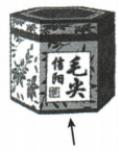

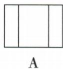

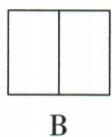

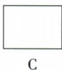

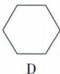

**原资料答案与解析：**

例1 解析 从正面可以看到三个矩形, 只有 A 符合.

答案 A

**展开解析（依据原详解补足理由与步骤）：**

按箭头从正面，原六棱柱左右及中间三个侧面都在可见正面范围，投影由三块相邻矩形组成，A。B只有两段，漏中间或一侧面分界；C仅外矩形漏全部内部棱；D六边形是从上看底面的俯视，观察方向不符。三视图保留可见轮廓和棱，不保留茶盒文字、颜色等非几何纹理。

## 易错

相似的矩形外框中，内部线可能代表槽或隐藏孔；看顶面是否封闭，不能统一画实或虚。
