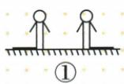
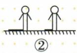
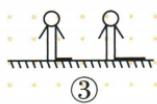
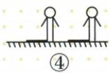
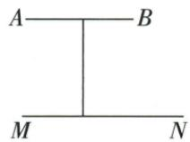

## 讲解

### 判据

有多物影对应图或生活投影，查投影线几何关系；不能只按等影长归类。

### 流程

1.确认每个物顶和其对应影端，不连错脚点。2.至少作两条独立投影线，平行支持平行模型，反延长共点支持中心。3.原四图前三幅共点，第四平行；第三等长仍中心。4.原桌影连MA/NB共点；七现象太阳①⑤⑦平行、点灯②③④⑥中心。5.若示图信息不足，不能用“相交看似在纸外”编造灯的具体高度。

## 例题

### 四组等高人影连顶端判中心前三幅

> 来源ID Q28-03；第28章投影与视图；301-350/full.md 第3879–3887行。原答案与解析定位：301-350/full.md 第3889–3891行。

例3 下列投影中,是中心投影的是\_\_\_\_.

**原资料答案与解析：**

答案 ①②③

注意 在中心投影下，位于同一水平面上且等高的物体离光源越近，影子越短，离光源越远，影子越长，但并不是两个等高物体的影子一样长就一定不是中心投影，还应考虑影子与物体的相对位置.

**展开解析（依据原详解补足理由与步骤）：**

①②③顶端与影端连线反向延长可交同一点，属于中心投影；③虽影长相等，但分居灯脚两侧，光线有不同方向仍交一点。④影向相同且对应投影线平行，是平行投影。不能只比较影长；等长影可以由等高的人分居点光源两侧等距离处形成。

### 七个生活投影按光线模型逐项辨别

> 来源ID Q28-05；第28章投影与视图；301-350/full.md 第4028–4030行。原答案与解析定位：301-350/full.md 第4032–4034行。

例1 下列现象中,属于中心投影的是

①太阳光下窗户的影子；②台灯下书本的影子；③手电筒照射下纸片的影子；④晚上路灯下人的影子；⑤阳光下旗杆的影子；⑥皮影戏中的影子；⑦日晷的晷针在晷面上形成的影子.

**原资料答案与解析：**

解析 太阳光线是平行光线,台灯、手电筒、路灯、皮影戏的光源都是点光源,所以①⑤⑦中的影子属于平行投影,②③④⑥中的影子属于中心投影.

答案 ②③④⑥

**展开解析（依据原详解补足理由与步骤）：**

①太阳下窗影、⑤阳光旗杆影、⑦日晷都用同地同刻太阳平行光模型；②台灯、③手电、④路灯、⑥皮影在原题近似点光源模型内，从一点发光，属中心投影。所以②③④⑥。实际灯具有尺寸，本题使用理想化模型，不能仅凭任何灯的名称对现实光束无条件归类。

### 桌影较大连接对应边界反延长交点判中心

> 来源ID Q28-06；第28章投影与视图；301-350/full.md 第4036–4038行。原答案与解析定位：301-350/full.md 第4040–4042行。

例2 如图,AB 表示一圆形桌面,MN 表示该桌面在某光源下的影子,则 MN 属于\_\_\_\_投影.(填“平行”或“中心”)

**原资料答案与解析：**

解析 分别连接 MA, NB 并延长, 两延长线会相交, 则形成影子 MN 的光源为点光源, 故 MN 属于中心投影.

答案 中心

**展开解析（依据原详解补足理由与步骤）：**

连接原桌端A与影端M、桌端B与影端N，反向延长相交，交点为点光源，故中心投影。AB、MN处于平行桌地平面，中心投影可以放大；若为平行光且桌面平行地面，只把各点同向平移，长度保持，不符合原图放大。优先以对应光线是否共点判定，不把任何影变大都当充分判据。

## 易错

同一有限图里只一条线不能定位灯；共点须一致解释全部已给物影，不因影大就断言中心。
