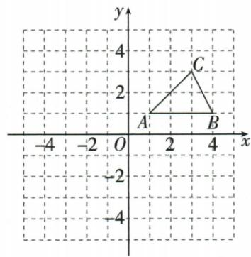
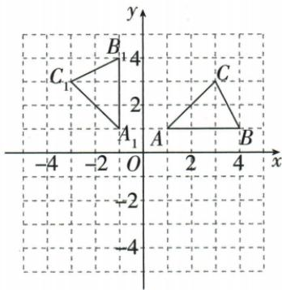
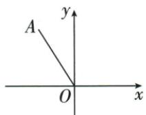
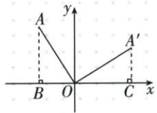
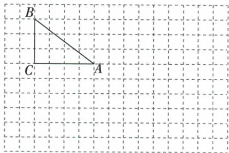
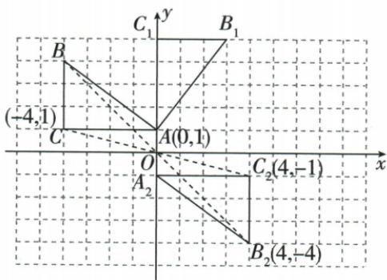

## 错法

原(−4,6)只交换得(6,−4)，或绕B₁(3,2)直接对A₁(1,1)用(−y,x)。

## 正解

顺转原点为(y,−x)，所以(6,4)，逆转原点为(−y,x)。绕非原点先减中心，转相对偏移再加回：A₁相对B₁(−2,−1)逆转(1,−2)，最终A₂(4,0)。保距离不足以核方向，须同有向转角。

## 例题

### 原点逆时针九十交换坐标并给新横负号

> 来源ID Q25-25；第25章图形的轴对称平移与旋转；301-350/full.md 第739–752行。原答案与解析定位：301-350/full.md 第754–776行。

例3 如图,在平面直角坐标系中,已知 $\triangle ABC$ 三个顶点的坐标分别是 $A(1,1),B(4,1),C(3,3)$ ,将 $\triangle ABC$ 绕原点 $O$ 逆时针旋转 $90^{\circ}$ 后得到 $\triangle A_{1}B_{1}C_{1}$ ,请画出 $\triangle A_{1}B_{1}C_{1}$ .

**原资料答案与解析：**

解析 如图所示, $\triangle A_{1}B_{1}C_{1}$ 即为所求作的图形.

**展开解析（依据原详解补足理由与步骤）：**

原点逆时针90°使向右的方向变向上、向上的方向变向左，因此点(x,y)变为(−y,x)。A(1,1)→A₁(−1,1)，B(4,1)→B₁(−1,4)，C(3,3)→C₁(−3,3)。在网格标出三点，按A₁-B₁-C₁连线。逐点距离平方原1²+1²等于新(−1)²+1²，另两点同理，且每条对应半径均逆时针90°。只交换两坐标而不改符号得到的是对角线反射，不是本次转动。

### 负四正六绕原点顺时针九十得到六四逐项排除

> 来源ID Q25-30；第25章图形的轴对称平移与旋转；301-350/full.md 第966–976行。原答案与解析定位：301-350/full.md 第881–896行。

例3 (2024 湖北) 如图, 点 A 的坐标是 $(-4, 6)$ , 将线段 OA 绕点 O 顺时针旋转 $90^{\circ}$ , 点 A 的对应点的坐标是 ()

A.(4,6)

B.(6,4)

C. $(-6,-4)$

D. $(-4,-6)$

**原资料答案与解析：**

例3 解析 如图,设旋转后点 A 的对应点为 $A'$ , 过点 A 和点 $A'$ 分别作 $AB \perp x$ 轴于 B, $A'C \perp x$ 轴于 C.

由旋转的性质可证 $\triangle AOB \cong \triangle OA'C, \therefore A'C = 4, OC = 6,$ $\therefore A'(6,4).$

答案 B

**展开解析（依据原详解补足理由与步骤）：**

顺时针90°使(x,y)变为(y,−x)，因此(−4,6)→(6,4)，B正确。A(4,6)只把原横坐标改号，属于y轴反射；C(−6,−4)是原点逆时针90°结果；D(−4,−6)只改纵坐标，属于x轴反射。用原点到两点的距离平方均52能查长度，却不能区分上述方向，还要核有向转角。

### 先下二再绕三二逆时针九十并求C四分之一圆弧π

> 来源ID Q25-31；第25章图形的轴对称平移与旋转；301-350/full.md 第982–1005行。原答案与解析定位：301-350/full.md 第898–916行。

例4 (2024 山东济宁) 如图, $\triangle ABC$ 三个顶点的坐标分别是 $A(1,3)$ ,

$B(3,4), C(1,4).$

(1) 将 $\triangle ABC$ 向下平移 2 个单位长度得 $\triangle A_{1}B_{1}C_{1}$ ，画出平移后的图形，并直接写出点 $B_{1}$ 的坐标.

(2) 将 $\triangle A_{1}B_{1}C_{1}$ 绕点 $B_{1}$ 逆时针旋转 $90^{\circ}$ 得 $\triangle A_{2}B_{1}C_{2}$ ，画出旋转后的图形，并求点 $C_{1}$ 运动到点 $C_{2}$ 所经过的路径长.

**原资料答案与解析：**

例4 解析 (1) $\triangle A_{1}B_{1}C_{1}$ 如图所示, $B_{1}(3,2)$ .

(2) $\triangle A_{2}B_{1}C_{2}$ 如图所示.

路径长为 $\frac{90\pi\cdot2}{180}=\pi.$

**展开解析（依据原详解补足理由与步骤）：**

(1)向下平移2，横坐标不变，纵坐标减2：A₁(1,1)、B₁(3,2)、C₁(1,2)。

(2)绕B₁(3,2)逆时针90°：先取相对中心坐标。A₁相对B₁为(−2,−1)，转后为(1,−2)，加回中心得A₂(4,0)；C₁相对B₁为(−2,0)，转后为(0,−2)，加回中心得C₂(3,0)。B₁自身固定。原答案图与这三个位置一致；辅助OCR文本出现的C₂(3,1)与图及变换不符，采用核对后的(3,0)。

(3)C₁沿以B₁为中心、半径B₁C₁=2的90°弧运动，弧长$L=90\pi\times2/180=\pi$。它是四分之一圆周，不是端点直线距离2√2。

### 三四直角网格绕A顺时针九十和关于原点半转

> 来源ID Q25-40；第25章图形的轴对称平移与旋转；301-350/full.md 第1228–1241行。原答案与解析定位：301-350/full.md 第1243–1265行。

例4 在如图所示的正方形网格中有 Rt△ABC, ∠C=90°, AC=4, BC=3.

(1)试在图中作出将 $\triangle ABC$ 以点A为旋转中心,沿顺时针方向旋转90°后的图形 $\triangle AB_{1}C_{1}$ .  
(2) 若点 B 的坐标为 $(-4, 4)$ ，试在图中作出平面直角坐标系，并标出 A、C 两点的坐标.  
(3)根据(2)中的平面直角坐标系作出与 $\triangle ABC$ 关于原点对称的图形 $\triangle A_{2}B_{2}C_{2}$ , 并标出 $B_{2}, C_{2}$ 两点的坐标.

**原资料答案与解析：**

解析（1）如图所示， $\triangle AB_{1}C_{1}$ 即为所求作的图形.

(2)如图所示,点A的坐标为 $(0,1)$ ,点C的坐标为 $(-4,1)$ .  
(3)如图所示, $\triangle A_{2}B_{2}C_{2}$ 即为所求作的图形,点 $B_{2}$ 的坐标为(4,-4),点 $C_{2}$ 的坐标为(4,-1).

**展开解析（依据原详解补足理由与步骤）：**

原网格B(−4,4)，BC竖直长3所以C(−4,1)，AC水平向右4所以A(0,1)。绕A顺时针90°，B相对A是(−4,3)，转为(3,4)，加回A得B₁(3,5)；C相对A(−4,0)，转为(0,4)，加回得C₁(0,5)，A不动。另一个独立小问是原△ABC关于O中心对称，直接两坐标反号，A₂(0,−1)、B₂(4,−4)、C₂(4,−1)。不能把第二问当成继续对旋转后的三角形作半转。
