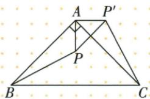

## 错法

AP3转90就把PP′写3；点C₁转90把轨迹写端点直距2√2。

## 正解

半径是点到中心的固定距离，弦是前后点的直线连接，弧是实际运动轨迹。原AP3的PP′为勾股3√2；原半径2转90轨迹占周长1/4，长π，弦则2√2。题问哪种量先圈出再算。

## 例题

### 等腰直角绕A四分之一转对应半径3求点距三根二

> 来源ID Q25-20；第25章图形的轴对称平移与旋转；301-350/full.md 第524–536行。原答案与解析定位：301-350/full.md 第538–544行。

例1 如图, $\triangle ABC$ 是等腰直角三角形,BC是斜边,P是 $\triangle ABC$ 内一点.将 $\triangle ABP$ 绕点A逆时针旋转得到 $\triangle ACP'$ ,若 $AP'=3$ ,则 $PP'$ 的长为\_\_\_\_.

**原资料答案与解析：**

解析 由旋转的性质可得, $AP=AP'=3,\angle PAP'=\angle BAC=90^{\circ}$ ,

$$
\therefore P P ^ {\prime} = \sqrt {3 ^ {2} + 3 ^ {2}} = 3 \sqrt {2}.
$$

答案 $3\sqrt{2}$

**展开解析（依据原详解补足理由与步骤）：**

AB与AC是等腰直角的两条等长直角边，B旋到C表示绕A逆时针90°。故AP=AP′=3，∠PAP′=90°。在直角△PAP′中，PP′²=3²+3²=18，长度为正，PP′=3√2。3是点P到旋转中心的半径，不是P到P′的移动距离；两段半径的和6是折线长，也不是弦长。

### 先下二再绕三二逆时针九十并求C四分之一圆弧π

> 来源ID Q25-31；第25章图形的轴对称平移与旋转；301-350/full.md 第982–1005行。原答案与解析定位：301-350/full.md 第898–916行。

例4 (2024 山东济宁) 如图, $\triangle ABC$ 三个顶点的坐标分别是 $A(1,3)$ ,

$B(3,4), C(1,4).$

(1) 将 $\triangle ABC$ 向下平移 2 个单位长度得 $\triangle A_{1}B_{1}C_{1}$ ，画出平移后的图形，并直接写出点 $B_{1}$ 的坐标.

(2) 将 $\triangle A_{1}B_{1}C_{1}$ 绕点 $B_{1}$ 逆时针旋转 $90^{\circ}$ 得 $\triangle A_{2}B_{1}C_{2}$ ，画出旋转后的图形，并求点 $C_{1}$ 运动到点 $C_{2}$ 所经过的路径长.

**原资料答案与解析：**

例4 解析 (1) $\triangle A_{1}B_{1}C_{1}$ 如图所示, $B_{1}(3,2)$ .

(2) $\triangle A_{2}B_{1}C_{2}$ 如图所示.

路径长为 $\frac{90\pi\cdot2}{180}=\pi.$

**展开解析（依据原详解补足理由与步骤）：**

(1)向下平移2，横坐标不变，纵坐标减2：A₁(1,1)、B₁(3,2)、C₁(1,2)。

(2)绕B₁(3,2)逆时针90°：先取相对中心坐标。A₁相对B₁为(−2,−1)，转后为(1,−2)，加回中心得A₂(4,0)；C₁相对B₁为(−2,0)，转后为(0,−2)，加回中心得C₂(3,0)。B₁自身固定。原答案图与这三个位置一致；辅助OCR文本出现的C₂(3,1)与图及变换不符，采用核对后的(3,0)。

(3)C₁沿以B₁为中心、半径B₁C₁=2的90°弧运动，弧长$L=90\pi\times2/180=\pi$。它是四分之一圆周，不是端点直线距离2√2。
