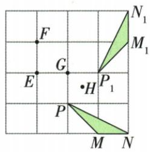

## 讲解

### 是什么

非平凡旋转中，中心O到每对不同对应点P/P′等距，因而O在PP′中垂线上。通常取两对不同对应点，中垂线唯一交点就是候选中心；找到后还需核查所有对应点具有同方向同角度，才能确认题图确由一次旋转得到。

若题目列出候选E/F/G/H，可先检距离，不等距就直接排除；不必对错误中心都作完整旋转。

### 怎么来的

旋转保半径，OP=OP′。中垂线定理将这个等距条件变成一条直线约束；第二对QQ′给另一条约束，两线交点满足两对半径等。若两中垂线平行无交点，则这两对对应关系没有同一个有限旋转中心；重合则这一步不足以唯一定位，可换另一对或使用已知转角。

等距只是筛选条件：同一圆上许多点都与O等距。最终须检∠POP′与∠QOQ′的有向角相同，不能用“都是等腰三角”代替一致转角。

### 什么时候能用

原4×4网格中G通过等半径与共同逆时针90°双重核验，其他候选各找到一对距离不同即可否决。180°情形可更快取对应点中点，详见中心对称。零度变换所有点固定，中心无唯一性。

## 例题

### 四乘四网格用两对应点等距定位旋转中心G

> 来源ID Q25-24；第25章图形的轴对称平移与旋转；301-350/full.md 第704–729行。原答案与解析定位：301-350/full.md 第731–733行。

例2 如图,在 $4 \times 4$ 的正方形网格中, $\triangle MNP$ 绕某点旋转一定的角度后, 得到 $\triangle M_{1}N_{1}P_{1}$ , 则其旋转中心一定是 ( )

A.点 $E$

B.点 $F$

C. 点 $G$

D. 点 H

**原资料答案与解析：**

解析 由旋转的性质可知,对应点到旋转中心的距离相等,所以旋转中心在每一组对应点所连线段的垂直平分线上,连接 $PP_{1}$ ,作线段 $PP_{1}$ 、 $NN_{1}$ 的垂直平分线,交点即为所求点.由作图知,旋转中心为点G.

答案 C

**展开解析（依据原详解补足理由与步骤）：**

候选中心必须到每一对对应点距离相等，并且各点的有向转角相同。原网格G到P/P₁的距离均1格，且GP逆时针90°到GP₁；G到M/M₁、N/N₁也满足等半径同90°，因此G可行。E到P为√2格、到P₁为2格，不等；F到N为√18格、到N₁为√10格，不等；H到N和N₁的距离平方分别4.5和8.5，不等。所以其余E/F/H都不能作中心，应选标为G的选项。每个排除值来自原网格水平、竖直格数与勾股；不是只凭中心看起来在两图之间。

## 易错

中心一般不等于任意对应点连线中点，只有半转180°时如此；普通90°的中点在中心旁。
