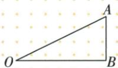
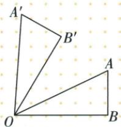

## 讲解

### 是什么

旋转是在同一平面绕固定点O，将图形每一点按同一方向转过同一角度。O为旋转中心，方向分顺时针/逆时针，角度给转多少；三者共同确定变换。O不动，其他点沿以O为圆心、原到O距离为半径的圆弧移动。

对应点P/P′满足OP=OP′，有向转角POP′等于指定角。小于等于180°时常可直接读普通夹角；若指定转角大于180°，普通小角不等于实际转动量，方向也不能省。

### 怎么来的

转动把所有半径射线同向转同角度，任意两原射线之间的夹角保持。取两点A/B及像A′/B′，有OA=OA′、OB=OB′和相同夹角，SAS使两中心三角全等，AB=A′B′；再由各边保长，原图与像全等，角和面积也不变。

作图先保留O，再从每条原半径射线按同一方向作指定转角，在新射线上截同半径，最后按原连接顺序连像点。只转一个顶点会改变图形，不是整体旋转。

### 什么时候能用

中心可在图内、图外或边上；题中绕A转，A固定，不必是图形自身中心。读“B落C”时B/C相对中心两半径给转角，必须再结合顺逆和实际位置。

## 例题

### 等腰直角绕A四分之一转对应半径3求点距三根二

> 来源ID Q25-20；第25章图形的轴对称平移与旋转；301-350/full.md 第524–536行。原答案与解析定位：301-350/full.md 第538–544行。

例1 如图, $\triangle ABC$ 是等腰直角三角形,BC是斜边,P是 $\triangle ABC$ 内一点.将 $\triangle ABP$ 绕点A逆时针旋转得到 $\triangle ACP'$ ,若 $AP'=3$ ,则 $PP'$ 的长为\_\_\_\_.

**原资料答案与解析：**

解析 由旋转的性质可得, $AP=AP'=3,\angle PAP'=\angle BAC=90^{\circ}$ ,

$$
\therefore P P ^ {\prime} = \sqrt {3 ^ {2} + 3 ^ {2}} = 3 \sqrt {2}.
$$

答案 $3\sqrt{2}$

**展开解析（依据原详解补足理由与步骤）：**

AB与AC是等腰直角的两条等长直角边，B旋到C表示绕A逆时针90°。故AP=AP′=3，∠PAP′=90°。在直角△PAP′中，PP′²=3²+3²=18，长度为正，PP′=3√2。3是点P到旋转中心的半径，不是P到P′的移动距离；两段半径的和6是折线长，也不是弦长。

### 绕O逆时针六十依次作等半径射线

> 来源ID Q25-21；第25章图形的轴对称平移与旋转；301-350/full.md 第548–550行。原答案与解析定位：301-350/full.md 第552–566行。

例2 如图, 把 $\triangle AOB$ 绕点 O 按逆时针方向旋转 $60^{\circ}$ , 画出旋转后的图形 $\triangle A'OB'$ .

**原资料答案与解析：**

解析 如图所示.

注意 旋转角是 $60^{\circ}$ , 是指 $\angle BOB' = 60^{\circ}$ , 而不是 $\angle AOB' = 60^{\circ}$ .

**展开解析（依据原详解补足理由与步骤）：**

保持O不动。以OA为起始射线，在逆时针侧作60°射线，取OA′=OA；同样从OB逆时针转60°，取OB′=OB；连A′B′。这样∠AOA′=∠BOB′=60°，OA/OA′和OB/OB′分别等长，两个点受同一次转动，△A′OB′就是所求。原∠AOB不一定60°，也不能仅把A转60°而B留原处。对照原答案图核方向与边长。

### 直角三角B中心转四十用等腰两底七十求120

> 来源ID Q25-23；第25章图形的轴对称平移与旋转；301-350/full.md 第672–684行。原答案与解析定位：301-350/full.md 第686–698行。

例1 如图, 在 $\triangle ABC$ 中, $\angle ACB = 90^{\circ}$ , $\angle ABC = 40^{\circ}$ . 将 $\triangle ABC$ 绕点 $B$ 逆时针旋转得到 $\triangle A'BC'$ , 点 $C$ 的对应点 $C'$ 恰好落在边 $AB$ 上, 则 $\angle CAA'$ 的度数是 \_\_\_\_.

**原资料答案与解析：**

解析 $\because \angle ACB = 90^{\circ},\angle ABC = 40^{\circ},\therefore \angle CAB = 90^{\circ} - \angle ABC = 90^{\circ} - 40^{\circ} = 50^{\circ}.$

∵ 将 $\triangle ABC$ 绕点 B 逆时针旋转得到 $\triangle A^{\prime}BC^{\prime}$ ，点 C 的对应点 $C^{\prime}$ 恰好落在边 AB 上，

$$
\therefore \angle A ^ {\prime} B A = \angle A B C = 4 0 ^ {\circ}, A ^ {\prime} B = A B, \therefore \angle B A A ^ {\prime} = \angle B A ^ {\prime} A = \frac {1}{2} \times (1 8 0 ^ {\circ} - 4 0 ^ {\circ}) = 7 0 ^ {\circ},
$$

$$
\therefore \angle C A A ^ {\prime} = \angle C A B + \angle B A A ^ {\prime} = 5 0 ^ {\circ} + 7 0 ^ {\circ} = 1 2 0 ^ {\circ}.
$$

答案 $120^{\circ}$

**展开解析（依据原详解补足理由与步骤）：**

原C90°、B40°，所以A50°。绕B转到C′落AB，BC→BC′的转角等于∠CBA=40°；BA→BA′也转40°。BA=BA′使△BAA′两底角各(180°−40°)/2=70°。原射线AC和AA′在AB两侧，∠CAA′=∠CAB+∠BAA′=50°+70°=120°。如果不按原图核两射线所处两侧，可能把相加误为相减；40°是转角，不是所求角。

### 三角角和三十五旋转后顶角同向相加得七十

> 来源ID Q25-28；第25章图形的轴对称平移与旋转；301-350/full.md 第922–942行。原答案与解析定位：301-350/full.md 第873–875行。

例1（2024 江苏无锡）如图，在 $\triangle ABC$ 中， $\angle B = 80^{\circ}$ ， $\angle C = 65^{\circ}$ ，将 $\triangle ABC$ 绕点 A 逆时针旋转得到 $\triangle AB'C'$ 。当 $AB'$ 落在 AC 上时， $\angle BAC'$ 的度数为（）

A. $65^{\circ}$

B. $70^{\circ}$

C. $80^{\circ}$

D. $85^{\circ}$

**原资料答案与解析：**

例1 解析 $\because \angle B = 80^{\circ}, \angle C = 65^{\circ}, \therefore \angle BAC = 35^{\circ}$ . 由旋转的性质可知, $\angle B'AC' = \angle BAC = 35^{\circ}$ , $\therefore$ 当 $AB'$ 落在 $AC$ 上时, $\angle BAC' = \angle BAC + \angle B'AC' = 70^{\circ}$ .

答案 B

**展开解析（依据原详解补足理由与步骤）：**

B80°、C65°，A=180°−80°−65°=35°。AB′落AC表示旋转角∠BAB′=35°；旋转保持△AB′C′顶角35°。按原图AB、AB′(即AC)、AC′依次，∠BAC′=35°+35°=70°，B正确。A65是原C角，C80是原B角；D85不等于两已确定35°之和。不能只写原A35°当成最终∠BAC′。

## 易错

点的移动距离PP′是弦长，运动轨迹是弧长，两者通常不同；AP=3转90°所得弦3√2，半径不是位移。
