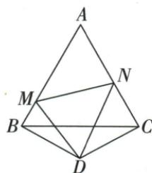
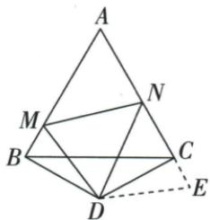

## 讲解

### 判据

原图等边ABC外侧顶点D组成DBC顶120的等腰，DMN60，目标把BM/NC拼成MN。

### 流程

1.按D外侧位置，60与30相加得DBM/DCN90。2.D中心顺转DBM120到DCE，CE=BM、DE=DM，N-C-E共线。3.MDE120减MDN60给NDE60，DM=DE/DN公共，SAS DMN≌DEN。4.MN=EN，原N-C-E序使EN=NC+CE=NC+BM。5.先造实际可加的共线段，不能仅凭三段长度图示相近写相等。

## 例题

### 等边加外侧一百二十等腰旋转拼接证MN等BM加NC

> 来源ID Q25-27；第25章图形的轴对称平移与旋转；301-350/full.md 第820–820行。原答案与解析定位：301-350/full.md 第822–867行。

例5 如图, $\triangle ABC$ 是等边三角形, $\triangle BDC$ 是等腰三角形, 且 $\angle BDC = 120^{\circ}$ , 以 $D$ 为顶点作 $60^{\circ}$ 角, 角的两边分别交 $AB, AC$ 于点 $M, N$ , 连接 $MN$ . 试猜想 $BM, MN, NC$ 之间的关系, 并加以证明.

**原资料答案与解析：**

解析 $MN = BM + NC$

证明:如图,将 $\triangle BDM$ 绕点D顺时针旋转 $120^{\circ}$ ,使BD与CD重合,得到 $\triangle CDE$ ,

则 $\triangle BDM \cong \triangle CDE, \therefore BM = CE, DM = DE, \angle BDM = \angle CDE, \angle DCE = \angle DBM.$

∵ $\triangle ABC$ 是等边三角形, ∴ $\angle ABC = \angle ACB = 60^{\circ}$ .

∵ $\triangle BDC$ 是等腰三角形且 $\angle BDC = 120^{\circ}, \therefore \angle DBC = \angle DCB = 30^{\circ}, \therefore \angle DBM = \angle DCN = 90^{\circ}.$

$\therefore \angle DCE = \angle DBM = 90^{\circ}, \therefore \angle DCN + \angle DCE = 180^{\circ}, \therefore N, C, E$ 三点共线.

又 $\angle BDM = \angle CDE, \therefore \angle CDN + \angle CDE = \angle CDN + \angle BDM,$

$\therefore \angle EDN = \angle BDC - \angle MDN = 120^{\circ} - 60^{\circ} = 60^{\circ} = \angle MDN.$

又∵ DN=DN, DM=DE, ∴ $\triangle DMN \cong \triangle DEN(SAS)$ ,

$\therefore MN=EN,\therefore MN=CE+NC=BM+NC.$

**展开解析（依据原详解补足理由与步骤）：**

按原图D在BC的外侧，等腰△DBC顶角120°，其底角各30°；等边△ABC的底角60°，所以∠DBM=∠DCN=90°。以D为中心，将△DBM顺时针120°转为△DCE，B到C，M到E，得到CE=BM、DE=DM、∠DCE=90°。CN也垂直DC，原图N-C-E按序共线。

转角∠MDE=120°，题给∠MDN=60°，且DN在这转角内部，所以∠NDE=60°=∠MDN。DM=DE、DN公共，按SAS得△DMN≌△DEN，MN=EN。因N-C-E按序，EN=NC+CE=NC+BM，故MN=BM+NC。这里是旋转后拼接两段，不是凭图把MN分为BM和NC；D的外侧位置及M/N落给定边须保留。

## 易错

若D改在内部或M/N落延长线，角的加减及点序都要另证，原结论不得无条件推广。
