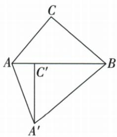
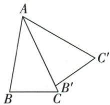
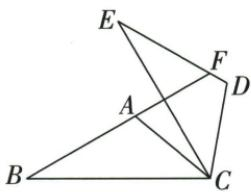

## 讲解

### 判据

点旋到另一条原边，转角由中心处两半径的夹角确定；另一对等半径常形成等腰。

### 流程

1.B中心题C→AB上的C′，原B40定转40，BA=BA′给BAA′两底70；原A50，图示跨AB两侧相加得120。2.A中心题AB′落AC，原角和得A35，AB→AB′转35；旋后顶角仍35，按原射线序相加得70。3.每次先标角顶点与射线，再决定相加或相减；转角不是所有对应角彼此之间的夹角。

## 例题

### 直角三角B中心转四十用等腰两底七十求120

> 来源ID Q25-23；第25章图形的轴对称平移与旋转；301-350/full.md 第672–684行。原答案与解析定位：301-350/full.md 第686–698行。

例1 如图, 在 $\triangle ABC$ 中, $\angle ACB = 90^{\circ}$ , $\angle ABC = 40^{\circ}$ . 将 $\triangle ABC$ 绕点 $B$ 逆时针旋转得到 $\triangle A'BC'$ , 点 $C$ 的对应点 $C'$ 恰好落在边 $AB$ 上, 则 $\angle CAA'$ 的度数是 \_\_\_\_.

**原资料答案与解析：**

解析 $\because \angle ACB = 90^{\circ},\angle ABC = 40^{\circ},\therefore \angle CAB = 90^{\circ} - \angle ABC = 90^{\circ} - 40^{\circ} = 50^{\circ}.$

∵ 将 $\triangle ABC$ 绕点 B 逆时针旋转得到 $\triangle A^{\prime}BC^{\prime}$ ，点 C 的对应点 $C^{\prime}$ 恰好落在边 AB 上，

$$
\therefore \angle A ^ {\prime} B A = \angle A B C = 4 0 ^ {\circ}, A ^ {\prime} B = A B, \therefore \angle B A A ^ {\prime} = \angle B A ^ {\prime} A = \frac {1}{2} \times (1 8 0 ^ {\circ} - 4 0 ^ {\circ}) = 7 0 ^ {\circ},
$$

$$
\therefore \angle C A A ^ {\prime} = \angle C A B + \angle B A A ^ {\prime} = 5 0 ^ {\circ} + 7 0 ^ {\circ} = 1 2 0 ^ {\circ}.
$$

答案 $120^{\circ}$

**展开解析（依据原详解补足理由与步骤）：**

原C90°、B40°，所以A50°。绕B转到C′落AB，BC→BC′的转角等于∠CBA=40°；BA→BA′也转40°。BA=BA′使△BAA′两底角各(180°−40°)/2=70°。原射线AC和AA′在AB两侧，∠CAA′=∠CAB+∠BAA′=50°+70°=120°。如果不按原图核两射线所处两侧，可能把相加误为相减；40°是转角，不是所求角。

### 三角角和三十五旋转后顶角同向相加得七十

> 来源ID Q25-28；第25章图形的轴对称平移与旋转；301-350/full.md 第922–942行。原答案与解析定位：301-350/full.md 第873–875行。

例1（2024 江苏无锡）如图，在 $\triangle ABC$ 中， $\angle B = 80^{\circ}$ ， $\angle C = 65^{\circ}$ ，将 $\triangle ABC$ 绕点 A 逆时针旋转得到 $\triangle AB'C'$ 。当 $AB'$ 落在 AC 上时， $\angle BAC'$ 的度数为（）

A. $65^{\circ}$

B. $70^{\circ}$

C. $80^{\circ}$

D. $85^{\circ}$

**原资料答案与解析：**

例1 解析 $\because \angle B = 80^{\circ}, \angle C = 65^{\circ}, \therefore \angle BAC = 35^{\circ}$ . 由旋转的性质可知, $\angle B'AC' = \angle BAC = 35^{\circ}$ , $\therefore$ 当 $AB'$ 落在 $AC$ 上时, $\angle BAC' = \angle BAC + \angle B'AC' = 70^{\circ}$ .

答案 B

**展开解析（依据原详解补足理由与步骤）：**

B80°、C65°，A=180°−80°−65°=35°。AB′落AC表示旋转角∠BAB′=35°；旋转保持△AB′C′顶角35°。按原图AB、AB′(即AC)、AC′依次，∠BAC′=35°+35°=70°，B正确。A65是原C角，C80是原B角；D85不等于两已确定35°之和。不能只写原A35°当成最终∠BAC′。

### 三十角加C转六十用交点三角角和证BF垂直CE

> 来源ID Q25-29；第25章图形的轴对称平移与旋转；301-350/full.md 第944–960行。原答案与解析定位：301-350/full.md 第877–879行。

例2（2024天津）如图， $\triangle ABC$ 中， $\angle B = 30^{\circ}$ ，将 $\triangle ABC$ 绕点 $C$ 顺时针旋转 $60^{\circ}$ 得到 $\triangle DEC$ ，点 $A, B$ 的对应点分别为 $D, E$ ，延长 $BA$ 交 $DE$ 于点 $F$ ，下列结论一定正确的是 （）

A. $\angle ACB = \angle ACD$

B. $AC \parallel DE$

C.AB = EF

D. $BF \perp CE$

**原资料答案与解析：**

例2 解析 $\because$ 将 $\triangle ABC$ 绕点 $C$ 顺时针旋转 $60^{\circ}$ 得到 $\triangle DEC$ , $\therefore \angle BCE = 60^{\circ}$ . 设 $BF$ 与 $CE$ 交于点 $O$ , 则 $\angle BOC = 180^{\circ} - \angle B - \angle BCO = 180^{\circ} - 30^{\circ} - 60^{\circ} = 90^{\circ}$ , $\therefore BF \perp CE$ .

答案 D

**展开解析（依据原详解补足理由与步骤）：**

设BF与CE交于O。C转60°使∠BCE=60°；B-F-A共线，原B角30°，所以△BCO的另两角为30°/60°，∠BOC=180°−30°−60°=90°，BF⊥CE，D正确。A声称∠ACB=∠ACD，后者是A半径转动的60°，原C角没有必等60°；B声称AC∥DE，旋转把AC对应DC、AB对应DE，未给原AC与新DE平行的额外角条件；C声称AB=EF，旋转实际保证AB=DE，F为延长线交点，不是B的对应点，故EF并非对应边。

## 易错

题图位置是加减角的依据；不要只看两图全等就认全部相关角等。
