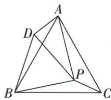

## 讲解

### 判据

等边ABC内P的三段距离分散，转BP六十度得到BD，用等边边长和对应夹角把PC搬到AD。

### 流程

1.BP=BD且PBD60给BPD等边，PD=PB。2.BC=BA、PBC=DBA，同原角分割得SAS BPC≌BDA，AD=PC，BDA=BPC。3.额外BPC150才给PDA=150−60=90。4.勾股PA²=PD²+AD²，替PD/PB、AD/PC得原平方关系。5.三条都证明后选择包含①②③的D；若无150条件，前两条仍成立，平方式不保证。

## 例题

### 等边中点P转六十SAS等边再直角证三条结论

> 来源ID Q25-26；第25章图形的轴对称平移与旋转；301-350/full.md 第782–798行。原答案与解析定位：301-350/full.md 第800–818行。

例4 如图,在等边三角形 ABC 中有一点 P, 连接 PA、PB、PC, 将 BP 绕点 B 逆时针旋转 $60^{\circ}$ 得到 BD, 连接 PD、AD, 有下列结论: ① $\triangle BPC \cong \triangle BDA$ ; ② $\triangle BDP$ 是等边三角形; ③ 如果 $\angle BPC = 150^{\circ}$ , 那么 $PA^{2} = PB^{2} + PC^{2}$ . 其中正确的有 ( )

A.①②

B.①③

C.②③

D.①②③

**原资料答案与解析：**

解析 $\because \triangle ABC$ 是等边三角形, 将 $BP$ 绕点 $B$ 逆时针旋转 $60^{\circ}$ 得到 $BD$ ,

$$
\therefore B C = A B, B P = B D, \angle A B C = \angle D B P = 6 0 ^ {\circ},
$$

∴ $\angle PBC = \angle DBA, \triangle BDP$ 是等边三角形, 故②正确;

在 $\triangle BPC$ 和 $\triangle BDA$ 中， $\left\{ \begin{array}{l} BC = BA, \\ \angle PBC = \angle DBA, \therefore \triangle BPC \cong \triangle BDA, \\ BP = BD, \end{array} \right.$ 故①正确；

$\therefore \angle BDA = \angle BPC, PC = DA, \because \triangle BDP$ 是等边三角形， $\therefore \angle BDP = 60^{\circ}$ ，

当 $\angle BPC = 150^{\circ}$ 时， $\angle BDA = 150^{\circ}, \therefore \angle ADP = 150^{\circ} - 60^{\circ} = 90^{\circ}$ ，

∴ $\triangle ADP$ 是直角三角形, ∴ $PA^{2}=DP^{2}+DA^{2}$ , ∴ $PA^{2}=PB^{2}+PC^{2}$ , 故③正确.

故正确的有①②③.

答案 D

**展开解析（依据原详解补足理由与步骤）：**

①BP转为BD，故BP=BD、∠PBD=60°；原BC=BA，且∠PBC与∠DBA都是原60°去掉同一个∠PBA，所以两夹角等。SAS得△BPC≌△BDA，①正确，也得AD=PC、∠BDA=∠BPC。

②△BPD两边BP=BD，顶角60°，两底角各60°，所以是等边三角形，PD=PB，②正确。

③若∠BPC=150°，对应∠BDA=150°。原DP射线在∠BDA内部，∠BDP=60°，所以∠PDA=150°−60°=90°。直角△PDA用勾股，PA²=PD²+DA²=PB²+PC²，③正确。故①②③全对，选D；A/B/C各遗漏一条已证成立的结论。第三结论的直角必须由额外150°条件得到，不能对所有内部P都套平方和。

## 易错

旋转本身不造任意直角，第三步需要150；夹角的两边必须正好对应BP/BC与BD/BA。
