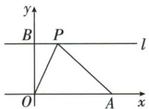
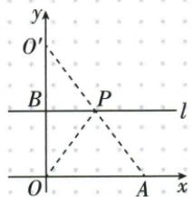

## 讲解

### 是什么

路径必须经过指定直线时，反射把一个必须拐弯的长度和，改写成另一个端点到折点的折线。任意折线不少于其首尾线段，因而得到下界；只有各点在同一直线并按路线顺序排列，才达到下界。

“求到最小值”需要两件事：证明所有合法路线都不小于候选值，再展示一条合法路线等于候选值。只有下界而交点落在允许范围之外，不能宣布已求最小。

### 怎么来的

对l上的任意P，反射A到A′使PA=PA′，所以PA+PB=PA′+PB≥A′B。若A′B与l交点P位于两端之间，则PA′+PB=A′B，原路线A-P-B达到下界。多次经过不同直线，可分别反射两端或依序展开；每个长度替换要指出折点在哪一条轴上。

固定PQ四边模型中PQ是一条常量边，不受反射下界处理影响。先给另外三段求下界，再加PQ；不能遗漏常量边。

### 什么时候能用

单线同侧两端通常可用一次反射；两线问题须核交点先后次序。道路若为射线、有限路段，或要求绕障碍，交点须再次验合法。等边题E只能在BD内，资料原图确认最优交点在线段内，才能用10。

## 例题

### 等边底中线反射Q转等边三角求最短10

> 来源ID Q25-06；第25章图形的轴对称平移与旋转；301-350/full.md 第33–33行。原答案与解析定位：301-350/full.md 第35–49行。

例4 如图,等边 $\triangle ABC$ 中,D为 $AC$ 的中点,点 $P、Q$ 分别为线段 $AB、AD$ 上的点,且 $BP=AQ=4,QD=3$ ,在 $BD$ 上有一动点 $E$ ,则 $PE+QE$ 的最小值为\_\_\_\_.

**原资料答案与解析：**

解析 $\because \triangle ABC$ 是等边三角形, $\therefore BA = BC$ ,

∵ D 为 AC 的中点, AQ = 4, QD = 3, ∴ AD = DC = AQ + QD = 7.

如图,作点 Q 关于 BD 的对称点 $Q'$ , 连接 $PQ'$ 交 BD 于 E, 连接 QE, 此时 $PE + EQ$ 的值最小, 最小值为 $PQ'$ 的长.

由轴对称的性质知, $DQ'=QD=3,\therefore AQ'=AD+DQ'=10,$

$$
\because A D = D C = 7, B P = 4, \therefore A P = A B - B P = A C - B P = 2 A D - B P = 1 0, \therefore A P = A Q ^ {\prime},
$$

又∵ $\angle A=60^{\circ},\therefore \triangle APQ'$ 是等边三角形,∴ $PQ'=AP=10,\therefore PE+QE$ 的最小值为 10.

答案 10

**展开解析（依据原详解补足理由与步骤）：**

D为等边△ABC的底边AC中点，BD也是高和对称轴。AD=AQ+QD=4+3=7，AC=14，AB=14，AP=AB−BP=10。把Q关于BD反射为Q′，Q′在DC上，DQ′=DQ=3，所以AQ′=AD+DQ′=10。

AP=AQ′=10，∠PAQ′=∠BAC=60°，因此△APQ′等边，PQ′=10。对于BD上的E，EQ=EQ′，PE+EQ=PE+EQ′≥PQ′=10。原图直线PQ′与有限线段BD相交，交点落在P与Q′之间，取该交点时两段合一线段，等号可达到。故最小值10。若候选只在BD延长线上，线段内问题不能直接取此下界。

### 先后到两公路用两端反射与交点顺序求最短路线

> 来源ID Q25-07；第25章图形的轴对称平移与旋转；301-350/full.md 第51–51行。原答案与解析定位：301-350/full.md 第53–110行。

例5 如图,为了做好某市运动会期间的交通安全工作,某交警执勤小队从 A 处出发,先到公路 $l_{1}$ 上设卡检查,再到公路 $l_{2}$ 上设卡检查,最后到 B 地执行任务,他们如何走才能使总路程最短?

**原资料答案与解析：**

解析 利用轴对称确定最短路线,作 A 关于公路 $l_{1}$ 的对称点 $A'$ ,

作 B 关于公路 $l_{2}$ 的对称点 $B'$ ，连接 $A'B'$ ，与公路 $l_{1}, l_{2}$ 分别相交于点 C, D，连接 AC, BD，如图所示，

交警执勤小队沿 $A \rightarrow C \rightarrow D \rightarrow B$ 走才能使总路程最短.

**展开解析（依据原详解补足理由与步骤）：**

先把A关于公路l₁反射为A′，把B关于公路l₂反射为B′。若C∈l₁、D∈l₂，则AC=A′C、DB=DB′，总路程AC+CD+DB=A′C+CD+DB′≥A′B′。按原图，连接A′B′依次交l₁/l₂于C/D，且A′-C-D-B′按序，因而折线的三段长度和恰为A′B′。实际路线走A→C→D→B。反射点只是用于计算，交警不经过它们。必须核查交点顺序及道路允许范围；一般位置若顺序不符，下界不一定能达到，不能只说“连接两个反射点”就结束。

### 点到水平直线折路反射原点到零四求最短5

> 来源ID Q25-11；第25章图形的轴对称平移与旋转；301-350/full.md 第210–220行。原答案与解析定位：301-350/full.md 第132–151行。

例4（2024四川成都）如图，在平面直角坐标系 $xOy$ 中，已知 $A(3,0)$ ， $B(0,2)$ ，过点 $B$ 作 $y$ 轴的垂线 $l, P$ 为直线 $l$ 上一动点，连接 $PO, PA$ ，则 $PO + PA$ 的最小值为 \_\_\_\_.

**原资料答案与解析：**

例4 解析 作点 O 关于直线 l 的对称点 $O'$ ，则 $O'(0,4)$ ，连接 $AO'$ ， $AO'$ 与直线 l 的交点为点 P，

此时 $PO + PA$ 取最小值，最小值为 $AO^{\prime}$ 的长，根据勾股定理可得 $AO^{\prime} = \sqrt{3^{2} + 4^{2}} = 5.$

答案5

**展开解析（依据原详解补足理由与步骤）：**

B(0,2)处作y轴垂线，故l为y=2。O关于l的对应点O′(0,4)，任意P∈l都有PO=PO′。于是PO+PA=PO′+PA≥AO′。A(3,0)、O′(0,4)的横纵距离3/4，勾股AO′=5。连接AO′与y=2交于P(1.5,2)，P在A/O′之间，取得等号，最小值5。不是直接用OA=3，因为路线必须先经过l；也不是要求P是给定点B。

### 一折两折与固定PQ四边最短三种原模型

> 来源ID Q25-47；第25章图形的轴对称平移与旋转；301-350/full.md 第1–31行。原答案与解析定位：301-350/full.md 第1–31行。

# - 方法 3 利用轴对称解决几何最值问题的方法

1. 如图①, 点 A、B 为直线 l 同侧两点, 在直线上找一点 P, 使 $AP + BP$ 的值最小.

作法:如图②,作点A关于l的对称点 $A'$ ,连接 $A'B$ ,与l的交点即为点P.

  
图①

  
图②

2. 如图③, 在直线 $l_{1}$ 、 $l_{2}$ 上分别找点 M、N, 使 $\triangle PMN$ 的周长最小.

作法:如图④,分别作点P关于直线 $l_{1}$ 、 $l_{2}$ 的对称点 $P^{\prime},P^{\prime\prime}$ ,连接 $P^{\prime}P^{\prime\prime}$ ,与两直线的交点分别为点M,N.

  
图③

  
图④

3. 如图⑤, 在直线 $l_{1}, l_{2}$ 上分别找点 $M, N$ , 使四边形 PMNQ 的周长最小.

作法:如图⑥,分别作点 P,Q 关于直线 $l_{1}$ 、 $l_{2}$ 的对称点 $P'$ , $Q'$ , 连接 $P'Q'$ , 与直线 $l_{1}$ 、 $l_{2}$ 的交点分别为点 M,N.

  
图⑤

  
图⑥

**原资料答案与解析：**

# - 方法 3 利用轴对称解决几何最值问题的方法

1. 如图①, 点 A、B 为直线 l 同侧两点, 在直线上找一点 P, 使 $AP + BP$ 的值最小.

作法:如图②,作点A关于l的对称点 $A'$ ,连接 $A'B$ ,与l的交点即为点P.

  
图①

  
图②

2. 如图③, 在直线 $l_{1}$ 、 $l_{2}$ 上分别找点 M、N, 使 $\triangle PMN$ 的周长最小.

作法:如图④,分别作点P关于直线 $l_{1}$ 、 $l_{2}$ 的对称点 $P^{\prime},P^{\prime\prime}$ ,连接 $P^{\prime}P^{\prime\prime}$ ,与两直线的交点分别为点M,N.

  
图③

  
图④

3. 如图⑤, 在直线 $l_{1}, l_{2}$ 上分别找点 $M, N$ , 使四边形 PMNQ 的周长最小.

作法:如图⑥,分别作点 P,Q 关于直线 $l_{1}$ 、 $l_{2}$ 的对称点 $P'$ , $Q'$ , 连接 $P'Q'$ , 与直线 $l_{1}$ 、 $l_{2}$ 的交点分别为点 M,N.

  
图⑤

  
图⑥

**展开解析（依据原详解补足理由与步骤）：**

单直线模型：反射A为A′，对轴上P有AP=A′P，AP+PB≥A′B；直线A′B与轴交于P且P在两端间才取等。两直线模型：把同一固定P分别反射成P′/P″，原PM+MN+NP=P′M+MN+NP″≥P′P″；候选交点须按P′-M-N-P″排列且落在题设两线允许范围。固定PQ四边模型：PQ不变，分别反射P/Q为P′/Q′，PM+MN+NQ+QP≥P′Q′+PQ；原图所示两交点可按顺序取到时达到。三个模型共同依据是反射保长度与折线不少于端点线段；下界还需可达性，不是所有射线、有限线段均无条件套。

## 易错

反射点是虚拟计算端点，实际路线仍在原地走。线段最短不表示可直接穿过题中障碍，也不能把移动弧长替为弦长。
