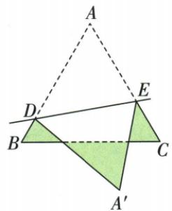

## 讲解

### 判据

原图折到三角形外且求阴影整体周长，先沿外周走一圈列边，再将折后段换成原段。

### 流程

1.按图列BC、BD、DA′、A′E、EC，确认DE内部不计。2.反射给DA′=DA、A′E=AE，各来自固定D/E。3.D在AB内，BD+DA=BA；E在AC内，AE+EC=AC。4.周长成为三条原等边边长之和3 cm。5.不改变原A′在外条件；若外边界改变，重新列段。

## 例题

### 等边折到外部用对应边替换阴影外周长3

> 来源ID Q25-05；第25章图形的轴对称平移与旋转；251-300/full.md 第4871–4879行。原答案与解析定位：251-300/full.md 第4881–4881行。

例3 如图,等边 $\triangle ABC$ 的边长为1 cm,D,E分别是AB,AC上的点,将 $\triangle ADE$ 沿直线DE折叠,点A落在点 $A'$ 处,且点 $A'$ 在 $\triangle ABC$ 外部,求阴影部分的周长.

**原资料答案与解析：**

解析 将 $\triangle ADE$ 沿直线 $DE$ 折叠, 点 $A$ 落在点 $A'$ 处, 则 $AD = A'D$ , $AE = A'E$ . 所以阴影部分的周长 $= BC + BD + CE + A'D + A'E = BC + BD + CE + AD + AE = BC + (BD + AD) + (CE + AE) = BC + AB + AC = 3 \mathrm{~cm}$ .

**展开解析（依据原详解补足理由与步骤）：**

翻折保长度，A′D=AD、A′E=AE。按原图阴影整体的外边界依次为BC、BD、DA′、A′E、EC；DE为内部折痕，不在外周。周长=BC+BD+AD+AE+EC。D在AB内，所以BD+AD=AB；E在AC内，所以AE+EC=AC。三项合成BC+AB+AC=3×1=3 cm。必须按题图A′在原三角形外的范围读边界；若改变重叠位置，不能继续照抄这五段。

## 易错

周长不含内部折痕；对应等長提供的是具体两段替换，不能直接认整个阴影与原三角形全等。
