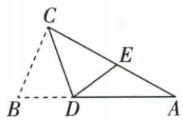

## 讲解

### 判据

已给折痕、原直角或顶角，折后点落另一边，先标不动点和像点，不直接搬错角。

### 流程

1.CD为折痕，C/D固定，B→E，所以DBC对应DEC。2.先在原△ABC用90/28求B62，故DEC62。3.原A-E-C按序，把DEC认作△ADE外角，DEC=DAE+ADE。4.DAE为原A28，同减28得ADE34。5.回验△ADE内角和，并核射线AE/EC反向是外角成立的原因。

## 例题

### 直角三角折角用对应角与外角减28得34

> 来源ID Q25-04；第25章图形的轴对称平移与旋转；251-300/full.md 第4859–4861行。原答案与解析定位：251-300/full.md 第4863–4869行。

例2 如图, 在 $\triangle ABC$ 中, $\angle ACB = 90^{\circ}$ , 沿 $CD$ 折叠 $\triangle CBD$ , 使点 $B$ 恰好落在 $AC$ 边上的点 $E$ 处. 若 $\angle A = 28^{\circ}$ , 求 $\angle ADE$ 的度数.

**原资料答案与解析：**

解析 $\because \angle ACB = 90^{\circ},\angle A = 28^{\circ},\therefore \angle B = 62^{\circ},$

∵ 沿 CD 折叠 $\triangle CBD$ ，使点 B 恰好落在 AC 边上的点 E 处，∴ $\angle DEC = \angle B = 62^{\circ}$ .

$$
\because \angle D E C = \angle A + \angle A D E, \therefore \angle A D E = 6 2 ^ {\circ} - 2 8 ^ {\circ} = 3 4 ^ {\circ}.
$$

**展开解析（依据原详解补足理由与步骤）：**

△ABC中C90°、A28°，内角和得B62°。沿CD翻折使B到E，C/D固定，对应∠DEC=∠DBC=62°。原A-E-C共线，∠DEC是△ADE在E的外角，等于∠DAE+∠ADE。∠DAE=A28°，所以ADE=62°−28°=34°。62°不能直接当作ADE；它的顶点是E，需用点序确定外角关系。

## 易错

翻折保角需顶点和两边都按对应配对；没有原共线点序，不能自认外角。
