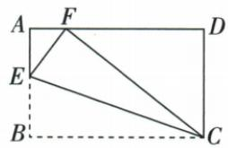
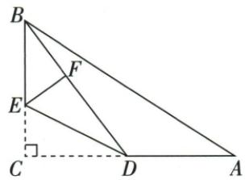

## 讲解

### 判据

矩形3/5沿EC将B折到F，折前后对应长保不变，目标EF可设x。

### 流程

1. 先核折叠对应点。折痕$EC$上的$E,C$固定，$B$折到$F$，所以$BE=EF$、$BC=FC=5$；原直角$\angle EBC$移为$\angle EFC$，不是$E$处的角变成直角。
2. 原$F$在$AD$上，$\triangle CDF$在$D$处直角，且$CD=AB=3$、$CF=5$。勾股给$DF^2=5^2-3^2=16$，长度为正，所以$DF=4$。由$AD=BC=5$及$A,F,D$点序，得$AF=AD-DF=1$。
3. 设$EF=x$，由折叠等长得$EB=x$，原$E$在$AB$内部，所以$AE=3-x$且$0<x<3$。$\triangle AEF$在$A$处直角，勾股给$x^2=(3-x)^2+1^2$。
4. 展开右侧平方得$x^2=9-6x+x^2+1$；两边同减$x^2$，得$0=10-6x$。两边同加$6x$再同除6，得$x=10/6=5/3$。
5. 回验$AE=3-5/3=4/3$，三边满足$(4/3)^2+1^2=25/9=(5/3)^2$，且$0<5/3<3$，所以方程根符合图中位置。

第25章的另一道原折叠题应另读自己的尺寸和点序：$CD=3$、$BD=5$、折后$DF=3$，且$F$在$BD$内部，故$BF=BD-DF=2$。设$EC=x$，则$EF=x$、$BE=4-x$；折后的$F$处直角给$x^2+2^2=(4-x)^2$。展开并两边同减$x^2$，得$4=16-8x$，于是$8x=12$、$x=1.5$。两题共同使用保长和勾股，但给定边长与所设对象不能混用。

## 例题

### 矩形3乘5翻折B到F等长方程求EF五比三

> 来源ID Q22-12；第22章勾股定理；251-300/full.md 第33–43行。原答案与解析定位：251-300/full.md 第45–51行。

例8 如图,折叠矩形 ABCD 的一边 BC,使点 B 落在 AD 边上的点 F 处,已知 AB=3,BC=5,求 EF 的长.

**原资料答案与解析：**

解析 由题意得 Rt△FEC≌Rt△BEC, ∴ EF=BE, FC=BC=5.

在 Rt△CDF 中，CD=AB=3，∴ $DF=\sqrt{CF^{2}-CD^{2}}=\sqrt{5^{2}-3^{2}}=4$ ，∴ AF=1.

设 $EF = x$ ，则 $EB = x, AE = 3 - x.$ 在 $\mathrm{Rt}\triangle AEF$ 中， $EF^2 = AE^2 + AF^2$

$\therefore x^{2} = (3 - x)^{2} + 1^{2}$ ，解得 $x = \frac{5}{3}$ 即 $EF$ 的长为 $\frac{5}{3}$

**展开解析（依据原详解补足理由与步骤）：**

折痕$EC$固定$E,C$，$B$折到$F$，折叠保长给$BE=EF$、$BC=FC=5$，原$\angle EBC=90^\circ$移为$\angle EFC=90^\circ$。矩形中$CD=AB=3$且$\angle CDF=90^\circ$，勾股给$DF^2=CF^2-CD^2=25-9=16$。取正长度得$DF=4$；由$AD=BC=5$和$A,F,D$顺序，$AF=AD-DF=1$。

设$EF=x$，则$EB=x$、$AE=3-x$，且$0<x<3$。$\triangle AEF$在$A$处直角，所以$x^2=(3-x)^2+1^2$。展开平方得$x^2=9-6x+x^2+1$；两边同减$x^2$，得$0=10-6x$。两边同加$6x$，得$6x=10$，再同除6，得到$EF=x=5/3$。

回验$AE=4/3$、$AF=1$、$EF=5/3$，满足$(4/3)^2+1^2=25/9=(5/3)^2$；$x$也在$(0,3)$内。原折后直角在$F$，不能把折痕交点$E$当成直角顶点。

### 六四直角折C到斜边先求BF2再平方差得CE一点五

> 来源ID Q25-10；第25章图形的轴对称平移与旋转；301-350/full.md 第198–206行。原答案与解析定位：301-350/full.md 第124–130行。

例3 (2024 江苏常州) 如图, 在 Rt△ABC 中, ∠ACB=90°, AC=6, BC=4, D 是边 AC 的中点, E 是边 BC 上一点, 连接 BD、DE. 将 △CDE 沿 DE 翻折, 点 C 落在 BD 上的点 F 处, 则 CE= \_\_\_\_.

**原资料答案与解析：**

例3 解析 $\because D$ 是边 $AC$ 的中点， $AC = 6, \therefore CD = 3.$

又∵BC=4,∴BD=5.

由翻折的性质可知， $EF = CE, DF = CD = 3, \therefore BF = BD - DF = 2.$ 设 $CE = x$ ，则 $EF = x, BE = 4 - x$ ，根据勾股定理可得 $x^2 + 2^2 = (4 - x)^2$ ，解得 $x = \frac{3}{2}$ ，即 $CE = \frac{3}{2}$ .

答案 $\frac{3}{2}$

**展开解析（依据原详解补足理由与步骤）：**

D为AC中点，CD=6/2=3。直角△BCD用勾股：BD²=3²+4²=25，BD=5。翻折C到F时D/E不动，DF=DC=3，EF=EC；F在BD内，BF=BD−DF=2。

设CE=x，0<x<4，BE=4−x。原C角90°翻到∠DFE90°，BF与DF共线，所以△BFE也是直角三角形。勾股给$x^2+2^2=(4-x)^2$。右边展开为16−8x+x²；等式同减x²，4=16−8x；加8x再减4，8x=12；除8得x=1.5。它在(0,4)内，且1.5²+2²=2.5²成立，故CE=1.5。不能把折后F当斜边BD的中点。

## 易错

折后直角F是原B像，原E不是90；保长不能把任意交线都等。
