## 讲解

### 判据

题问图形是否轴对称、哪些结论一定成立，先分单图自身还是两图关系，再定字母配对。

### 流程

1.单图先取候选轴，外轮廓和全部内线逐点折叠；仪器题不能忽略烧杯嘴或灯芯。2.两图按A↔A′、B↔B′找对应边/角，写保长度的对象。3.连接不同对应点，核轴既垂直又过中点，轴上点固定。4.原AC和BD均垂直PQ才能推出彼此平行，交叉线AD/BC的夹角仍不保证90°。5.逐项把“肯定”“不一定”与问题要求对齐，不把某个特殊画法当全部情形。

## 例题

### 轴反射对应边与中垂四结论逐项判断

> 来源ID Q25-01；第25章图形的轴对称平移与旋转；251-300/full.md 第4799–4818行。原答案与解析定位：251-300/full.md 第4820–4820行。

例1 如图, $\triangle ABC$ 与 $\triangle A^{\prime}B^{\prime}C^{\prime}$ 关于直线MN对称, $BB^{\prime}$ 交MN于点O,则下列说法中一定正确的有\_\_\_\_.

① $AC=A'C'$ ; ② $AB\parallel B'C'$ ;   
③ $BB'\perp MN$ ; ④BO= $B'O$ .

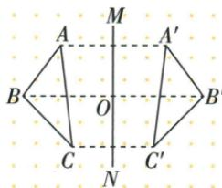

**原资料答案与解析：**

答案 ①③④

**展开解析（依据原详解补足理由与步骤）：**

①正确：A对应A′，C对应C′，反射保长度，AC=A′C′。②不能保证：AB对应的是A′B′，不是B′C′，给出的平行关系没有依据。③正确：B与B′是不同对应点，连接它们的线段垂直对称轴MN。④正确：O为BB′与轴的交点，也是BB′中点，BO=B′O。因此一定正确的是①③④；不是只因两图全等就能任意配边。

### 化学仪器全图折叠重合逐项识别广口瓶

> 来源ID Q25-08；第25章图形的轴对称平移与旋转；301-350/full.md 第155–168行。原答案与解析定位：301-350/full.md 第116–118行。

例1（2024 重庆 A）下列四种化学仪器的示意图中, 是轴对称图形的是
()

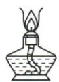  
A

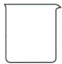  
B

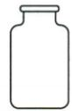  
C

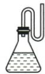  
D

**原资料答案与解析：**

例1 解析 如果一个平面图形沿着一条直线折叠, 直线两旁的部分能够互相重合, 那么这个图形是轴对称图形. 由此定义可知, C 选项符合题意.

答案 C

**展开解析（依据原详解补足理由与步骤）：**

A酒精灯外壳近似对称，但题图灯芯等内线偏向一侧，整个图不能沿同轴重合；B烧杯一侧有嘴，另一侧没有对应凸起；C广口瓶沿中央竖直线折叠，外轮廓和内部线条都成对重合；D导管弯向一侧，无相应另一侧结构。因此C正确。判断对象是提供的示意图全部线条，不是只看器具外形，也不声称现实所有同名器具都有同样对称性。

### 轴反射四项不一定垂直的交叉连线

> 来源ID Q25-09；第25章图形的轴对称平移与旋转；301-350/full.md 第172–194行。原答案与解析定位：301-350/full.md 第120–122行。

例2（2024 河北）如图, AD 与 BC 交于点 O, $\triangle ABO$ 和 $\triangle CDO$ 关于直线 PQ 对称, 点 A, B 的对称点分别是点 C, D. 下列不一定正确的是（）

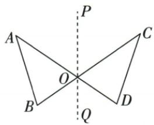

A. $AD \perp BC$

B. $AC \perp PQ$

C. $\triangle ABO \cong \triangle CDO$

D. $AC \parallel BD$

**原资料答案与解析：**

例2 解析 由轴对称的性质可得 $AC \perp PQ, BD \perp PQ, \triangle ABO \cong \triangle CDO, \therefore AC \parallel BD.$

答案 A

**展开解析（依据原详解补足理由与步骤）：**

B正确：A/C是不同对应点，AC⊥PQ。C正确：反射后△ABO与△CDO全等，O在轴上固定。D正确：B/D对应也使BD⊥PQ，两条不同直线都垂直PQ，所以AC∥BD。A所说AD⊥BC不一定：AD和BC虽关于PQ成轴反射，交点O在轴上，但两条镜像直线的夹角随原图改变，轴反射只使轴平分相关夹角，不能保证夹角90°。因此“不一定正确”选A。

### 六句轴对称辨析及常见图形轴数校准

> 来源ID Q25-45；第25章图形的轴对称平移与旋转；251-300/full.md 第4696–4703；4721–4721行。原答案与解析定位：251-300/full.md 第4696–4703行。

1.角的平分线是这个角的对称轴.
(×)  
2.一个轴对称图形不一定只有一条对称轴. (√)  
3.等腰三角形至少有一条对称轴.
(√)  
4. 圆的直径是其对称轴. (×)   
5. 圆的圆心在其对称轴上. ( √ )   
6. 正 n 边形是轴对称图形，有 n 条对称轴. (√)

| 图形及名称 | 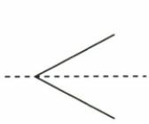角 | 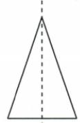等腰三角形 | 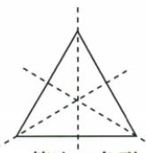等边三角形 | 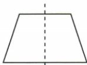等腰梯形 |
| --- | --- | --- | --- | --- |
| 对称轴 | 角的平分线所在直线 | 底边的垂直平分线 | 每条边的垂直平分线 | 上、下底中点连线所在直线 |
| 对称轴数量 | 1条 | 1条 | 3条 | 1条 |
| 图形及名称 | 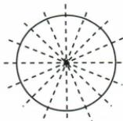圆 | 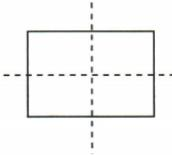长方形 | 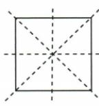正方形 | 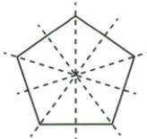正五边形 |
| 对称轴 | 直径所在的直线 | 对边中点连线所在直线 | 对边中点连线所在直线以及对角线所在直线 | 每条边的垂直平分线 |
| 对称轴数量 | 无数条 | 2条 | 4条 | 5条 |

**原资料答案与解析：**

1.角的平分线是这个角的对称轴.
(×)  
2.一个轴对称图形不一定只有一条对称轴. (√)  
3.等腰三角形至少有一条对称轴.
(√)  
4. 圆的直径是其对称轴. (×)   
5. 圆的圆心在其对称轴上. ( √ )   
6. 正 n 边形是轴对称图形，有 n 条对称轴. (√)

**展开解析（依据原详解补足理由与步骤）：**

①错误：角平分线若指射线并非完整对称轴，轴是它所在直线。②正确：任意等腰三角形至少有一条顶角平分线所在轴；等边的特殊情形有三条。③正确：一般图形关于固定轴反射会得到与其成轴对称的像，不要求原图自身对称。④错误：直径是有限线段，圆的轴是该直径所在直线。⑤正确：圆的每条对称轴过圆心，关于不过圆心的线反射会改变圆心位置。⑥正确：正n边形有n条对称轴。附表的“等腰三角形1条、矩形2条”应分别限定非等边和非正方；否则特殊图形另有轴。

### 四句成轴对称辨析区分全等与对应线中垂

> 来源ID Q25-46；第25章图形的轴对称平移与旋转；251-300/full.md 第4791–4795行。原答案与解析定位：251-300/full.md 第4791–4795行。

1. 若两个图形全等，则它们成轴对称. (×)   
2. 两个成轴对称的图形面积相等.
(√)  
3. 轴对称图形的对称轴将这个图形分为全等的两部分. (√)  
4. 连接两个成轴对称的图形的一对对应点，作这条线段的垂线，就可以得到这两个图形的对称轴. (×)

**原资料答案与解析：**

1. 若两个图形全等，则它们成轴对称. (×)   
2. 两个成轴对称的图形面积相等.
(√)  
3. 轴对称图形的对称轴将这个图形分为全等的两部分. (√)  
4. 连接两个成轴对称的图形的一对对应点，作这条线段的垂线，就可以得到这两个图形的对称轴. (×)

**展开解析（依据原详解补足理由与步骤）：**

①错误：成轴对称能推出全等，但两图全等未必由一次轴反射互相对应；②正确：轴反射保长度及全等，因此面积相等；③正确：沿自身对称轴分开的两侧在折叠后重合，形状大小相同；④错误：对不同对应点，轴必须既垂直连接线又经过其中点，只垂直可能距两点不等。轴上的固定点对应自身，此时连接线退化，不能再谈零线段的中垂线。

## 易错

全等不足以推出轴反射，任意两边不因同在两全等图内就等长；轴必须完整直线。
