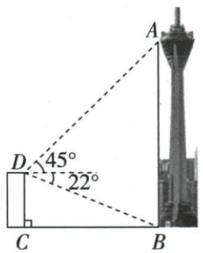
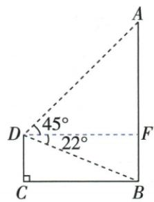
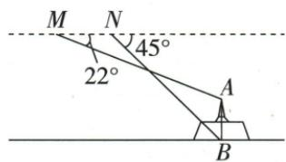
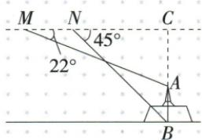

## 错法

原显示屏只答CD而忘1.5；无人机也照楼顶模型把119与落差相加。

## 正解

角从观测点水平线量。显示屏CD超眼，须加1.5；楼顶仰看更高顶加61；无人机顶在机下方，从119减77.2得41.8取42。先画一条观测水平线，可直观看到各段是上差还是下差。

## 例题

### 显示屏两站同侧三十四十五前进十超眼高再加一点五

> 来源ID Q27-16；第27章锐角三角函数；301-350/full.md 第3388–3397行。原答案与解析定位：301-350/full.md 第3399–3415行。

例3 某大楼外墙上有一块电子显示屏 DC, 在点 A 处测得显示屏顶端 D 的仰角为 $30^{\circ}$ , 向显示屏方向前进 10 米后, 在点 B 处测得显示屏顶端 D 的仰角为 $45^{\circ}$ , 已知点 A、B、C 离地面的高度都为 1.5 米, 求显示屏顶端 D 点距离地面的高度。(结果保留根号)

**原资料答案与解析：**

解析 在 Rt△BCD 中，

$$
B C = \frac {C D}{\tan 4 5 ^ {\circ}} = C D,
$$

在 Rt△ACD 中，

$$
A C = \frac {C D}{\tan 3 0 ^ {\circ}} = \sqrt {3} C D,
$$

∵ AB = AC - BC, ∴ $10 = \sqrt{3} CD - CD$ ,
解得 $CD = 5\sqrt{3} + 5.$

∵ 点 C 离地面的高度为 1.5 米，
∴ 显示屏顶端 D 点距离地面的高度为 $(5\sqrt{3}+6.5)$ 米.

**展开解析（依据原详解补足理由与步骤）：**

令CD=h，是顶D超过A/B/C同水平视线的高度。近站B45给BC=h，远站A30给AC=h/tan30=√3h。A-B-C序使AC−BC=AB10，因此(√3−1)h=10，除并有理化h=10/(√3−1)=5(√3+1)。C距地1.5，D距地=h+1.5=5√3+6.5 m。求出CD不能直接作为总高；图中两测量点在同侧，水平距离用差。

### 楼顶61仰45俯22按给定正切0点40塔高214

> 来源ID Q27-20；第27章锐角三角函数；301-350/full.md 第3519–3532行。原答案与解析定位：301-350/full.md 第3534–3556行。

例4 如图,为测量电视塔观景台 A 处的高度,某数学兴趣小组在电视塔附近一建筑物楼顶 D 处测得 A 处的仰角为 $45^{\circ}$ , 塔底部 B 处的俯角为 $22^{\circ}$ . 已知建筑物的高 CD 约为 61 米, 请计算观景台 A 处的高度 AB. (结果精确到 1 米. 参考数据: $\sin 22^{\circ} \approx 0.37$ , $\cos 22^{\circ} \approx 0.93$ , $\tan 22^{\circ} \approx 0.40$ )

**原资料答案与解析：**

解析 过点 D 作 $DF \perp AB$ 于 F，则四边形 CDFB 是矩形，∴ $BF = CD \approx 61$ 米，在 Rt△ADF 中， $\angle AFD = 90^{\circ}$ ， $\angle ADF = 45^{\circ}$ ，∴ AF = DF.

在 Rt△DFB 中， $\tan 22^{\circ}=\frac{BF}{DF},\therefore DF=\frac{BF}{\tan 22^{\circ}}\approx\frac{61}{0.40}=152.5$ （米），

$$
\therefore A B = A F + B F = 1 5 2. 5 + 6 1 = 2 1 3. 5 \approx 2 1 4 (\text { 米 }).
$$

答: 观景台 A 处的高度 AB 约为 214 米.

**展开解析（依据原详解补足理由与步骤）：**

过D作水平DF垂直塔AB，矩形给BF=CD61。俯角FDB22相对水平DF量，tan22=BF/DF，用题给0.40得DF≈61/0.40=152.5。仰45使AF=DF152.5，塔总AB=AF+BF=213.5，按精确到1米通常四舍五入为214 m。直接使用原提供近似数据，不暗换精确tan22后声称同一精度结果；不将俯22当相对竖直的角。

### 无人机水平119近移74俯45到底远俯22到顶塔高42

> 来源ID Q27-24；第27章锐角三角函数；301-350/full.md 第3729–3753行。原答案与解析定位：301-350/full.md 第3669–3705行。

例2（2024 山东日照）潮汐塔是万平口区域内的标志性建筑，在其塔顶可俯视景区全貌。某数学兴趣小组用无人机测量潮汐塔 AB 的高度，测量方案如图所示，无人机在距水平地面 119 m 的 M 点处测得潮汐塔顶端 A 的俯角为 $22^{\circ}$ ，再将无人机沿水平方向飞行 74 m 到达点 N，测得潮汐塔底端 B 的俯角为 $45^{\circ}$ （点 M, N, A, B 在同一平面内），则潮汐塔 AB 的高度为（）

(结果精确到 1 m, 参考数据: $\sin 22^{\circ} \approx 0.37$ , $\cos 22^{\circ} \approx 0.93$ , $\tan 22^{\circ} \approx 0.40$ )

A.41 m

B.42 m

C.48 m

D. $51 \mathrm{~m}$

**原资料答案与解析：**

例2 解析 延长 $BA$ 交 $MN$ 的延长线于点 $C$ .

由题意得, $BC \perp MC, BC = 119 \, m, MN = 74 \, m,$

在 Rt△CNB 中，∠CNB=45°，

$$
\therefore C N = B C = 1 1 9 \mathrm{m},
$$

$$
\therefore M C = M N + C N = 1 9 3 \mathrm{m},
$$

在 Rt△ACM 中，∠AMC=22°，

$$
\therefore A C = M C \cdot \tan 2 2 ^ {\circ} \approx 7 7. 2 \mathrm{m},
$$

$$
\therefore A B = B C - A C \approx 4 2 \mathrm{m},
$$

∴ 潮汐塔 AB 的高度为 42 m.

答案 B

**展开解析（依据原详解补足理由与步骤）：**

延长BA向上与无人机水平MC交C，BC为119。近站N对塔底俯45，直角NCB给NC=BC119；远站M到C距离MC=MN+NC74+119=193。远站对塔顶俯22，AC=MCtan22≈193×0.40=77.2。塔AB=BC−AC=119−77.2=41.8，精确到1m为42，B。A41未按四舍五入；C48和D51不满足原角距组合关系。这里塔顶在无人机下方，须从119减落差，不能像楼顶仰角题那样相加。
