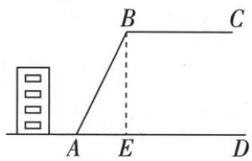
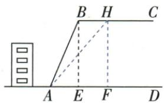

## 错法

把原坡比$12:5$读成12.5°，或把斜坡长26 m当作水平距离，都会把原直角三角形的量用错。另一种错法是把$\tan50^\circ\approx1.2$直接替换成精确等号，再说“移动至少10 m且恰10 m可取”。

后者容易发生，是因为题目“不超过”确实包含等号，学生便把近似计算的数值也当成那个等号。允许真实50°边界与允许某个近似取整距离，是两件不同的判断。

## 正解

先由坡比与勾股求原竖高24 m、水平距离10 m。改后竖高不变，若水平距离为$x$，则$\tan\theta=24/x$。锐角正切递增，$\theta\le50^\circ$给$24/x\le\tan50^\circ$，所以$x\ge24/\tan50^\circ$。

移动距离为$x-10$，精确可取下限是$24/\tan50^\circ-10$ m；在这个精确距离上坡角恰为50°。按原参考值$\tan50^\circ\approx1.2$，下限估算为$24/1.2-10=10$ m，因此原答案应解释为“按参考值约10 m”。

不能把这一近似结果写成“真实下限等于10 m”，也不能直接把改后水平距离20 m称为真实50°边界。若原要求改为严格小于50°，应严格超过上述精确下限；原题的条件与答案均保留，这里只纠正精度和可取端点的口径。

## 例题

### 坡比十二五斜26定高24再坡角不超50最少平移10

> 来源ID Q27-22；第27章锐角三角函数；301-350/full.md 第3613–3625行。原答案与解析定位：301-350/full.md 第3627–3642行。

例6 如图,某校教学楼后面紧邻着一个山坡,坡上面是一块平地. $BC \parallel AD$ , $BE \perp AD$ , 斜坡 $AB$ 长 $26 \mathrm{~m}$ , 斜坡 $AB$ 的坡比为 $12:5$ . 为了减缓坡面, 防止山体滑坡, 学校决定对该斜坡进行改造. 经地质人员勘测, 当坡角不超过 $50^{\circ}$ 时, 可有效预防山体滑坡. 如果改造时保持坡脚 $A$ 不动, 那么坡顶 $B$ 沿 $BC$ 方向至少向右移多远, 才能有效预防山体滑坡? (tan $50^{\circ} \approx 1.2$ )

**原资料答案与解析：**

解析 如图, 设点 B 沿 BC 方向移动至点 H 处, 使得 $\angle HAD = 50^{\circ}$ . 过点 H 作 $HF \perp AD$ 于点 F,

由斜坡 $AB$ 的坡比为 $12:5$ , 设 $BE = 12a \mathrm{~m}(a > 0)$ , 则 $AE = 5a \mathrm{~m}$ , 根据勾股定理得 $AE^2 + BE^2 = AB^2$ , $\therefore (5a)^2 + (12a)^2 = 26^2$ , 解得 $a = 2$ (舍负), $\therefore BE = 24 \mathrm{~m}, AE = 10 \mathrm{~m}, \therefore HF = BE = 24 \mathrm{~m}$ ,

在 Rt△AFH 中， $\tan\angle HAF=\tan50^{\circ}=\frac{HF}{AF}=\frac{24}{AF},\therefore AF\approx\frac{24}{1.2}=20\ m,\therefore BH=EF=10\ m.$

故坡顶 B 沿 BC 方向至少向右移 10 m, 才能有效预防山体滑坡.

**展开解析（依据原详解补足理由与步骤）：**

原坡比是竖高BE与水平距离AE的比$12:5$。设$BE=12k$ m、$AE=5k$ m，$k>0$。在直角△AEB中，由勾股定理，$(12k)^2+(5k)^2=26^2$，合并得$169k^2=676$；除169得$k^2=4$，取正根$k=2$。因此$BE=24$ m、$AE=10$ m。

B沿水平BC移动至H，竖高$HF=BE=24$ m。令新水平距离$AF=x$ m、坡角为$\theta$，则$\tan\theta=HF/AF=24/x$。要求$\theta\le50^\circ$，由锐角正切递增得到$24/x\le\tan50^\circ$；乘正数$x$后，再除正数$\tan50^\circ$，得$x\ge24/\tan50^\circ$。

原图E、F在同一水平地面上，B、H沿水平线移动，所以$BH=EF=AF-AE=x-10$。因此精确最小移动距离是：

$$BH_{\min}=\frac{24}{\tan50^\circ}-10\ \mathrm m.$$

原题给$\tan50^\circ\approx1.2$，据此近似计算$BH_{\min}\approx24/1.2-10=10$ m。保留原答案10 m，并明确它是“使用原参考值算得的近似最小移动距离”。真实可取等号对应上面的精确式和坡角恰50°，不能从近似1.2推出恰移10 m就是该边界，也不能把近似水平20 m作为严格下限。

坡度比较的是竖高与水平距离，斜长26 m不能代入水平分母，$12:5$也不是角度12.5°。以上仍使用原题的几何模型与原参考值，未增加新题目条件。
