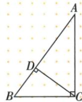

## 错法

原小CAM3x/5x后求B仍把邻腿当CM3x；cosB在BCD仍用原AB当斜。

## 正解

M中点使大BC6x，tanB4x/6x2/3。斜边高小BCD的斜边是BC，cosB=BD/BC，4/BC3/5得20/3。角值相同不代表每条边的角色跨图保持。

## 例题

### 中线小三角正弦三五设三四五倍数求tanB二三

> 来源ID Q27-04；第27章锐角三角函数；301-350/full.md 第2985–2987行。原答案与解析定位：301-350/full.md 第2989–2993行。

例2 如图, 在 Rt△ABC 中, ∠C=90°, AM 是 BC 边上的中线, $\sin\angle CAM=\frac{3}{5}$ , 求 tan B 的值.

**原资料答案与解析：**

解析 在 Rt△ACM 中, $\sin\angle CAM=\frac{CM}{AM}=\frac{3}{5}$ , 设 CM=3x(x>0), 则 AM=5x,

根据勾股定理得 $AC=\sqrt{AM^{2}-CM^{2}}=4x$ , ∵ M 为 BC 的中点, ∴ BC=2CM=6x,

在 Rt△ABC 中, $\tan B=\frac{AC}{BC}=\frac{4x}{6x}=\frac{2}{3}$ .

**展开解析（依据原详解补足理由与步骤）：**

sinCAM在直角△ACM内是CM/AM3/5，设CM3x、AM5x，x>0。勾股AC²=25x²−9x²=16x²，AC4x。M是BC中点，所以BC=2CM6x。求B角须回原△ABC，对腿AC4x、邻腿BC6x，tanB=4x/(6x)=2/3。不能在小形把CM3x作原B角邻边。

### 斜边高已知sinA三五与BD四转余角cosB求BC二十除三

> 来源ID Q27-02；第27章锐角三角函数；301-350/full.md 第2934–2936行。原答案与解析定位：301-350/full.md 第2938–2945行。

例2 如图所示, 在 Rt△ABC 中, $\angle ACB = 90^{\circ}, CD \perp AB$ 于点 D, $\sin A=\frac{3}{5}, BD=4$ , 则 BC 的长为 \_\_\_\_.

**原资料答案与解析：**

解析 因为 $\angle A + \angle B = 90^{\circ}$

所以 $\cos B = \cos(90^{\circ} - \angle A) = \sin A$ $=\frac{3}{5}.$

在 Rt $\triangle BCD$ 中, $\cos B = \frac{BD}{BC}$ , BD =
4, 所以 $BC = \frac{20}{3}$ .

答案 $\frac{20}{3}$

**展开解析（依据原详解补足理由与步骤）：**

原ABC在C直角，A+B90°，所以cosB=sinA=3/5。在小直角△BCD中D直角，关于同一个B角，BD为邻腿、BC为斜边，所以BD/BC=3/5。代BD4，4/BC=3/5；乘5BC得20=3BC，再除3得BC=20/3。换三角不改变B角的函数值，但斜边已从原AB变为小形BC，不能沿用原分母。
