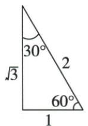
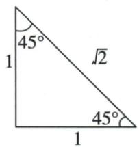

## 讲解

### 是什么

特殊角30°、45°、60°的值按三个边比读取。30°：sin=1/2，cos=√3/2，tan=√3/3；45°：sin=cos=√2/2，tan=1；60°：sin=√3/2，cos=1/2，tan=√3。表中值是准确值，根式不随意用粗小数替代。

### 怎么来的

边2等边三角作底中线，也为高和角平分线，把顶60分成30。底半边1，斜边2，高由勾股√(4−1)=√3，故分别考查30/60两角：30对1邻√3，60对√3邻1，依定义得到六个值。45等腰直角两腿取1，勾股斜√2，两个锐角45，所以正弦余弦1/√2=√2/2，正切1。缩放任意倍仍保边比，不需三角尺真的1/2厘米。

### 什么时候能用

用于准确的特殊角。非特殊角题若给近似参考数据，按原要求使用；不将cos45误当1，更不把tan60当2tan30。由函数值认特殊角须角已在锐角域，利用上一条单调性唯一。

## 例题

### 特殊角原三角尺及九个函数值的来源

> 来源ID Q27-25；第27章锐角三角函数；301-350/full.md 第2881–2911行。原答案与解析定位：301-350/full.md 第2881–2911行。

# 知识点 ③ 特殊角的三角函数值★★★

|  | 特殊角 $\alpha$ / 30° | 特殊角 $\alpha$ / 45° | 特殊角 $\alpha$ / 60° |
| --- | --- | --- | --- |
| sin $\alpha$ | $\frac{1}{2}$ | $\frac{\sqrt{2}}{2}$ | $\frac{\sqrt{3}}{2}$ |
| cos $\alpha$ | $\frac{\sqrt{3}}{2}$ | $\frac{\sqrt{2}}{2}$ | $\frac{1}{2}$ |
| tan $\alpha$ | $\frac{\sqrt{3}}{3}$ | 1 | $\sqrt{3}$ |

技巧总结 巧记特殊角的三角函数值的三种方法：

(1)三角尺记忆法.

(2) 特殊值记忆法.

$30^{\circ}, 45^{\circ}, 60^{\circ}$ 角的正弦值依次为 $\frac{\sqrt{1}}{2}, \frac{\sqrt{2}}{2}, \frac{\sqrt{3}}{2}$ ;

余弦值依次为 $\frac{\sqrt{3}}{2},\frac{\sqrt{2}}{2},\frac{\sqrt{1}}{2}$ ;正切值依次为 $\frac{\sqrt{3}}{3},\frac{\sqrt{3^{2}}}{3},\frac{\sqrt{3^{3}}}{3}$ .

(3) 口诀记忆法.

1,2,3;3,2,1;3,9,27;弦比2,切比3,分子根号别忘添.

**原资料答案与解析：**

# 知识点 ③ 特殊角的三角函数值★★★

|  | 特殊角 $\alpha$ / 30° | 特殊角 $\alpha$ / 45° | 特殊角 $\alpha$ / 60° |
| --- | --- | --- | --- |
| sin $\alpha$ | $\frac{1}{2}$ | $\frac{\sqrt{2}}{2}$ | $\frac{\sqrt{3}}{2}$ |
| cos $\alpha$ | $\frac{\sqrt{3}}{2}$ | $\frac{\sqrt{2}}{2}$ | $\frac{1}{2}$ |
| tan $\alpha$ | $\frac{\sqrt{3}}{3}$ | 1 | $\sqrt{3}$ |

技巧总结 巧记特殊角的三角函数值的三种方法：

(1)三角尺记忆法.

(2) 特殊值记忆法.

$30^{\circ}, 45^{\circ}, 60^{\circ}$ 角的正弦值依次为 $\frac{\sqrt{1}}{2}, \frac{\sqrt{2}}{2}, \frac{\sqrt{3}}{2}$ ;

余弦值依次为 $\frac{\sqrt{3}}{2},\frac{\sqrt{2}}{2},\frac{\sqrt{1}}{2}$ ;正切值依次为 $\frac{\sqrt{3}}{3},\frac{\sqrt{3^{2}}}{3},\frac{\sqrt{3^{3}}}{3}$ .

(3) 口诀记忆法.

1,2,3;3,2,1;3,9,27;弦比2,切比3,分子根号别忘添.

**展开解析（依据原详解补足理由与步骤）：**

30/60直角三角形来自边2等边三角形作高，短腿1，另一腿勾股√3，斜边2；按对/斜、邻/斜、对/邻分别得30正弦1/2余弦√3/2正切√3/3，60正弦√3/2余弦1/2正切√3。45等腰直角两腿1，斜边勾股√2，所以正弦余弦均√2/2、正切1。原表9值逐一对应，不把口诀当推导。

### 两式特殊角零次负次先代函数再实数运算

> 来源ID Q27-09；第27章锐角三角函数；301-350/full.md 第3079–3081行。原答案与解析定位：301-350/full.md 第3083–3085行。

例7 求下列各式的值.

(1) $2\sin 30^{\circ} + 3\cos 60^{\circ} - 4\tan 45^{\circ}$ . (2) $\tan 60^{\circ} - (4 - \pi)^{0} + 2\cos 30^{\circ} + \left(\frac{1}{4}\right)^{-1}$ .

**原资料答案与解析：**

解析（1）原式 $= 2 \times \frac{1}{2} + 3 \times \frac{1}{2} - 4 \times 1 = 1 + \frac{3}{2} - 4 = -\frac{3}{2}$ .

(2) 原式 $= \sqrt{3} - 1 + 2 \times \frac{\sqrt{3}}{2} + 4 = \sqrt{3} - 1 + \sqrt{3} + 4 = 2\sqrt{3} + 3.$

**展开解析（依据原详解补足理由与步骤）：**

(1)sin30=1/2、cos60=1/2、tan45=1，原式2×1/2+3×1/2−4×1=1+3/2−4=−3/2。(2)tan60√3、cos30√3/2；4−π非零，所以零次幂1；(1/4)⁻¹=4。原式√3−1+2×√3/2+4=√3−1+√3+4=2√3+3。先分别算函数和幂，再乘系数合并同类根式；不能把角度加减当函数值加减。

### 根二乘余弦四十五减一逐项选零

> 来源ID Q27-13；第27章锐角三角函数；301-350/full.md 第3168–3176行。原答案与解析定位：301-350/full.md 第3127–3129行。

例3 (2024 天津) $\sqrt{2} \cos 45^{\circ} - 1$ 的值等于 （）

A.0

B.1

C. $\frac{\sqrt{2}}{2} - 1$

D. $\sqrt{2}-1$

**原资料答案与解析：**

例3 解析 $\sqrt{2}\cos 45^{\circ} - 1 = \sqrt{2} \times \frac{\sqrt{2}}{2}$ $1 = 1 - 1 = 0.$

答案 A

**展开解析（依据原详解补足理由与步骤）：**

cos45=√2/2，所以√2cos45−1=√2×√2/2−1=2/2−1=0，A。B1漏掉最后减1；C√2/2−1漏了前系数√2；D√2−1把cos45当1，均错。原解析OCR在相邻公式间漏减号，按原题运算恢复。

### 解直角四组条件分别三四六十与等腰四十五

> 来源ID Q27-14；第27章锐角三角函数；301-350/full.md 第3217–3222行。原答案与解析定位：301-350/full.md 第3224–3262行。

例1 在 Rt△ABC 中, ∠C=90°, ∠A, ∠B, ∠C 的对边分别是 a, b, c, 根据下列条件, 解直角三角形:

(1) $a = 8, \angle B = 60^{\circ}$ .   
(2) $c=10,\angle B=45^{\circ}.$   
(3) $a=2\sqrt{6},b=6\sqrt{2}.$   
(4) $c=3\sqrt{10},b=3\sqrt{5}.$

**原资料答案与解析：**

解析（1） $\angle A = 90^{\circ} - 60^{\circ} = 30^{\circ}$

$$
c = \frac {a}{\cos B} = \frac {8}{\frac {1}{2}} = 1 6,
$$

$$
b = a \cdot \tan B = 8 \times \tan 6 0 ^ {\circ} = 8 \sqrt {3}.
$$

(2) $\angle A = 90^{\circ} - 45^{\circ} = 45^{\circ}$ ,

$$
b = c \cdot \sin B = 1 0 \times \sin 4 5 ^ {\circ} = 5 \sqrt {2},
$$

$$
a = c \cdot \cos B = 1 0 \times \sin 4 5 ^ {\circ} = 5 \sqrt {2}.
$$

(3) $\tan A = \frac{a}{b} = \frac{2\sqrt{6}}{6\sqrt{2}} = \frac{\sqrt{3}}{3}, \therefore \angle A =$

$$
3 0 ^ {\circ}, \therefore \angle B = 9 0 ^ {\circ} - 3 0 ^ {\circ} = 6 0 ^ {\circ}.
$$

$$
c = \sqrt {a ^ {2} + b ^ {2}} = \sqrt {2 4 + 7 2} = 4 \sqrt {6}.
$$

(4) $\sin B = \frac{b}{c} = \frac{3\sqrt{5}}{3\sqrt{10}} = \frac{\sqrt{2}}{2}, \therefore \angle B$

$$
= 4 5 ^ {\circ}, \therefore \angle A = 9 0 ^ {\circ} - 4 5 ^ {\circ} = 4 5 ^ {\circ}.
$$

$$
a = \sqrt {c ^ {2} - b ^ {2}} = \sqrt {9 0 - 4 5} = 3 \sqrt {5}.
$$

**展开解析（依据原详解补足理由与步骤）：**

四小问分别使用自己的已知条件。原$c$为$\angle C=90^\circ$的对边，所以始终是斜边。

（1）$a=8$、$\angle B=60^\circ$。互余给$\angle A=90^\circ-60^\circ=30^\circ$。对$B$而言，$a$是邻直角边，故$\cos B=a/c=1/2$。两边乘$c$再乘2，得$c=2a=16$。又$\tan B=b/a=\sqrt3$，两边乘$a$得$b=a\sqrt3=8\sqrt3$。

（2）$c=10$、$\angle B=45^\circ$。互余给$\angle A=45^\circ$。$\sin B=b/c=\sqrt2/2$，两边乘$c$，得$b=10\times\sqrt2/2=5\sqrt2$；$\cos B=a/c=\sqrt2/2$同理给$a=5\sqrt2$。原解析后一行把$\cos45^\circ$又写成$\sin45^\circ$；两值在45°时恰好相同，但求邻边的依据仍是余弦，不能把两种定义混用。

（3）$a=2\sqrt6$、$b=6\sqrt2$。$\tan A=a/b=(2\sqrt6)/(6\sqrt2)=\sqrt3/3$，且$A$为锐角，故$\angle A=30^\circ$、$\angle B=60^\circ$。勾股给$c^2=a^2+b^2=24+72=96$，长度取正，$c=\sqrt{96}=4\sqrt6$。

（4）$c=3\sqrt{10}$、$b=3\sqrt5$。$\sin B=b/c=\sqrt2/2$，$B$在锐角范围内，所以$\angle B=45^\circ$、$\angle A=45^\circ$。勾股给$a^2=c^2-b^2=90-45=45$，取正长度得$a=\sqrt{45}=3\sqrt5$。不能把上一小问的边长代入这一问。

## 易错

只背表易把sin30与cos30交换；先说对/邻/斜能恢复正确值。原式根二cos45−1必须连同外系数运算。
