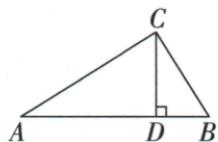

## 讲解

### 是什么

同一直角三角的两锐角A/B互余，sinA=cosB，cosA=sinB，tanA·tanB=1。对同一锐角还有sin²A+cos²A=1、tanA=sinA/cosA。平方表示整个sinA或cosA的平方，不是sin(A²)。

### 怎么来的

若关于A对腿a、邻腿b、斜c，则关于B对腿b、邻腿a。sinA=a/c与cosB=a/c相等，另组同理；tanA=a/b与tanB=b/a乘积1。由勾股a²+b²=c²除正c²，得(a/c)²+(b/c)²=1；代入定义即平方和。正弦/余弦相除为(a/c)/(b/c)=a/b，就是tanA，cosA正所以除法安全。

### 什么时候能用

A/B必须互余且锐角；不是任意两不同角都可交换函数。补斜边高题用A+B90把sinA3/5转cosB，再在小直角形中cosB=BD/BC，正确换了分母。

## 例题

### 斜边高已知sinA三五与BD四转余角cosB求BC二十除三

> 来源ID Q27-02；第27章锐角三角函数；301-350/full.md 第2934–2936行。原答案与解析定位：301-350/full.md 第2938–2945行。

例2 如图所示, 在 Rt△ABC 中, $\angle ACB = 90^{\circ}, CD \perp AB$ 于点 D, $\sin A=\frac{3}{5}, BD=4$ , 则 BC 的长为 \_\_\_\_.

**原资料答案与解析：**

解析 因为 $\angle A + \angle B = 90^{\circ}$

所以 $\cos B = \cos(90^{\circ} - \angle A) = \sin A$ $=\frac{3}{5}.$

在 Rt $\triangle BCD$ 中, $\cos B = \frac{BD}{BC}$ , BD =
4, 所以 $BC = \frac{20}{3}$ .

答案 $\frac{20}{3}$

**展开解析（依据原详解补足理由与步骤）：**

原ABC在C直角，A+B90°，所以cosB=sinA=3/5。在小直角△BCD中D直角，关于同一个B角，BD为邻腿、BC为斜边，所以BD/BC=3/5。代BD4，4/BC=3/5；乘5BC得20=3BC，再除3得BC=20/3。换三角不改变B角的函数值，但斜边已从原AB变为小形BC，不能沿用原分母。

### 中线小三角正弦三五设三四五倍数求tanB二三

> 来源ID Q27-04；第27章锐角三角函数；301-350/full.md 第2985–2987行。原答案与解析定位：301-350/full.md 第2989–2993行。

例2 如图, 在 Rt△ABC 中, ∠C=90°, AM 是 BC 边上的中线, $\sin\angle CAM=\frac{3}{5}$ , 求 tan B 的值.

**原资料答案与解析：**

解析 在 Rt△ACM 中, $\sin\angle CAM=\frac{CM}{AM}=\frac{3}{5}$ , 设 CM=3x(x>0), 则 AM=5x,

根据勾股定理得 $AC=\sqrt{AM^{2}-CM^{2}}=4x$ , ∵ M 为 BC 的中点, ∴ BC=2CM=6x,

在 Rt△ABC 中, $\tan B=\frac{AC}{BC}=\frac{4x}{6x}=\frac{2}{3}$ .

**展开解析（依据原详解补足理由与步骤）：**

sinCAM在直角△ACM内是CM/AM3/5，设CM3x、AM5x，x>0。勾股AC²=25x²−9x²=16x²，AC4x。M是BC中点，所以BC=2CM6x。求B角须回原△ABC，对腿AC4x、邻腿BC6x，tanB=4x/(6x)=2/3。不能在小形把CM3x作原B角邻边。

### 斜边高小角ACD与原B同余角正弦根五三

> 来源ID Q27-07；第27章锐角三角函数；301-350/full.md 第3047–3049行。原答案与解析定位：301-350/full.md 第3051–3055行。

例5 如图所示,在直角三角形 ABC 中, $\angle ACB=90^{\circ},CD\perp AB$ 于 D,已知 $AC=\sqrt{5},AB=3$ ,那么 $\sin\angle ACD$ 的值为 \_\_\_\_.

**原资料答案与解析：**

解析∵在直角三角形ABC中， $\angle ACB=90^{\circ},CD\perp AB,$

$\therefore \angle ACD + \angle BCD = 90^{\circ}, \angle BCD + \angle B = 90^{\circ}, \therefore \angle ACD = \angle B$ ，则 $\sin \angle ACD = \sin B = \frac{AC}{AB} = \frac{\sqrt{5}}{3}$ .

答案 $\frac{\sqrt{5}}{3}$

**展开解析（依据原详解补足理由与步骤）：**

C原直角被CD分成ACD和BCD，ACD+BCD90°；小△BCD在D直角，B+BCD90°。同减BCD得ACD=B。因此sinACD=sinB，在原直角△ABC中sinB=AC/AB=√5/3。可以搬角到易算的原三角，而不能直接把原AC当成小角ACD的对边。

### 平方绝对值和零逐项零求三十六十直角形

> 来源ID Q27-10；第27章锐角三角函数；301-350/full.md 第3091–3091行。原答案与解析定位：301-350/full.md 第3093–3099行。

例8 若 $(3\tan A-\sqrt{3})^{2}+|2\sin B-\sqrt{3}|=0$ ，则以锐角A、B为内角的△ABC的形状是\_\_\_\_。

**原资料答案与解析：**

解析 $\because (3\tan A - \sqrt{3})^2 +|2\sin B - \sqrt{3}| = 0,\therefore 3\tan A - \sqrt{3} = 0,2\sin B - \sqrt{3} = 0,$

则 $\tan A = \frac{\sqrt{3}}{3},\sin B = \frac{\sqrt{3}}{2},\therefore \angle A = 30^{\circ},\angle B = 60^{\circ},\therefore \angle C = 90^{\circ},$

∴ 以锐角 A、B 为内角的 $\triangle ABC$ 的形状是直角三角形.

答案 直角三角形

**展开解析（依据原详解补足理由与步骤）：**

平方与绝对值均非负，和为0意味着各自0。3tanA−√3=0给tanA=√3/3；2sinB−√3=0给sinB=√3/2。A/B已限定锐角，函数在锐角域的单调性保证各有唯一角，特殊表得A30°、B60°。C=180−30−60=90°，所以直角三角。不能在未限定范围时凭函数值认唯一角，也不能只说两非负项相消。

## 易错

函数名不能拆作乘法，sin²A不等于sinA²；原tan30+tan30不等tan60。
