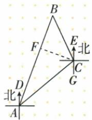
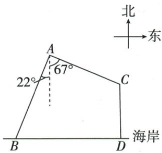
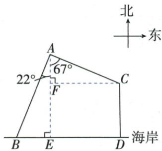

## 讲解

### 是什么

“北偏东50°”从该观测点的正北射线向东侧转50°；“南偏西22°”从正南向西侧量22°。题名的第一个方向决定基准，不能自动从东西水平线量。若写“东偏北”，则以东为基准，和“北偏东”的相应角互余。

地图的南北向画成上下线，是平面方位，不是实际空间的竖直高度。不同观测点各有自己的北向，地理小范围模型中这些南北线平行。

### 怎么来的

画图先给每个观测点作同向平行的北/东射线，再依文字画视线。同一点两“北偏东”角可作差；换到另一点反看原线，A→C北偏东50转为C→A南偏西50。原C→B北偏西25，因此CA/CB在同一西侧由北到南平角里，内角为180−25−50=105。把同一线反方向不转换，就会把105误为75。

### 什么时候能用

只按原图与明确定义量方向。两不同点的方向角不能直接相减而不搬平行参照；大范围真实地球方向需另模型，原题用平面小范围，不扩充未给条件。

## 例题

### 三北向二十五五十二十方位角原三角非直角

> 来源ID Q27-15；第27章锐角三角函数；301-350/full.md 第3270–3278行。原答案与解析定位：301-350/full.md 第3280–3307行。

例2 已知点 C 在点 A 的北偏东 $50^{\circ}$ 方向上, 点 B 在点 C 的北偏西 $25^{\circ}$ 方向上, 点 B 在点 A 的北偏东 $20^{\circ}$ 方向上, 下列说法:

① $\triangle ABC$ 是直角三角形；

② $\angle BAC=30^{\circ}$ ; ③ $\angle ACB=75^{\circ}$ ;

④若 AC=30，则 $AB=20\sqrt{3}$ .

其中正确的有\_\_\_\_.(填序号)

**原资料答案与解析：**

解析 根据题意作出示意图, 过点 C 作 $CF \perp AB$ 于点 F, 如图.

由题意得, $\angle DAC=50^{\circ},\angle DAB=20^{\circ},\angle BCE=25^{\circ},\therefore\angle BAC=30^{\circ}$ ，故②正确. $\because AD\parallel CG,\therefore\angle ACG=\angle DAC=50^{\circ},\therefore\angle ACB=180^{\circ}-25^{\circ}-50^{\circ}=105^{\circ}$ ，故①③错误.

$$
\therefore \angle B = 4 5 ^ {\circ}, \therefore B F = C F,
$$

$$
\begin{array}{r l} & {\therefore \angle B A C = 3 0 ^ {\circ}, \therefore A C = 2 C F, A F =} \\ & {\sqrt {3}   C F, \therefore A B = (\sqrt {3} + 1)   C F =} \\ & {\frac {(\sqrt {3} + 1)}{2} A C = 1 5 \sqrt {3} + 1 5, \text {故} ④ \text {错误}.} \end{array}
$$

答案 ②

**展开解析（依据原详解补足理由与步骤）：**

②正确：A处从同一北向量起量，北偏东50与20的差给BAC30°。C处CA为南偏西50，CB为北偏西25，二者间左侧内角为180−50−25=105°，故③75错误；B=180−30−105=45，三角非直角，①错误。若AC30，从C作CF⊥AB于F，原A-F-B序。AC为A30小形斜边，CF15、AF15√3；B45给BF=CF15，所以AB=AF+FB=15√3+15，非20√3，④错误。只有②。每个北方向平行，不能在C处仍把CA当A→C的北偏东方向。

### 海岸六塔垂距五两南偏方向求船距四点三

> 来源ID Q27-21；第27章锐角三角函数；301-350/full.md 第3562–3566行。原答案与解析定位：301-350/full.md 第3568–3607行。

例5 如图,在东西方向的海岸上有两个相距6海里的码头B,D,某海岛上的观测塔A距离海岸5海里,在A处测得B位于南偏西22°方向,一艘渔船从D出发,沿正北方向航行至C处,此时在A处测得C位于南偏东67°方向,求此时观测塔A与渔船之间的距离(结果精确到0.1海里). $\left(\text{参考数据:}\sin22^{\circ}\approx\frac{3}{8},\right.$

$$
\cos 2 2 ^ {\circ} \approx \frac {1 5}{1 6}, \tan 2 2 ^ {\circ} \approx \frac {2}{5}, \sin 6 7 ^ {\circ} \approx \frac {1 2}{1 3}, \cos 6 7 ^ {\circ} \approx \frac {5}{1 3}, \tan 6 7 ^ {\circ} \approx \frac {1 2}{5})
$$

**原资料答案与解析：**

解析 如图所示, 过点 A 作 $AE \perp BD$ 于 E, 过点 C 作 $CF \perp AE$ 于 F.根据题意知 AE=5 海里, BD=6 海里, $\angle BAE=22^{\circ}, \angle CAF=67^{\circ}$ ,

$$
\angle A E D = \angle A E B = \angle C F A = \angle C F E = \angle C D E = 9 0 ^ {\circ},
$$

∴ 四边形 CDEF 是矩形, ∴ CF = DE = BD - BE.

在 Rt△ABE 中，∵ $\tan\angle BAE=\frac{BE}{AE}$ ，∴ BE= $\tan22^{\circ}\times5\approx\frac{2}{5}\times5=2$ （海里）.

∴ CF = BD - BE = 6 - 2 = 4 (海里).

在 Rt△ACF 中，∵ $\sin\angle CAE=\frac{CF}{AC}$ ，∴ $AC=\frac{CF}{\sin\angle CAE}\approx\frac{13}{3}\approx4.3$ （海里）.

答:此时观测塔 A 与渔船之间的距离约为 4.3 海里.

**展开解析（依据原详解补足理由与步骤）：**

作AE⊥海岸BD，AE5，C沿D正北航行；从C作CF⊥AE，CDEF矩形。南偏西22以A处向南AE为基准，在ABE中BE=AE·tan22≈5×2/5=2；原B-E-D序给DE=BD−BE6−2=4，所以CF4。南偏东67同样以向南AF为基准，△ACF的对腿CF4、斜边AC，sin67=CF/AC，用题给12/13求AC≈4/(12/13)=13/3≈4.3海里。67不是与东西水平夹角；题问塔船斜距AC，不是CF水平距离。

## 易错

海岛南偏东67与南AE夹角67，所以对水平CF用sin，不先擅改成23而继续原函数。
