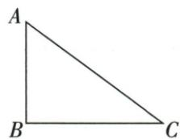

## 讲解

### 是什么

在非退化直角三角形里，先指定锐角A：与A相对的直角边为对边，紧邻A但不是斜边的直角边为邻边，直角对面最长边为斜边。正弦sinA=对/斜，余弦cosA=邻/斜，正切tanA=对/邻。邻边不包括虽然也经过A的斜边。

这三个值都是同单位长度比，没有长度单位。sinA是一个完整符号，sin不是可与A相乘的数；换另一个锐角，对/邻交换，斜边不变。

### 怎么来的

所有含同一锐角A的直角三角形都有90°及A两角等，AA相似，所以三组对应边比一样。不管把三角放大多少，对/斜、邻/斜、对/邻都不改变，因此函数值只由角的大小决定。把角作为输入，每个输入锐角对应唯一边比，这就是叫三角函数的理由。原两腿√2/√3的例先勾股斜√5，才分别求三个比；原B直角3/4题斜边是AC而不是因习惯指定AB。

### 什么时候能用

本章限0°<A<90°，必须先找到包含它的直角三角形；原图非直角时作垂线或搬到等角的直角形，不直接拿两原边长相除。超出锐角范围的定义另属后续学习，不沿用本章边比推理。

## 例题

### 三个三角函数误解逐项正切范围直角与角和

> 来源ID Q27-01；第27章锐角三角函数；301-350/full.md 第2857–2857行。原答案与解析定位：301-350/full.md 第2859–2863行。

例1 下列说法: ①若 $\alpha$ 为锐角, 则 $0 < \tan \alpha < 1$ ; ②在 $\triangle ABC$ 中, 已知 BC = 3, AC = 4, 则 $\tan A = \frac{3}{4}$ ; ③ $\tan 60^{\circ} = \tan (30^{\circ} + 30^{\circ}) = \tan 30^{\circ} + \tan 30^{\circ} = \frac{\sqrt{3}}{3} + \frac{\sqrt{3}}{3} = \frac{2\sqrt{3}}{3}$ . 其中正确说法的个数是 \_\_\_\_.

**原资料答案与解析：**

解析 当 $45^{\circ} < \alpha < 90^{\circ}$ 时, $\alpha$ 的对边比邻边长, 则 $\tan \alpha > 1$ , 故①错误. 在 $\triangle ABC$ 中, $\tan A = \frac{BC}{AC}$ 的前提是 $\angle C = 90^{\circ}$ , 故②错误. $\tan 60^{\circ} = \sqrt{3}$ , 不等于 $\tan 30^{\circ}$ 与 $\tan 30^{\circ}$ 的和, 故③错误.

# 答案0

注意 若 $\alpha$ 为锐角，则 $0 < \sin \alpha < 1$ ， $0 < \cos \alpha < 1$ ，但 $\tan \alpha > 0$ ，不能想当然地认为 $\tan \alpha < 1$ .

**展开解析（依据原详解补足理由与步骤）：**

①错误：正切是对直角边/邻直角边，当角大于45°时对边较长，比大于1；原tan60°=√3已提供反例。②错误：BC/AC作为tanA须在C直角的三角内，题未给直角，仅两边长不能使用定义。③错误：tan是整个函数符号，不能对角度相加直接分配；tan60°=√3，2tan30°=2√3/3，二者不等。三项都错，正确个数0。

### 直角两腿根二根三先勾股后求A三比

> 来源ID Q27-03；第27章锐角三角函数；301-350/full.md 第2969–2969行。原答案与解析定位：301-350/full.md 第2971–2979行。

例1 已知在 Rt△ABC 中, ∠A, ∠B, ∠C 的对边分别为 a, b, c, ∠C = 90°, $a = \sqrt{2}$ , $b = \sqrt{3}$ , 求 ∠A 的正弦、余弦、正切的值.

**原资料答案与解析：**

解析∵在Rt△ABC中，∠C=90°,a=√2,b=√3,

$$
\therefore c = \sqrt {a ^ {2} + b ^ {2}} = \sqrt {(\sqrt {2}) ^ {2} + (\sqrt {3}) ^ {2}} = \sqrt {5},
$$

$$
\therefore \sin A = \frac {a}{c} = \frac {\sqrt {1 0}}{5}, \cos A = \frac {b}{c} = \frac {\sqrt {1 5}}{5}, \tan A = \frac {a}{b} = \frac {\sqrt {6}}{3}.
$$

**展开解析（依据原详解补足理由与步骤）：**

C直角，所以c是斜边，c²=a²+b²=2+3=5，c=√5。A对边a√2、邻腿b√3，sinA=√2/√5=√10/5，cosA=√3/√5=√15/5，tanA=√2/√3=√6/3。各有理化同时乘分子分母同一根号，未改值。斜边最长，sin/cos在0与1间，tan为正，符合。

### 三四直角B角位置正确tanA四三逐项

> 来源ID Q27-11；第27章锐角三角函数；301-350/full.md 第3133–3149行。原答案与解析定位：301-350/full.md 第3112–3114行。

例1（2024云南）如图，在 $\triangle ABC$ 中，若 $\angle B=90^{\circ},AB=3,BC=4$ ，则 $\tan A=$ （ ）

A. $\frac{4}{5}$

B. $\frac{3}{5}$

C. $\frac{4}{3}$

D. $\frac{3}{4}$

**原资料答案与解析：**

例1 解析 $\tan A = \frac{BC}{AB} = \frac{4}{3}$ .

答案 C

**展开解析（依据原详解补足理由与步骤）：**

B90，所以AC斜边5，关于A的对腿BC4、邻腿AB3，tanA=4/3，C。A4/5是sinA，B3/5是cosA；D3/4把对/邻颠倒，是tanC。先从直角找斜边，不能习惯性把字母C当直角而使用BC/AC。

## 易错

原“余弦/正切”OCR等号链由PDF实际第30页核对，恢复邻/斜与对/邻。原三误解中没给C直角的BC/AC不能称tanA。
