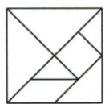
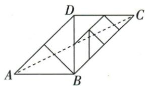

## 讲解

### 判据

拼接图没给绝对边长，先从原七巧板的等腰直角部件读等边与垂直，再用半对角构成目标直角形。

### 流程

1. 从原七巧板部件读取关系。$\triangle ABD$与$\triangle BCD$是全等的等腰直角三角形，因此$AB=BD=CD$，且$\angle ABD=\angle BDC=90^\circ$。两线$AB,CD$均垂直$BD$，所以$AB\parallel CD$。
2. 对四边形$ABCD$，同一组对边$AB,CD$既平行又相等，可判它为平行四边形。不能把“平行”和“相等”分属不同组，也不能在证明前先使用对角线互平分。
3. 设$AC$与$BD$交于$O$。平行四边形的对角线互平分，故$OB=BD/2$；再由$BD=AB$得到$OB=AB/2$。
4. $AB\perp BD$且$O$在$BD$上，所以$\triangle ABO$在$B$处直角。$O$在$AC$内部，射线$AO$与$AC$同向，因此$\angle OAB=\angle CAB$。
5. 对这个锐角，$OB$是对直角边，$AB$是邻直角边，故$\tan\angle CAB=\tan\angle OAB=OB/AB=(AB/2)/AB=1/2$。边$AB>0$，约去共同长度合法，不需要绝对边长。
6. 回查全程的对象：先由部件证平行四边形，再取半对角，最后在真实直角三角形$ABO$中读正切；整体对角线$AC$不是这里的邻直角边。

## 例题

### 七巧板两等腰直角拼平行四边中点正切半

> 来源ID Q27-12；第27章锐角三角函数；301-350/full.md 第3151–3164行。原答案与解析定位：301-350/full.md 第3116–3125行。

例2 (2024 江西) 将图 1 所示的七巧板, 拼成图 2 所示的四边形 ABCD, 连接 AC, 则 $\tan \angle CAB =$ \_\_\_\_ .

  
图1

图 2

**原资料答案与解析：**

例2 解析 设 AC 与 BD 交于点 O，由七巧板可知 $\triangle ABD$ 和 $\triangle BCD$ 是全等的等腰直角三角形，∴ AB = BD = CD, $\angle ABD = \angle BDC = 90^{\circ}$ , $\therefore AB \parallel CD$ ,

∴ 四边形 ABCD 是平行四边形，
∴ $OB=\frac{1}{2}BD=\frac{1}{2}AB$ ,

$$
\therefore \tan \angle C A B = \tan \angle O A B = \frac {O B}{A B} = \frac {1}{2}.
$$

答案 $\frac{1}{2}$

**展开解析（依据原详解补足理由与步骤）：**

七巧板原图拼出△ABD/BCD两个全等的等腰直角三角，AB=BD=CD且ABD=BDC90°，AB∥CD；一组对边平行且等长使ABCD为平行四边形。设AC与BD交O，对角互平分给OB=BD/2=AB/2。B角ABD90使△ABO直角，AO与AC同射线，因此tanCAB=tanOAB=OB/AB=1/2。原形ABD直角，不能以整体对角AC未经求长直接代某腿。

## 易错

函数比无需绝对尺度；BD不是整形斜边，先找真实ABO直角。
