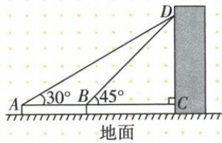
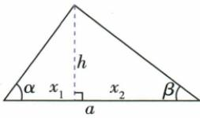
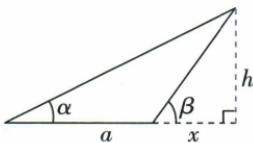
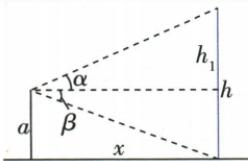
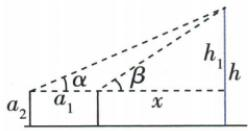
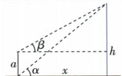
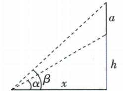

## 讲解

### 判据

两个测点在目标同侧同高，前进距离已知，目标上方高度差同一个h。

### 流程

1.近45给BC=h，远30给AC√3h。2.前进AB10=AC−BC，(√3−1)h10。3.有理化h=5√3+5，再加共同眼高1.5为总高5√3+6.5。4.列式先标A-B-C序与C同水平，不把两水平距相加。5.原理论异侧模型才用距和，其他不同高模型先各设高度差。

## 例题

### 显示屏两站同侧三十四十五前进十超眼高再加一点五

> 来源ID Q27-16；第27章锐角三角函数；301-350/full.md 第3388–3397行。原答案与解析定位：301-350/full.md 第3399–3415行。

例3 某大楼外墙上有一块电子显示屏 DC, 在点 A 处测得显示屏顶端 D 的仰角为 $30^{\circ}$ , 向显示屏方向前进 10 米后, 在点 B 处测得显示屏顶端 D 的仰角为 $45^{\circ}$ , 已知点 A、B、C 离地面的高度都为 1.5 米, 求显示屏顶端 D 点距离地面的高度。(结果保留根号)

**原资料答案与解析：**

解析 在 Rt△BCD 中，

$$
B C = \frac {C D}{\tan 4 5 ^ {\circ}} = C D,
$$

在 Rt△ACD 中，

$$
A C = \frac {C D}{\tan 3 0 ^ {\circ}} = \sqrt {3} C D,
$$

∵ AB = AC - BC, ∴ $10 = \sqrt{3} CD - CD$ ,
解得 $CD = 5\sqrt{3} + 5.$

∵ 点 C 离地面的高度为 1.5 米，
∴ 显示屏顶端 D 点距离地面的高度为 $(5\sqrt{3}+6.5)$ 米.

**展开解析（依据原详解补足理由与步骤）：**

令CD=h，是顶D超过A/B/C同水平视线的高度。近站B45给BC=h，远站A30给AC=h/tan30=√3h。A-B-C序使AC−BC=AB10，因此(√3−1)h=10，除并有理化h=10/(√3−1)=5(√3+1)。C距地1.5，D距地=h+1.5=5√3+6.5 m。求出CD不能直接作为总高；图中两测量点在同侧，水平距离用差。

### 六种测高原模型按水平距离和差及共眼基线列式

> 来源ID Q27-26；第27章锐角三角函数；301-350/full.md 第3372–3380行。原答案与解析定位：301-350/full.md 第3372–3380行。

# 知识点 5 测量物体的高度的常见模型★★☆

# 1. 利用水平距离测量物体的高度

| 数学模型 | 应测数据 | 数量关系 |
| --- | --- | --- |
|  | $\alpha ,\beta$ ,水平距离  $a$ | $\tan \alpha = \frac{h}{x_1},\tan \beta = \frac{h}{x_2},$  $\frac{h}{\tan \alpha} + \frac{h}{\tan \beta} = a$ |
|  | $\alpha ,\beta$ ,水平距离  $a$ | $\tan \alpha = \frac{h}{a+x},\tan \beta = \frac{h}{x},$  $\frac{h}{\tan \alpha} - \frac{h}{\tan \beta} = a$ |

# 2.测量底部不可到达的物体的高度

| 数学模型 | 应测数据 | 数量关系 |
| --- | --- | --- |
|  | 仰角 $\alpha$ ,俯角 $\beta$ ,高度 $a$ | $\tan \alpha = \frac{h_1}{x}, \tan \beta = \frac{a}{x}$ , $h = a + \frac{\tan \alpha}{\tan \beta} \cdot a$ |
|  | 仰角 $\alpha$ ,仰角 $\beta$ ,水平距离 $a_1$ ,测角仪高 $a_2$ | $\tan \alpha = \frac{h_1}{a_1 + x}, \tan \beta = \frac{h_1}{x}$ , $\frac{h_1}{\tan \alpha} - \frac{h_1}{\tan \beta} = a_1, h = a_2 + h_1$ 6 |
|  | 仰角 $\alpha$ ,仰角 $\beta$ ,高度 $a$ | $\tan \alpha = \frac{h}{x}, \tan \beta = \frac{h - a}{x}$ , $\frac{h}{\tan \alpha} = \frac{h - a}{\tan \beta}$ |
|  | 仰角 $\alpha$ ,仰角 $\beta$ ,高度 $a$ | $\tan \alpha = \frac{h}{x}, \tan \beta = \frac{a + h}{x}$ , $\frac{h}{\tan \alpha} = \frac{a + h}{\tan \beta}$ |

**原资料答案与解析：**

# 知识点 5 测量物体的高度的常见模型★★☆

# 1. 利用水平距离测量物体的高度

| 数学模型 | 应测数据 | 数量关系 |
| --- | --- | --- |
|  | $\alpha ,\beta$ ,水平距离  $a$ | $\tan \alpha = \frac{h}{x_1},\tan \beta = \frac{h}{x_2},$  $\frac{h}{\tan \alpha} + \frac{h}{\tan \beta} = a$ |
|  | $\alpha ,\beta$ ,水平距离  $a$ | $\tan \alpha = \frac{h}{a+x},\tan \beta = \frac{h}{x},$  $\frac{h}{\tan \alpha} - \frac{h}{\tan \beta} = a$ |

# 2.测量底部不可到达的物体的高度

| 数学模型 | 应测数据 | 数量关系 |
| --- | --- | --- |
|  | 仰角 $\alpha$ ,俯角 $\beta$ ,高度 $a$ | $\tan \alpha = \frac{h_1}{x}, \tan \beta = \frac{a}{x}$ , $h = a + \frac{\tan \alpha}{\tan \beta} \cdot a$ |
|  | 仰角 $\alpha$ ,仰角 $\beta$ ,水平距离 $a_1$ ,测角仪高 $a_2$ | $\tan \alpha = \frac{h_1}{a_1 + x}, \tan \beta = \frac{h_1}{x}$ , $\frac{h_1}{\tan \alpha} - \frac{h_1}{\tan \beta} = a_1, h = a_2 + h_1$ 6 |
|  | 仰角 $\alpha$ ,仰角 $\beta$ ,高度 $a$ | $\tan \alpha = \frac{h}{x}, \tan \beta = \frac{h - a}{x}$ , $\frac{h}{\tan \alpha} = \frac{h - a}{\tan \beta}$ |
|  | 仰角 $\alpha$ ,仰角 $\beta$ ,高度 $a$ | $\tan \alpha = \frac{h}{x}, \tan \beta = \frac{a + h}{x}$ , $\frac{h}{\tan \alpha} = \frac{a + h}{\tan \beta}$ |

**展开解析（依据原详解补足理由与步骤）：**

异侧两站距a：同高h对应两水平距h/tanα、h/tanβ，二距之和为a。同侧两站距a：远近水平距之差为a，故h/tanα−h/tanβ=a，需远α<近β。楼上看对面顶/底：观测高a，俯β求共水平x=a/tanβ，仰α求超观测高x tanα，总高a+x tanα。相同眼高a₂两站同侧：先对超眼高h₁列距差a₁，最终总高a₂+h₁。不同高度站看同顶：水平距共x，分别h/tanα与(h−a)/tanβ相等。看同楼上下端两仰：共水平距x=h/tanα=(h+a)/tanβ。原模型有必要图和关系，不冒充独立数值例题；每个和差来自真实点序和共用基线。

## 易错

两站眼高相同才共用h；没有附条件不把原模型公式当固定答案。
