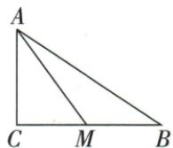

## 讲解

### 判据

只给sin小角3/5并有中点，设公共正尺度把小三角恢复，再用中点换到目标形。

### 流程

1.CAM的小形sin=CM/AM3/5，设3x/5x。2.勾股AC4x，x正所以取正长度。3.M为BC中点，整个BC6x。4.B角在大形，tanB=AC/BC4x/6x2/3，共尺度约去。5.不能把CM3x替整个BC求B角。

## 例题

### 中线小三角正弦三五设三四五倍数求tanB二三

> 来源ID Q27-04；第27章锐角三角函数；301-350/full.md 第2985–2987行。原答案与解析定位：301-350/full.md 第2989–2993行。

例2 如图, 在 Rt△ABC 中, ∠C=90°, AM 是 BC 边上的中线, $\sin\angle CAM=\frac{3}{5}$ , 求 tan B 的值.

**原资料答案与解析：**

解析 在 Rt△ACM 中, $\sin\angle CAM=\frac{CM}{AM}=\frac{3}{5}$ , 设 CM=3x(x>0), 则 AM=5x,

根据勾股定理得 $AC=\sqrt{AM^{2}-CM^{2}}=4x$ , ∵ M 为 BC 的中点, ∴ BC=2CM=6x,

在 Rt△ABC 中, $\tan B=\frac{AC}{BC}=\frac{4x}{6x}=\frac{2}{3}$ .

**展开解析（依据原详解补足理由与步骤）：**

sinCAM在直角△ACM内是CM/AM3/5，设CM3x、AM5x，x>0。勾股AC²=25x²−9x²=16x²，AC4x。M是BC中点，所以BC=2CM6x。求B角须回原△ABC，对腿AC4x、邻腿BC6x，tanB=4x/(6x)=2/3。不能在小形把CM3x作原B角邻边。

## 易错

参数尺度无需实际求出，目标比会相消；但中点倍数不应省略。
