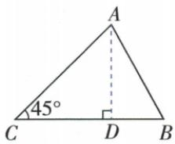

## 讲解

### 判据

目标原图不是直角形，作高分解后用已给边角逐个恢复。

### 流程

1.锐角三角C45/AC√6/AB2，A高AD落BC内部；CD=AD√3。2.另形cosDAB√3/2，DAB30/B60；A=45+30=75。3.DB=2sin30=1，BC按C-D-B序√3+1。4.等腰5边sin底4/5，高4半底3，整底6；不能只答半底。

## 例题

### 锐角三角45根六与边2作高拆得角75和60边根三加一

> 来源ID Q27-17；第27章锐角三角函数；301-350/full.md 第3432–3432行。原答案与解析定位：301-350/full.md 第3434–3456行。

例1 在锐角三角形 $ABC$ 中, $\angle C = 45^{\circ}, AC = \sqrt{6}, AB = 2$ , 求这个三角形未知边的边长和未知角的度数.

**原资料答案与解析：**

解析 如图所示, 过点 A 作 $AD \perp BC$ 于 D, 在 Rt△ACD 中, $\angle DCA = 45^{\circ}, AC = \sqrt{6}$ ,

$$
\therefore \angle D A C = 4 5 ^ {\circ}, C D = A D = A C \times \sin 4 5 ^ {\circ} = \sqrt {6} \times \sin 4 5 ^ {\circ} = \sqrt {3}.
$$

在 Rt△ABD 中， $\cos\angle DAB=\frac{AD}{AB}=\frac{\sqrt{3}}{2},\therefore\angle DAB=30^{\circ},$

$$
\therefore \angle B = 9 0 ^ {\circ} - 3 0 ^ {\circ} = 6 0 ^ {\circ}, \angle B A C = 4 5 ^ {\circ} + 3 0 ^ {\circ} = 7 5 ^ {\circ},
$$

∵ 在 Rt△ABD 中， $\frac{DB}{AB}=\sin30^{\circ},\therefore DB=2\sin30^{\circ}=1,\therefore BC=CD+DB=\sqrt{3}+1.$

**展开解析（依据原详解补足理由与步骤）：**

作AD⊥BC。题已明确原三角锐角，所以D在有限BC内部。AC√6且C45，小形ACD等腰直角，AD=CD=√6/√2=√3。另一小形ABD中cosDAB=AD/AB=√3/2，DAB30、B60；原A由DAC45与DAB30相加得75。DB=ABsin30=2×1/2=1，C-D-B序使BC=CD+DB=√3+1。若原三角未限定锐角，垂足位置或B取另一支可能改变，不能取消条件。

### 等腰边5sin底角四五作高半底3求BC6逐项

> 来源ID Q27-23；第27章锐角三角函数；301-350/full.md 第3709–3725行。原答案与解析定位：301-350/full.md 第3657–3667行。

例1（2024甘肃临夏州）如图，在 $\triangle ABC$ 中， $AB=AC=5, \sin B=\frac{4}{5}$ ，则BC的长是 （）

A.3

B.6

C.8

D.9

**原资料答案与解析：**

例1 解析 过点 A 作 $AD \perp BC$ 于点 D, ∵ AB = AC, ∴ BD = CD.

$$
\begin{array}{r l} & {\text {在} \mathrm{Rt} \triangle A B D \text {中}, A D = A B \cdot \sin B =} \\ & {5 \times \frac {4}{5} = 4, \therefore B D = \sqrt {A B ^ {2} - A D ^ {2}} =} \end{array}
$$

$$
\sqrt {5 ^ {2} - 4 ^ {2}} = 3, \therefore B C = 2 B D = 6.
$$

答案 B

**展开解析（依据原详解补足理由与步骤）：**

等腰AB=AC5，顶点高AD也是底边中线。小直角ABD中AD=ABsinB=5×4/5=4；BD²=5²−4²=9，BD3，BC2BD6，B。A3只算半底；C8把高4倍2；D9是半底平方误当长度。虽原ABC非直角，作高后B角仍同一锐角，才可用定义。

## 易错

题未给锐角条件时垂足可能外侧，侧边与角可能有第二支；原题已给，应使用而非删掉。
