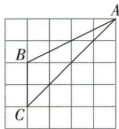

## 讲解

### 判据

角的两边是方格中的斜线，原三角形未必是直角三角形。要用正切，先构造一个包含目标角的直角三角形；水平、竖直格数只是计算某条斜边长度的辅助信息，不能直接充当目标角的对边与邻边。

### 流程

1. 选目标角的一条边作为邻边方向，过另一边上的点向它作垂线。原题过B作BD垂直AC，得到含$\angle A$且直角在D的△ABD；直角位置必须先确定。
2. 按原图检查垂足D的实际位置。原D落在格点，BD的水平与竖直分量各为1格，因此$BD^{2}=1^{2}+1^{2}=2$，$BD=\sqrt{2}$。
3. 对AD也用同一单位数格。其水平与竖直分量各为3格，$AD^{2}=3^{2}+3^{2}=18$，$AD=3\sqrt{2}$；AD与BD都用勾股求出，而不是从画面斜长估测。
4. 回到直角△ABD，以$\angle A$为基准，BD是对边，AD是邻边，所以$\tan A=BD/AD=\sqrt{2}/(3\sqrt{2})=1/3$。
5. 核对所用比是否围绕目标角、是否来自直角三角形。不能直接写原非直角△ABC中的$BC/AC$，也不能为了方便数格，把本来不在格点的垂足移到格点。

## 例题

### 斜格角A作BD垂AC读根二与三根二求tan三分一

> 来源ID Q27-05；第27章锐角三角函数；301-350/full.md 第2999–3009行。原答案与解析定位：301-350/full.md 第3011–3015行。

例3 如图, 在 $5 \times 5$ 的正方形网格中, 每个小正方形的边长为 $1, \triangle ABC$ 的三个顶点 $A, B, C$ 均在格点上, 则 $\tan A$ 的值为 \_\_\_\_.

**原资料答案与解析：**

解析 过点 B 作 $BD \perp AC$ 于点 D,

利用勾股定理, 得 $BD = \sqrt{2}$ , $AD = 3\sqrt{2}$ , 则 $\tan A = \frac{BD}{AD} = \frac{\sqrt{2}}{3\sqrt{2}} = \frac{1}{3}$ .

答案 $\frac{1}{3}$

**展开解析（依据原详解补足理由与步骤）：**

过B向AC作垂线BD，所求A成为直角△ABD内角。原斜网格中垂足D落格点，BD由横/竖各1格组成，勾股BD√2；AD由横/竖各3格组成，勾股AD3√2。tanA=对BD/邻AD=√2/(3√2)=1/3。原ABC不是直角三角，不能直接拿BC/AC代；方格边沿水平竖直，但目标角的邻边AC是斜向，需按其方向构造。

## 易错

若垂足不在格点仍可按长度关系求，不能为了数格捏造格点垂足。
