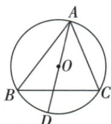

## 讲解

### 判据

目标小角的直角边难求，找它与原易算角相等或互余的几何依据。

### 流程

1.斜边高ACD/B同余于BCD，所以sinACD=sinB=AC/AB√5/3。2.sinA3/5与cosB相等，在小BCD中cosB=BD/BC，用BD4求BC20/3；也可斜边高关系BC²=AB·BD配原BC/AB3/5，消AB得同值。3.圆中AD直径造ACD直角，同弧AC给B=D，sinB=AC/AD2/3。4.每次先证等角/余角再搬值，不直接把任意两角函数记号互换。

## 例题

### 斜边高已知sinA三五与BD四转余角cosB求BC二十除三

> 来源ID Q27-02；第27章锐角三角函数；301-350/full.md 第2934–2936行。原答案与解析定位：301-350/full.md 第2938–2945行。

例2 如图所示, 在 Rt△ABC 中, $\angle ACB = 90^{\circ}, CD \perp AB$ 于点 D, $\sin A=\frac{3}{5}, BD=4$ , 则 BC 的长为 \_\_\_\_.

**原资料答案与解析：**

解析 因为 $\angle A + \angle B = 90^{\circ}$

所以 $\cos B = \cos(90^{\circ} - \angle A) = \sin A$ $=\frac{3}{5}.$

在 Rt $\triangle BCD$ 中, $\cos B = \frac{BD}{BC}$ , BD =
4, 所以 $BC = \frac{20}{3}$ .

答案 $\frac{20}{3}$

**展开解析（依据原详解补足理由与步骤）：**

原ABC在C直角，A+B90°，所以cosB=sinA=3/5。在小直角△BCD中D直角，关于同一个B角，BD为邻腿、BC为斜边，所以BD/BC=3/5。代BD4，4/BC=3/5；乘5BC得20=3BC，再除3得BC=20/3。换三角不改变B角的函数值，但斜边已从原AB变为小形BC，不能沿用原分母。

### 斜边高小角ACD与原B同余角正弦根五三

> 来源ID Q27-07；第27章锐角三角函数；301-350/full.md 第3047–3049行。原答案与解析定位：301-350/full.md 第3051–3055行。

例5 如图所示,在直角三角形 ABC 中, $\angle ACB=90^{\circ},CD\perp AB$ 于 D,已知 $AC=\sqrt{5},AB=3$ ,那么 $\sin\angle ACD$ 的值为 \_\_\_\_.

**原资料答案与解析：**

解析∵在直角三角形ABC中， $\angle ACB=90^{\circ},CD\perp AB,$

$\therefore \angle ACD + \angle BCD = 90^{\circ}, \angle BCD + \angle B = 90^{\circ}, \therefore \angle ACD = \angle B$ ，则 $\sin \angle ACD = \sin B = \frac{AC}{AB} = \frac{\sqrt{5}}{3}$ .

答案 $\frac{\sqrt{5}}{3}$

**展开解析（依据原详解补足理由与步骤）：**

C原直角被CD分成ACD和BCD，ACD+BCD90°；小△BCD在D直角，B+BCD90°。同减BCD得ACD=B。因此sinACD=sinB，在原直角△ABC中sinB=AC/AB=√5/3。可以搬角到易算的原三角，而不能直接把原AC当成小角ACD的对边。

### 外接圆直径三同弧搬B到D正弦二三

> 来源ID Q27-08；第27章锐角三角函数；301-350/full.md 第3057–3069行。原答案与解析定位：301-350/full.md 第3071–3073行。

例6 如图, $\odot O$ 是 $\triangle ABC$ 的外接圆, $AD$ 是 $\odot O$ 的直径, $\odot O$ 的半径为 $\frac{3}{2}, AC = 2$ , 求 $\sin B$ 的值.

**原资料答案与解析：**

解析 连接 CD, ∵ AD 是 ⊙O 的直径, ∴ $\angle ACD = 90^{\circ}$ .

∵ ⊙O 的半径为 $\frac{3}{2}$ , ∴ AD = 3, ∴ $\sin D = \frac{AC}{AD} = \frac{2}{3}$ , ∵ $\angle B = \angle D$ , ∴ $\sin B = \frac{2}{3}$ .

**展开解析（依据原详解补足理由与步骤）：**

连CD，AD为同圆直径，所以ACD90°。半径3/2给直径AD3，sinD=AC/AD2/3。按原图B和D在弦AC同侧，B/D截同一弧AC，圆周角等，所以sinB=sinD2/3。这里B角未必在原ABC的直角形内，先搬到直径三角ACD再用定义。若点落弦异侧，圆周角互补；本章所说锐角搬等角须按原位置核。

## 易错

同弧等角须按同侧弧位置；一般大三角未直角也可先造直径形。
