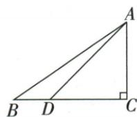
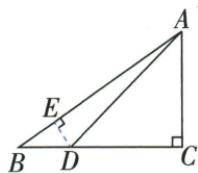
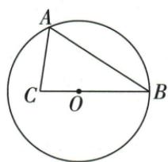
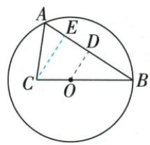

## 讲解

### 判据

目标BAD所在ABD不直角，先从D向目标另一边AB作垂线，造小形ADE。

### 流程

1.先由ADC45与DC6求AC6，原sinB3/5得AB10，再勾股BC8/BD2。2.DE⊥AB后同B角给DE=BD×3/5=6/5，BE勾股8/5。3.B-E-A按序，AE10−8/5=42/5。4.tanBAD=DE/AE1/7，每一段来源清楚。5.圆弦题同样过C作CE⊥AB，先已有R5，再共角给BE6/CE4.5，AE2，正切9/4。

## 例题

### 六腿直角点D角四十五作垂AB求BAD正切七分一

> 来源ID Q27-06；第27章锐角三角函数；301-350/full.md 第3021–3023行。原答案与解析定位：301-350/full.md 第3025–3041行。

例4 如图, 在 Rt△ABC 中, ∠C=90°, sin B=3/5, 点 D 在 BC 边上, 且 ∠ADC=45°, DC=6, 求 ∠BAD 的正切值.

**原资料答案与解析：**

解析 如图, 过点 D 作 $DE \perp AB$ 于点 E,

在 Rt△ADC 中，∠C=90°，∠ADC=45°，DC=6，∴∠DAC=45°，∴AC=DC=6.

在 Rt△ABC 中，∠C=90°，sin B= $\frac{AC}{AB}=\frac{3}{5}$ ，∴ AB= $\frac{5}{3}$ AC=10.

由勾股定理, 得 $BC = \sqrt{AB^{2} - AC^{2}} = \sqrt{10^{2} - 6^{2}} = 8$ , ∴ BD = BC - DC = 8 - 6 = 2.

在 Rt△BDE 中，∠BED=90°，sin B= $\frac{DE}{BD}=\frac{3}{5}$ ，∴ DE= $\frac{3}{5}$ BD= $\frac{6}{5}$ .

由勾股定理, 得 $BE=\sqrt{BD^{2}-DE^{2}}=\sqrt{2^{2}-\left(\frac{6}{5}\right)^{2}}=\frac{8}{5}, \therefore AE=AB-BE=10-\frac{8}{5}=\frac{42}{5}$ ,

$$
\therefore \tan \angle B A D = \frac {D E}{A E} = \frac {6}{5} \times \frac {5}{4 2} = \frac {1}{7}.
$$

**展开解析（依据原详解补足理由与步骤）：**

△ADC中C90、D45，AC=DC6。原sinB=AC/AB3/5，AB10；勾股BC²=100−36=64，BC8，所以BD=8−6=2。为使目标BAD落直角形，过D作DE⊥AB于E。

在△BDE中同一个B角sinB=DE/BD3/5，DE=2×3/5=6/5；勾股BE²=2²−(6/5)²=64/25，BE8/5。原B-E-A序，AE=AB−BE=10−8/5=42/5。△ADE中tanBAD=DE/AE=(6/5)/(42/5)=1/7。每个函数比都在它所在的直角三角内，不能用非直角△ABD的BD/AB替目标正切。

### 圆弦8余弦四五先半弦求R5再作C垂线tanBAC九四

> 来源ID Q27-19；第27章锐角三角函数；301-350/full.md 第3474–3487行。原答案与解析定位：301-350/full.md 第3489–3512行。

例3 如图, 在 $\odot O$ 中, 弦 $AB$ 的长为 8 , 点 $C$ 在 $BO$ 的延长线上, 且 $\cos \angle ABC = \frac{4}{5}, OC = \frac{1}{2} OB$ .

(1) 求 $\odot O$ 的半径.

(2) 求 $\angle BAC$ 的正切值.

**原资料答案与解析：**

解析（1）过点 $O$ 作 $OD \perp AB$ ，垂足为 $D, \because AB = 8, \therefore AD = BD = \frac{1}{2} AB = 4,$

在 Rt△OBD 中， $\cos\angle ABC=\frac{4}{5},\therefore OB=\frac{BD}{\cos\angle ABC}=\frac{4}{\frac{4}{5}}=5,\therefore\odot O$ 的半径为 5.

(2) 过点 $C$ 作 $CE \perp AB$ , 垂足为 $E$ , $\because OC = \frac{1}{2} OB, OB = 5, \therefore BC = \frac{3}{2} OB = 7.5$ . 在 Rt $\triangle BCE$ 中, $\cos \angle ABC = \frac{4}{5}$ ,

$$
\therefore B E = B C \cdot \cos \angle A B C = 7. 5 \times \frac {4}{5} = 6, \therefore A E = A B - B E = 8 - 6 = 2, C E = \sqrt {B C ^ {2} - B E ^ {2}} = \sqrt {7 . 5 ^ {2} - 6 ^ {2}} = 4. 5,
$$

∴ 在 Rt△ACE 中, $\tan\angle BAC=\frac{CE}{AE}=\frac{4.5}{2}=\frac{9}{4}$ , ∴ $\angle BAC$ 的正切值为 $\frac{9}{4}$ .

**展开解析（依据原详解补足理由与步骤）：**

(1)作OD⊥AB，圆心垂弦给BD=AD4。原B-O-C共线且B到O/C同射线，所以ABC与OBD在B的角相同，cosABC=BD/OB4/5，OB5。(2)OC=OB/2=2.5，B-O-C序给BC=7.5；过C作CE⊥AB于E。小BCE中BE=BCcosABC=7.5×4/5=6，CE²=7.5²−6²=20.25，CE4.5。原B-E-A序，AE=AB−BE8−6=2；直角ACE给tanBAC=CE/AE4.5/2=9/4。虽然C在圆内不是圆周点，不能套直径圆周角作C90，直角来自新作CE。

## 易错

一个角移到新直角形，函数值相同，但斜边/邻对边需要重新识别。
