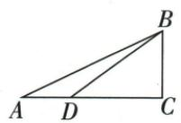
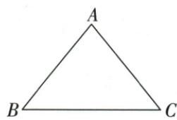

## 讲解

### 判据

已知两边或边角，优先选只含原已知量与一个未知量的关系，逐步补其余元素。

### 流程

1.a8/B60，a是B邻腿，用cosB=a/c求c16、tanB=b/a求b8√3，A30。2.c10/B45，斜边直接乘sin/cos得两腿5√2，A45。3.两腿2√6/6√2求tanA√3/3认A30/B60，勾股c4√6。4.c3√10/b3√5求sinB√2/2认B45，再勾股a3√5。5.每小问核三边勾股和两角互余；不能跨小问沿用边值。

## 例题

### 解直角四组条件分别三四六十与等腰四十五

> 来源ID Q27-14；第27章锐角三角函数；301-350/full.md 第3217–3222行。原答案与解析定位：301-350/full.md 第3224–3262行。

例1 在 Rt△ABC 中, ∠C=90°, ∠A, ∠B, ∠C 的对边分别是 a, b, c, 根据下列条件, 解直角三角形:

(1) $a = 8, \angle B = 60^{\circ}$ .   
(2) $c=10,\angle B=45^{\circ}.$   
(3) $a=2\sqrt{6},b=6\sqrt{2}.$   
(4) $c=3\sqrt{10},b=3\sqrt{5}.$

**原资料答案与解析：**

解析（1） $\angle A = 90^{\circ} - 60^{\circ} = 30^{\circ}$

$$
c = \frac {a}{\cos B} = \frac {8}{\frac {1}{2}} = 1 6,
$$

$$
b = a \cdot \tan B = 8 \times \tan 6 0 ^ {\circ} = 8 \sqrt {3}.
$$

(2) $\angle A = 90^{\circ} - 45^{\circ} = 45^{\circ}$ ,

$$
b = c \cdot \sin B = 1 0 \times \sin 4 5 ^ {\circ} = 5 \sqrt {2},
$$

$$
a = c \cdot \cos B = 1 0 \times \sin 4 5 ^ {\circ} = 5 \sqrt {2}.
$$

(3) $\tan A = \frac{a}{b} = \frac{2\sqrt{6}}{6\sqrt{2}} = \frac{\sqrt{3}}{3}, \therefore \angle A =$

$$
3 0 ^ {\circ}, \therefore \angle B = 9 0 ^ {\circ} - 3 0 ^ {\circ} = 6 0 ^ {\circ}.
$$

$$
c = \sqrt {a ^ {2} + b ^ {2}} = \sqrt {2 4 + 7 2} = 4 \sqrt {6}.
$$

(4) $\sin B = \frac{b}{c} = \frac{3\sqrt{5}}{3\sqrt{10}} = \frac{\sqrt{2}}{2}, \therefore \angle B$

$$
= 4 5 ^ {\circ}, \therefore \angle A = 9 0 ^ {\circ} - 4 5 ^ {\circ} = 4 5 ^ {\circ}.
$$

$$
a = \sqrt {c ^ {2} - b ^ {2}} = \sqrt {9 0 - 4 5} = 3 \sqrt {5}.
$$

**展开解析（依据原详解补足理由与步骤）：**

四小问分别使用自己的已知条件。原$c$为$\angle C=90^\circ$的对边，所以始终是斜边。

（1）$a=8$、$\angle B=60^\circ$。互余给$\angle A=90^\circ-60^\circ=30^\circ$。对$B$而言，$a$是邻直角边，故$\cos B=a/c=1/2$。两边乘$c$再乘2，得$c=2a=16$。又$\tan B=b/a=\sqrt3$，两边乘$a$得$b=a\sqrt3=8\sqrt3$。

（2）$c=10$、$\angle B=45^\circ$。互余给$\angle A=45^\circ$。$\sin B=b/c=\sqrt2/2$，两边乘$c$，得$b=10\times\sqrt2/2=5\sqrt2$；$\cos B=a/c=\sqrt2/2$同理给$a=5\sqrt2$。原解析后一行把$\cos45^\circ$又写成$\sin45^\circ$；两值在45°时恰好相同，但求邻边的依据仍是余弦，不能把两种定义混用。

（3）$a=2\sqrt6$、$b=6\sqrt2$。$\tan A=a/b=(2\sqrt6)/(6\sqrt2)=\sqrt3/3$，且$A$为锐角，故$\angle A=30^\circ$、$\angle B=60^\circ$。勾股给$c^2=a^2+b^2=24+72=96$，长度取正，$c=\sqrt{96}=4\sqrt6$。

（4）$c=3\sqrt{10}$、$b=3\sqrt5$。$\sin B=b/c=\sqrt2/2$，$B$在锐角范围内，所以$\angle B=45^\circ$、$\angle A=45^\circ$。勾股给$a^2=c^2-b^2=90-45=45$，取正长度得$a=\sqrt{45}=3\sqrt5$。不能把上一小问的边长代入这一问。

### 公共直角腿6与四三小正切求大邻腿12和cosA

> 来源ID Q27-18；第27章锐角三角函数；301-350/full.md 第3462–3464行。原答案与解析定位：301-350/full.md 第3466–3468行。

例2 如图, 在 Rt△ABC 中, ∠C=90°, 点 D 是 AC 边上一点, $\tan\angle DBC=\frac{4}{3}$ , 且 BC=6, AD=4. 求 $\cos A$ 的值.

**原资料答案与解析：**

解析 在 Rt△DBC 中, ∠C=90°, BC=6, tan∠DBC= $\frac{CD}{BC}=\frac{4}{3}$ , ∴ CD=8, ∴ AC=AD+CD=12.

在 Rt△ABC 中, 由勾股定理得 $AB=\sqrt{AC^{2}+BC^{2}}=\sqrt{12^{2}+6^{2}}=6\sqrt{5}$ , ∴ $\cos A=\frac{AC}{AB}=\frac{12}{6\sqrt{5}}=\frac{2\sqrt{5}}{5}$ .

**展开解析（依据原详解补足理由与步骤）：**

小△DBC中C90，tanDBC=CD/BC4/3，BC6，所以CD8；A-D-C序使AC=AD+DC4+8=12。大△ABC斜边AB²=12²+6²=180，AB6√5。A邻腿AC12，cosA=AC/AB=12/(6√5)=2√5/5。若直接用小形CD8作为大形AC，就会得错误边比；公共BC桥接两个直角形。

### 等腰边5sin底角四五作高半底3求BC6逐项

> 来源ID Q27-23；第27章锐角三角函数；301-350/full.md 第3709–3725行。原答案与解析定位：301-350/full.md 第3657–3667行。

例1（2024甘肃临夏州）如图，在 $\triangle ABC$ 中， $AB=AC=5, \sin B=\frac{4}{5}$ ，则BC的长是 （）

A.3

B.6

C.8

D.9

**原资料答案与解析：**

例1 解析 过点 A 作 $AD \perp BC$ 于点 D, ∵ AB = AC, ∴ BD = CD.

$$
\begin{array}{r l} & {\text {在} \mathrm{Rt} \triangle A B D \text {中}, A D = A B \cdot \sin B =} \\ & {5 \times \frac {4}{5} = 4, \therefore B D = \sqrt {A B ^ {2} - A D ^ {2}} =} \end{array}
$$

$$
\sqrt {5 ^ {2} - 4 ^ {2}} = 3, \therefore B C = 2 B D = 6.
$$

答案 B

**展开解析（依据原详解补足理由与步骤）：**

等腰AB=AC5，顶点高AD也是底边中线。小直角ABD中AD=ABsinB=5×4/5=4；BD²=5²−4²=9，BD3，BC2BD6，B。A3只算半底；C8把高4倍2；D9是半底平方误当长度。虽原ABC非直角，作高后B角仍同一锐角，才可用定义。

## 易错

只有两角没有尺度边不能求具体三边；反求角需锐角唯一性。
