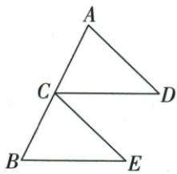

## 错法

原ABP、ACP的AP共同、BP=CP、A共同，凑三项便叫SAS；A不是AP和BP两边的夹角，而且未给两直角。

## 正解

SAS角须在两给边共同顶点，原A不符合；HL需先两个直角、等斜边与腿，原未具备。可以添第三边或真正夹角，原开放题AD=CE补SSS，不能任添非夹角。

## 例题

### 原SSA与AAA两组反例图明确缺失判据

> 来源ID Q20-33；第20章全等三角形；201-250/full.md 第2698–2702；2820–2824行。原答案与解析定位：201-250/full.md 第2698–2702行；201-250/full.md 第2820–2824行。

“边边角”（或“SSA”）：两边和其中一边的对角分别相等的两个三角形全等. （×）

解读：如图，在 $\triangle ABP$ 和 $\triangle ACP$ 中， $\angle A = \angle A, AP = AP, BP = CP$ ，满足“SSA”，但它们不全等.

“角角角”（或 “AAA”）：三个角分别相等的两个三角形全等. （×）

解读：如图，在 $\triangle ABC$ 和 $\triangle ADE$ 中， $\angle A = \angle A, \angle ADE = \angle B, \angle AED = \angle C$ ，满足 “AAA”，但它们不全等（形状相同但大小不相等）.

**原资料答案与解析：**

“边边角”（或“SSA”）：两边和其中一边的对角分别相等的两个三角形全等. （×）

解读：如图，在 $\triangle ABP$ 和 $\triangle ACP$ 中， $\angle A = \angle A, AP = AP, BP = CP$ ，满足“SSA”，但它们不全等.

“角角角”（或 “AAA”）：三个角分别相等的两个三角形全等. （×）

解读：如图，在 $\triangle ABC$ 和 $\triangle ADE$ 中， $\angle A = \angle A, \angle ADE = \angle B, \angle AED = \angle C$ ，满足 “AAA”，但它们不全等（形状相同但大小不相等）.

**展开解析（依据原详解补足理由与步骤）：**

原SSA图ABP与ACP共有AP及A角，BP=CP，但给定角A不夹在已给AP、BP之间，另一侧交点B、C可在同一射线上不同位置，不能固定第三边，原两三角不全等。原AAA图ABC与ADE三个对应角等，却一个是另一个放大或缩小，边未等，不能全等。原后段AAA图另接完整原文，结论只是相似或缺尺寸，不新增数值反例。直角三角形若等的是斜边与一腿，可以用HL；这是一组额外直角前提，不能当一般SSA合法。

### 给两边添加夹角或第三边判全等

> 来源ID Q20-18；第20章全等三角形；201-250/full.md 第3152–3164行。原答案与解析定位：201-250/full.md 第3195–3197行。

例1（2024 山东德州）如图，C 是 AB 的中点，CD = BE，请添加一个条件：\_\_\_\_，使 $\triangle ACD \cong \triangle CBE$ .

**原资料答案与解析：**

例1 解析 在有两边分别相等的基础上,添加这两边的夹角相等或第三边相等均可判定两三角形全等.

答案 $AD = CE$ （答案不唯一）

**展开解析（依据原详解补足理由与步骤）：**

C是AB中点，AC=CB；原CD=BE。△ACD与△CBE对应A-C、C-B、D-E，已有两边。原答案AD=CE补第三边，SSS成立。另一合法选项需写它们的夹角ACD=CBE，配AC/CB、CD/BE形成SAS。原题开放只需一种，保原AD=CE完整证明。若添一个不夹在两已知边之间的角，一般SSA不能保证；不能因三项数量足够便任添角。
