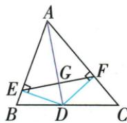

## 错法

原欲AD中垂EF，只证直角便结束，或只凭DE=DF便断AD为中垂。

## 正解

定义需直角+中点；等距判定先只让D在线上，还需AE=AF让不同A也在线，才能两点定线得AD重合。原两个完整证明分别补全两条件或两点。

## 例题

### 角平分配两垂足双证AD垂直平分EF

> 来源ID Q21-04；第21章等腰三角形；201-250/full.md 第3910–3910行。原答案与解析定位：201-250/full.md 第3912–3918行。

例2 如图所示,AD 平分 $\angle BAC, DE \perp AB, DF \perp AC$ , 垂足分别为 E, F, 连接 EF, EF 与 AD 交于点 G. 求证: AD 垂直平分 EF.

**原资料答案与解析：**

证明 证法一:∵ AD 平分 ∠BAC, DE⊥AB, DF⊥AC, ∴ DE=DF, ∠EAG=∠FAG. 在 Rt△AED 和 Rt△AFD 中, AD=AD, DE=DF, ∴ Rt△AED≌Rt△AFD, ∴ AE=AF. 又 ∠EAG=∠FAG, AG=AG, ∴ △AEG≌△AFG. ∴ EG=FG, ∠AGE=∠AGF=90°. ∴ AD 垂直平分 EF.

证法二：∵ AD 平分 $\angle BAC, DE \perp AB, DF \perp AC, \therefore DE = DF.$ 又∵ AD = AD, ∴ Rt $\triangle AED \cong Rt \triangle AFD.$ ∴ AE = AF. ∴ 点 A 在 EF 的垂直平分线上. 又由 DE = DF 知点 D 在 EF 的垂直平分线上,

∴ AD 垂直平分 EF.

**展开解析（依据原详解补足理由与步骤）：**

AD内部平分BAC、DE⊥AB、DF⊥AC，先角平分距离性质得DE=DF；两直角小三角AED、AFD以AD公共斜边及等腿DE/DF用HL，得AE=AF。原法一：在AEG、AFG中AE=AF、EAG=FAG、AG共同，SAS全等，EG=FG、AGE=AGF；E-G-F共线令两邻补等角各90°，于是垂直且平分两条件俱有。原法二：AE=AF使A在EF中垂线，DE=DF使D也在其上，A≠D，两点唯一确定的AD就是EF中垂线。原全等未写SAS和HL依据的地方补齐。
