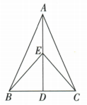
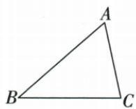
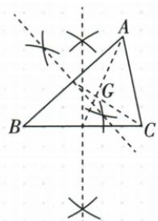

## 错法

连续两次减半给1便答BEC，或ABG5被当六小块之一乘6；都未识目标包含哪些区域。

## 正解

原BEC是BDE和CDE两块1相加得2；原ABG是连重心三顶点的三等份之一，不是六份最小块，整体15。先给每一块角名再换比例。

## 例题

### 连续两中线等底等高分块求2平方厘米

> 来源ID Q19-06；第19章三角形；201-250/full.md 第1898–1898行。原答案与解析定位：201-250/full.md 第1900–1906行。

例3 如图所示, 在 $\triangle ABC$ 中, $AD, CE$ 分别是 $\triangle ABC$ , $\triangle ACD$ 的中线, 若 $\triangle ABC$ 的面积是 $4 \mathrm{~cm}^{2}$ , 则 $\triangle BEC$ 的面积是 \_\_\_\_.

**原资料答案与解析：**

解析 因为 AD 是 $\triangle ABC$ 的中线, 所以 $S_{\triangle ABD} = S_{\triangle ACD} = \frac{1}{2} S_{\triangle ABC} = 2 \, cm^{2}$ .

因为 CE 是 $\triangle ACD$ 的中线, 所以 BE 是 $\triangle ABD$ 的中线, $S_{\triangle CDE} = \frac{1}{2} S_{\triangle ACD} = 1 \, cm^{2}$ ,

所以 $S_{\triangle BDE}=\frac{1}{2}S_{\triangle ABD}=1\ cm^{2}$ ，所以 $S_{\triangle BEC}=S_{\triangle BDE}+S_{\triangle CDE}=2\ cm^{2}$ .

答案 $2 \mathrm{~cm}^{2}$

**展开解析（依据原详解补足理由与步骤）：**

AD是ABC中线，BD=DC，所以ABD与ACD等底同高，各4/2=2 cm²。CE是ACD中线，E是AD中点，AE=ED；同一个E也使BE为ABD中线。因此CDE是ACD的一半，BDE是ABD的一半，各1 cm²。E到B、C连线组成BEC，D在BC上，故BEC由BDE、CDE无重叠组成，总1+1=2 cm²。另一核法：E在AD中点，E到BC的高为A到BC高的一半，因此同底BC的BEC面积亦为ABC一半。不能把连续两次减半1 cm²当最后答案，那只是小块CDE。

### 尺规两条中线交点重心及三等面积15

> 来源ID Q19-09；第19章三角形；201-250/full.md 第1950–1956行。原答案与解析定位：201-250/full.md 第1969–1981行。

例2 (2024 黑龙江绥化)已知: $\triangle ABC$ .

(1)尺规作图:画出 $\triangle ABC$ 的重心G.(保留作图痕迹,不要求写作法和证明)

(2)在(1)的条件下,连接 AG,BG. 已知 $\triangle ABG$ 的面积等于 $5 \, cm^{2}$ , 则 $\triangle ABC$ 的面积是 \_\_\_\_ $cm^{2}$ .

**原资料答案与解析：**

例2 解析（1）如图，点 G 即为所求作的点.

(2) 设 BC 边的中点为 M，则 $S_{\triangle ABM} = S_{\triangle ACM}, S_{\triangle BGM} = S_{\triangle CGM}, \therefore S_{\triangle ABG} = S_{\triangle ACG}$ ，同理得 $S_{\triangle ACG} = S_{\triangle CBG}$ ，又 $\because S_{\triangle ABG} = 5 \, cm^{2}, \therefore S_{\triangle ACG} = S_{\triangle CBG} = 5 \, cm^{2}, \therefore S_{\triangle ABC} = 15 \, cm^{2}.$

故答案为 15.

**展开解析（依据原详解补足理由与步骤）：**

（1）对BC分别以B、C为圆心、同一大于BC/2的半径作两侧相交弧，连两交点得BC垂直平分线，交BC于M；对AC同法取其中点N。连AM、BN，它们交于G，即重心，保留原两对弧和作图线，不靠目测中点。（2）AD或AM中线给ABM与ACM等面积，G在AM又给BGM与CGM等面积；分别相减得ABG=ACG。同理利用另一中线得ACG=BCG。三块无重叠组成ABC，各5 cm²，整体15 cm²。不能把G当BC中点或把一块5当半图；重心分成三个顶点三角形是三等份，三中线再分才是六等份。
