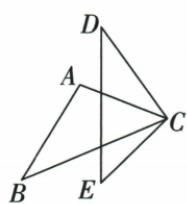

## 错法

原ABC≌CDE中共C就把ACB45直接给DCE45；忽略原字母把C对应E。

## 正解

按A-C、B-D、C-E，CED45，D35，目标DCE100。公共边角只有在当前对应体系下配对才可当对应，不因物理共用就永远对应。

## 例题

### 共C却非对应C的35与45求100

> 来源ID Q20-06；第20章全等三角形；201-250/full.md 第2636–2644行。原答案与解析定位：201-250/full.md 第2666–2668行。

例2（2024 四川成都）如图， $\triangle ABC \cong \triangle CDE$ ，若 $\angle D = 35^{\circ}$ ， $\angle ACB = 45^{\circ}$ ，则 $\angle DCE$ 的度数为 \_\_\_\_.

**原资料答案与解析：**

例2 解析 $\because \triangle ABC \cong \triangle CDE,$ $\angle ACB = 45^{\circ},\therefore \angle CED = \angle ACB =$ $45^{\circ},\therefore \angle DCE = 180^{\circ} - \angle D-$ $\angle CED = 180^{\circ} - 35^{\circ} - 45^{\circ} = 100^{\circ}.$

答案 $100^{\circ}$

**展开解析（依据原详解补足理由与步骤）：**

△ABC≌△CDE给A-C、B-D、C-E。原ACB45°应移到CED45°，不是直接移到DCE。新三角CDE内角和：DCE=180°−D35°−E45°=100°。两三角共享点C，但原C对应新E，按字母顺序核而非位置猜。
