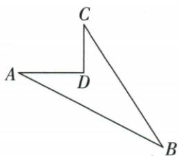

## 错法

原9/15/12套a²+b²=c²说非直角，或凹土地ABC还没判90就写两腿面积。

## 正解

先最大b检a²+c²=b²逆判B90；正向求边则先已有直角且认斜边。土地ADC已直角求共享AC后，ABC三边平方169逆判C90才两腿面积。

## 例题

### 比9比15比12最长b逆判B直角

> 来源ID Q22-16；第22章勾股定理；251-300/full.md 第157–157行。原答案与解析定位：251-300/full.md 第159–171行。

例 在 $\triangle ABC$ 中, $\angle A, \angle B, \angle C$ 所对的边分别是 a, b, c, a:b:c = 9:15:12, 试判断 $\triangle ABC$ 是不是直角三角形.

**原资料答案与解析：**

解析 由题意知 b 是最长边. 设 a=9k (k>0), 则 b=15k, c=12k.

$$
\begin{array}{l} \because a ^ {2} + c ^ {2} = (9 k) ^ {2} + (1 2 k) ^ {2} = 2 2 5 k ^ {2}, \\ b ^ {2} = (1 5 k) ^ {2} = 2 2 5 k ^ {2}, \end{array}
$$

$$
\therefore a ^ {2} + c ^ {2} = b ^ {2},
$$

∴ $\triangle ABC$ 是直角三角形.

注意 $a^2 + b^2 = c^2$ 只是一种常用的表达形式，并非所有情况下 $c$ 都表示斜边。在运用勾股定理的逆定理时，应先确定最长边，而不是直接套用 $a^2 + b^2 = c^2$ 。不要把 $c$ 默认为最长边。

**展开解析（依据原详解补足理由与步骤）：**

共同正倍率k，a9k、b15k、c12k，最长是b。a²+c²=(81+144)k²=225k²=b²，逆定理得直角在最长边b所对的B，不是默认C90。三比量均正且9+12>15。若只写a²+b²≠c²然后判非直角，检错了斜边。

### 凹土地3 4 5再5 12 13逆判作差24平米

> 来源ID Q22-18；第22章勾股定理；251-300/full.md 第238–238行。原答案与解析定位：251-300/full.md 第240–252行。

例2 一块地如图所示, 已知 $AD = 4 \, m, CD = 3 \, m, AD \perp CD, AB = 13 \, m, BC = 12 \, m$ , 则这块地的面积为 \_\_\_\_ $m^{2}$ .

**原资料答案与解析：**

解析 连接 $AC$ ，在 $\triangle ADC$ 中， $\because AD = 4 \mathrm{~m}, CD = 3 \mathrm{~m}, \angle D = 90^{\circ}, \therefore AC = \sqrt{AD^{2} + CD^{2}} = \sqrt{4^{2} + 3^{2}} = 5 (\mathrm{~m})$ ，在 $\triangle ACB$ 中， $\because BC^{2} + AC^{2} = 12^{2} + 5^{2} = 169, AB^{2} = 13^{2} = 169, \therefore BC^{2} + AC^{2} = AB^{2}, \therefore \triangle ABC$ 为直角三角形， $\angle ACB = 90^{\circ}$ .

∴ 这块地的面积为 $S_{\triangle ABC}-S_{\triangle ADC}=\frac{1}{2}\times5\times12-\frac{1}{2}\times3\times4=24(m^{2})$ .

答案 24

**展开解析（依据原详解补足理由与步骤）：**

连AC，ADC已给D90，3/4为腿，AC²=3²+4²=25，AC5。ABC未给直角，需要AC²+BC²=25+144=169=AB²先用逆定理，直角在最长AB对面的C。于是ABC面积5×12/2=30。原D在ABC内部并形成凹四边形A-D-C-B，目标地块是ABC扣ADC，ADC面积3×4/2=6，目标24 m²。与上一凸土地234题不同，此处必须作差；不能照原自动图片说明误称D在AC上，D实际不共线。

### 直角两已知边3与4未给斜边的双分支

> 来源ID Q22-02；第22章勾股定理；201-250/full.md 第4419–4419行。原答案与解析定位：201-250/full.md 第4421–4425行。

例2 在 Rt△ABC 中, AC = 3, AB = 4, 则 BC 的长为 \_\_\_\_.

**原资料答案与解析：**

解析 在 Rt△ABC 中, 当 BC 为斜边时, $BC = \sqrt{AB^{2} + AC^{2}} = \sqrt{4^{2} + 3^{2}} = 5$ ; 当 BC 为直角边时, BC = $\sqrt{AB^{2} - AC^{2}} = \sqrt{4^{2} - 3^{2}} = \sqrt{7}$ .

答案 5 或 $\sqrt{7}$

注意 本题没有说明哪个角是直角、哪条边是斜边，所以要分情况讨论.

**展开解析（依据原详解补足理由与步骤）：**

若BC斜边，两给边为腿，BC²=3²+4²=25，正长BC5；若AB4为斜边，BC²=4²−3²=7，BC=√7。AC3不能为斜边，因为斜边严格长于AB4。两分支均满足正长度与三边关系，答案5或√7。原未规定直角在哪，不能从字母C或随手画图指定。
