## 讲解

### 是什么

连接三角形两边中点的线段叫中位线，它平行第三边且长为第三边一半。中位线连接两个边中点，中线却是顶点连对边中点，两种线的端点及性质不同。

### 怎么来的

一般△ABC，M为AB中点、N为AC中点。延长MN到E使NE=MN，A-N-C、M-N-E按序。△ANM与△CNE有AN=NC、MN=NE、夹角ANM=CNE（对顶），SAS全等，得AM=CE、AMN=CEN，因此AB∥CE。BM=AM=CE；在△BMC与△ECM中BM=EC、MC共同、夹角BMC=ECM（由BM∥CE内错），再SAS全等，得到BC=EM与BCM=EMC；后一等角推出BC∥ME。M-N-E共线，MN=ME/2=BC/2，故结论。原双中点题把这个一般定理分别用于ABD、BCD；原圆题用于ABC的AB与BC中点O、D，得到OD=AC/2。

### 什么时候能用

要先证明两个端点确为相应两边中点，不是任意一条看似水平短线就中位线。中位线长度半关系以非退化三角形和内部中点为背景；中点坐标平均也可核，但不要替换成未证明的图形直觉。

三条中位线分原三角为四个SSS全等小三角，每条小边为一原边半长，周长半原周，四等区域每个原面积四分之一。反向过一边中点且平行另一边，交第二边可证明也是中点：先取该第二边真实中点连线，由正向中位定理同过给定点平行另一边，平行线唯一，两线重合交点相同。原跷跷板以此确认地面M中点；原倍长边或角平分垂线先构新中点后用，不从图近似认为中点。

## 例题

### 双中点作共同对角线中点构造等腰

> 来源ID Q18-17；第18章命题的证明；201-250/full.md 第1348–1363行。原答案与解析定位：201-250/full.md 第1365–1377行。

例6 如图,在四边形ABCD中,AB=CD,E、F分别是BC、AD的中点,BA、CD的延长线分别与EF的延长线交于点M、N.求证: $\angle BME=\angle CNE$ .

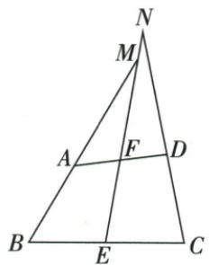

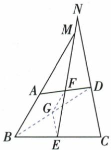

**原资料答案与解析：**

证明 连接 $BD$ , 取 $BD$ 的中点 $G$ , 连接 $GE, GF$ , 如图.

在 $\triangle ABD$ 中， $\because G、F$ 分别是 $BD、AD$ 的中点， $\therefore GF=\frac{1}{2}AB,GF//AB.$

同理可得 $GE = \frac{1}{2} CD, GE \parallel CD$ . $\because AB = CD, \therefore GF = GE. \therefore \angle GEF = \angle GFE.$

$$
\because G F \parallel B M, \therefore \angle G F E = \angle B M E.
$$

$$
\because G E \parallel C N, \therefore \angle G E F = \angle C N E. \therefore \angle B M E = \angle C N E.
$$

**展开解析（依据原详解补足理由与步骤）：**

原图F在AD中点、E在BC中点，AB=CD，但AB与CD未必平行。连BD取其中点G，再连GF、GE。在△ABD中，F、G是两边中点，GF∥AB、GF=AB/2；在△BCD中，G、E是两边中点，GE∥CD、GE=CD/2。AB=CD使GF=GE，△GFE为等腰，所以GEF=GFE。原BM在AB所在直线、CN在CD所在直线、E/F/M/N共线，用GF∥BM和GE∥CN把这两个底角分别移为BME、CNE，得目标相等。辅助点取在同一对角线上，是为了同时进入两原三角形并把两个相等原边都减半；不是随意连任意一点就有中位线。

### 弧中点连半径弦与直径直角多次勾股

> 来源ID Q18-18；第18章命题的证明；201-250/full.md 第1389–1401行。原答案与解析定位：201-250/full.md 第1403–1415行。

例7 如图, $AB$ 是 $\odot O$ 的直径, $P$ 是弧 $BC$ 的中点, $AB = 13$ , $AC = 5$ , 求 $PA$ 的长.

**原资料答案与解析：**

解析 连接 $PB, BC$ , 连接 $OP$ 交 $BC$ 于 $D$ .

∵ P 是弧 BC 的中点, ∴ $OP \perp BC, BD = CD.$

又∵ OA=OB, ∴ $OD=\frac{1}{2}AC=\frac{5}{2}$ . 又∵ $OP=\frac{1}{2}AB=\frac{13}{2}$ , ∴ PD=OP-OD=4.

∵ AB 是 ⊙O 的直径, ∴ $\angle ACB = 90^{\circ}$ . ∵ AB = 13, AC = 5,

$$
\therefore B C = \sqrt {A B ^ {2} - A C ^ {2}} = 1 2, \therefore B D = \frac {1}{2} B C = 6. \therefore P B = \sqrt {P D ^ {2} + B D ^ {2}} = 2 \sqrt {1 3}.
$$

∵ AB 是 $\odot O$ 的直径, ∴ $\angle APB = 90^{\circ}$ , ∴ $PA = \sqrt{AB^{2} - PB^{2}} = 3\sqrt{13}$ .

**展开解析（依据原详解补足理由与步骤）：**

先连PB、BC、OP并令OP交BC于D，原P在不含A的BC弧中点。等弧给BOP=POC，OB=OC、OP共同，由SAS得PB=PC；进一步△BPD与△CPD由SAS全等，故BD=CD，BDP=CDP，两角邻补所以均90°，OP⊥BC。O是AB中点、D是BC中点，△ABC中位线OD=AC/2=5/2；OP为半径=AB/2=13/2。原图O、D、P按序，PD=OP−OD=4。

AB为直径，ACB90°，BC²=13²−5²=144，BC=12，BD=6。在直角△PDB中PB²=PD²+BD²=16+36=52，PB=2√13。AB亦为直径，APB90°，PA²=AB²−PB²=169−52=117，PA=3√13。每次正根来自长度为正。三个不同直角分别来自直径、垂径和直径，不能把未画辅助线的斜段随意当直角边；PD差式依赖原弧中点与点序。

### 中位线池塘3倍回原边6米

> 来源ID Q23-21；第23章平行四边形；251-300/full.md 第1051–1063行。原答案与解析定位：251-300/full.md 第1065–1067行。

例如图，A、B两点被池塘隔开，A、B、C三点不共线.设AC、BC的中点分别为M、N.若MN=3米，则AB=\_\_\_\_.

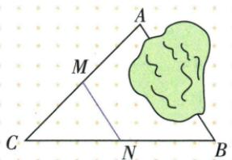

**原资料答案与解析：**

解析 $\because AC, BC$ 的中点分别为 M、N, $\therefore AB = 2MN = 6$ 米.

答案 6 米

**展开解析（依据原详解补足理由与步骤）：**

M/N是AC/BC两个中点，MN为ABC中位线，MN=AB/2，所以AB2×3=6 m。A/B不可测，中点可达M/N线段可测；若只一个中点另一点任意，半长不成立。

### 三中点围顶点四边周长16四项

> 来源ID Q23-22；第23章平行四边形；251-300/full.md 第1102–1125行。原答案与解析定位：251-300/full.md 第1127–1129行。

例1 如图,在 $\triangle ABC$ 中, $AB=6,AC=10$ ,点 $D,E,F$ 分别是 $AB,BC,AC$ 的中点,则四边形 $ADEF$ 的周长是()

( )

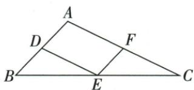

A.8

B.10

C.12

D.16

**原资料答案与解析：**

解析 $\because$ 点 $D, E, F$ 分别是 $AB, BC, AC$ 的中点， $\therefore DE \parallel AC, EF \parallel AB, DE = \frac{1}{2} AC = 5, EF = \frac{1}{2} AB = 3,$ $\therefore$ 四边形 $ADEF$ 是平行四边形， $\therefore AD = EF, DE = AF, \therefore$ 四边形 $ADEF$ 的周长为 $2(DE + EF) = 16.$

# 答案 D

**展开解析（依据原详解补足理由与步骤）：**

D/F在AB/AC中点，AD3、AF5。DE连接AB/BC中点，平行AC且5；EF连接BC/AC中点平行AB且3。ADEF两组对边平行，为平行四边，周长3+5+3+5=16，D。A8只加一组邻边、漏周长另一半；B10只计两长边，C12不满足原四边和。无需已知BC长。

### 延长边等长造新平行四边取得F中点四倍

> 来源ID Q23-23；第23章平行四边形；251-300/full.md 第1131–1131行。原答案与解析定位：251-300/full.md 第1133–1149行。

例2 如图, 点 E 为平行四边形 ABCD 的边 DC 的延长线上一点, 且 CE = DC, 连接 AE 交 BC 于点 F, 连接 AC、BD 交于点 O, 连接 OF. 求证: DE = 4OF.

**原资料答案与解析：**

证明 连接 BE.∵ 四边形 ABCD 是平行四边形,∴ $AB \parallel CD, AB = CD, BO = DO,$ ∴ $AB \parallel CE.$ 又∵ DC = CE, ∴ AB = CE.

∴ 四边形 ABEC 是平行四边形, ∴ F 是 BC 的中点.

又∵ O 是 BD 的中点, ∴ OF 是 $\triangle BCD$ 的中位线, ∴ CD = 2OF.

$$
\because C D = C E, \therefore D E = 2 C D = 4 O F.
$$

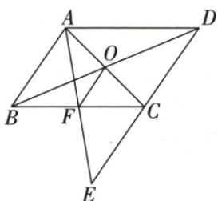

**展开解析（依据原详解补足理由与步骤）：**

AB=DC=CE且AB∥CE，ABEC是一组对边平行且等的平行四边。AE、BC是它对角，交F互平分，所以F是BC中点；原O是BD中点。BCD中OF连接BC/BD中点，中位线OF=CD/2。原D-C-E顺序与CE=CD，DE2CD=4OF。倍数一层从新四边中点，一层从延长同长段，不能直接称F原图显然中点。

### 角平分垂线延长造BH中点再DE半CH1

> 来源ID Q23-24；第23章平行四边形；251-300/full.md 第1155–1159行。原答案与解析定位：251-300/full.md 第1161–1175行。

例3 如图, 在 $\triangle ABC$ 中, $AD$ 平分 $\angle BAC, AD \perp BD$ , $E$ 为 $BC$ 的中点.

(1) 求证: $DE \parallel AC$ .

(2) 若 AB=4, AC=6, 求 DE 的长.

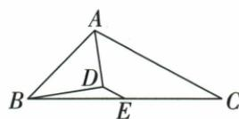

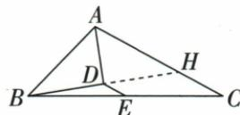

**原资料答案与解析：**

解析 (1) 证明: 如图, 延长 BD 交 AC 于点 H.

∵ AD 平分 ∠BAC, ∴ ∠BAD = ∠HAD.

$\because AD \perp BD, \therefore \angle ADB = \angle ADH = 90^{\circ}.$

在 $\triangle ADB$ 和 $\triangle ADH$ 中， $\angle BAD = \angle HAD, AD = AD, \angle ADB = \angle ADH.$

$\therefore \triangle ADB \cong \triangle ADH(ASA) \therefore BD = HD \therefore D$ 为 $BH$ 的中点.

又 E 为 BC 的中点, ∴ DE 为 △BHC 的中位线, ∴ DE // AC.

(2) $\because \triangle ADB \cong \triangle ADH, \therefore AH = AB = 4, \therefore CH = AC - AH = 2.$

由(1)知 DE 为 $\triangle BHC$ 的中位线, $\therefore DE = \frac{1}{2} CH = 1$ .

**展开解析（依据原详解补足理由与步骤）：**

延BD交AC于H。原AD角平分使BAD=HAD，BD⊥AD使ADB=ADH90、AD共同夹边，ASA全等ADB/ADH，BD=DH、AB=AH4。原B-D-H共线D内部，所以D为BH中点；E为BC中点，在BHC中DE平行HC（同AC）且CH/2。原A-H-C按序CH6−4=2，DE1。不能把DE说ABC中位线，它用的是新BHC。

### 交叉四边两中点另取BD中点造等腰再平行搬角

> 来源ID Q23-25；第23章平行四边形；251-300/full.md 第1177–1177行。原答案与解析定位：251-300/full.md 第1179–1221行。

例4 如图所示,在四边形 ADBC 中,AB 与 CD 相交于点 O,AB=CD,E,F 分别是 BC,AD 的中点,连接 EF,分别交 DC,AB 于点 M,N,判断 $\triangle OMN$ 的形状,并说明理由.

**原资料答案与解析：**

解析 $\triangle OMN$ 是等腰三角形. 理由如下:

如图,取BD的中点H.连接HE,HF.

∵ E, F 分别是 BC, AD 的中点, ∴ $HF \parallel AB$ , $HE \parallel CD$ , $HF = \frac{1}{2} AB$ , $HE = \frac{1}{2} CD$ ,

$$
\because A B = C D, \therefore H F = H E, \therefore \angle H F E = \angle H E F.
$$

$$
\because H F \parallel A B, H E \parallel C D, \therefore \angle H F E = \angle O N M, \angle H E F = \angle O M N, \therefore \angle O N M = \angle O M N.
$$

∴ OM=ON，即 $\triangle OMN$ 是等腰三角形.

**展开解析（依据原详解补足理由与步骤）：**

OMN等腰OM=ON。取BD中点H，E为BC中点、F为AD中点，分别在BCD/ABD中中位线HE∥CD、HF∥AB，HE=CD/2、HF=AB/2。给AB=CD使HE=HF，同HEF等腰HFE=HEF。两组平行把它们分别搬成ONM/OMN，目标同三角底角相等，OM=ON。H不必落EF，原辅助两条中位线才桥接跨三角等角。

### 中位平行转B70再内角65四项

> 来源ID Q23-26；第23章平行四边形；251-300/full.md 第1227–1237行。原答案与解析定位：251-300/full.md 第1247–1257行。

例1（2024四川广安）如图，在 $\triangle ABC$ 中，点 $D,E$ 分别是 $AC,BC$ 的中点，若 $\angle A=45^{\circ},\angle CED=70^{\circ}$ ，则 $\angle C$ 的度数为()

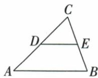

A. $45^{\circ}$

B. $50^{\circ}$

C.60°

D.65°

**原资料答案与解析：**

例1 解析 由题知 DE 是 $\triangle ABC$ 的中位线, 则 DE // AB,

$$
\therefore \angle C E D = \angle B = 7 0 ^ {\circ},
$$

$$
\therefore \angle C = 1 8 0 ^ {\circ} - 4 5 ^ {\circ} - 7 0 ^ {\circ} = 6 5 ^ {\circ}.
$$

答案 D

**展开解析（依据原详解补足理由与步骤）：**

D/E为AC/BC中点，DE∥AB。CE与CB同线同向，CED对应ABC70；C180−A45−B70=65，D。A45误把C与A设相等，B50/C60均使三角总不180。原70不是内C，须先搬到B。

### 跷跷板中点高40双倍端高80

> 来源ID Q23-27；第23章平行四边形；251-300/full.md 第1239–1243行。原答案与解析定位：251-300/full.md 第1259–1263行。

例2（2024 海南）如图是跷跷板示意图, 支柱 OM 经过 AB 的中点 O,

OM 与地面 CD 垂直于点 M, OM = 40 cm, 当跷跷板的一端 A 着地时, 另一端 B 离地面的高度为 \_\_\_\_ cm.

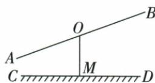

**原资料答案与解析：**

例2 解析 过点 B 作 $BE \perp CD$ 于点 E, 当一端 A 着地时, 可得 OM 是 $\triangle ABE$ 的中位线,

∴ BE = 2OM = 80 cm, 即另一端 B 离地面的高度为 80 cm.

答案 80

**展开解析（依据原详解补足理由与步骤）：**

过B作BE⊥地面，A着地且O为AB中点。OM∥BE，两角同位与AO=OB说明沿AB中点平行截AE也到中点M；也可由中位线逆/ASA等份证明。于是OM是ABE中位线，BE=2OM80 cm。关键A高度0与O中点，不能把40直接作B高或两端都加40。

### 菱形周长20中点E中位线OE2点5四项

> 来源ID Q23-40；第23章平行四边形；251-300/full.md 第1744–1765行。原答案与解析定位：251-300/full.md 第1767–1777行。

例1 如图,菱形ABCD的周长为20,对角线AC、BD相交于点O,E是CD的中点,则OE的长是()

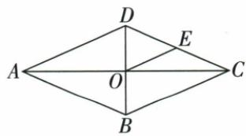

A.2.5

B.3

C.4

D.5

**原资料答案与解析：**

解析 ∵ 四边形 ABCD 为菱形, 周长为 20, ∴ DO = BO, BC = 20 ÷ 4 = 5,

∵ O 是 BD 的中点, E 是 CD 的中点,

∴ OE 为 $\triangle BCD$ 的中位线，

$$
\therefore O E = \frac {1}{2} B C = 2. 5.
$$

答案 A

**展开解析（依据原详解补足理由与步骤）：**

边BC20/4=5，O为BD中点、E为CD中点，BCD中位OE=BC/2=2.5，A。B3/C4无法与半5相等，D5是整BC没有半长。不需对角具体读数。原2.5OCR小数空格正文恢复，原证据保留。

### 菱形AB中点OE3中位反求边6四项

> 来源ID Q23-44；第23章平行四边形；251-300/full.md 第1889–1897行。原答案与解析定位：251-300/full.md 第1869–1875行。

例1（2024 山东济宁）如图,菱形 ABCD 的对角线 AC,BD 相交于点 O,E 是 AB 的中点,连接 OE. 若 OE =3,则菱形的边长为 ( )

A.6

B.8

C.10

D.12

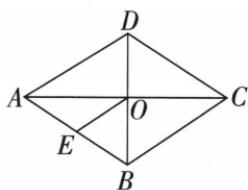

**原资料答案与解析：**

例1 解析：菱形的对角线互相平分，∴ O 为 AC 的中点，

∵ E 是 AB 的中点，

$\therefore BC=2OE=6,$ 即菱形边长为 6.

答案 A

**展开解析（依据原详解补足理由与步骤）：**

O是AC中点，E是AB中点，ABC中OE=BC/2；OE3使BC6，A。B8/C10/D12都不满足原半长3。原图50cfd...放在后一个标题下面但属于本题中点图，补接到此，第二题原图f6...才给四对角。

### 原中点四边形对角性质转四边类型与半面积

> 来源ID Q23-63；第23章平行四边形；251-300/full.md 第1075–1086行。原答案与解析定位：251-300/full.md 第1075–1086行。

# 知识点 ③ 中点四边形★☆☆

1. 定义：顺次连接四边形各边中点所得的四边形叫作中点四边形。如图，点 E、F、G、H 分别为四边形 ABCD 各边的中点，则四边形 EFGH 为中点四边形。

# 2.重要结论

(1) 连接对角线相等的四边形各边的中点所得的中点四边形是菱形（如连接矩形各边的中点所得的中点四边形为菱形）.  
(2) 连接对角线互相垂直的四边形各边的中点所得的中点四边形是矩形(如连接菱形各边的中点所得的中点四边形为矩形).  
(3) 连接对角线既垂直又相等的四边形各边的中点所得的中点四边形是正方形.  
(4) 中点四边形的面积等于原四边形面积的一半.

**原资料答案与解析：**

# 知识点 ③ 中点四边形★☆☆

1. 定义：顺次连接四边形各边中点所得的四边形叫作中点四边形。如图，点 E、F、G、H 分别为四边形 ABCD 各边的中点，则四边形 EFGH 为中点四边形。

# 2.重要结论

(1) 连接对角线相等的四边形各边的中点所得的中点四边形是菱形（如连接矩形各边的中点所得的中点四边形为菱形）.  
(2) 连接对角线互相垂直的四边形各边的中点所得的中点四边形是矩形(如连接菱形各边的中点所得的中点四边形为矩形).  
(3) 连接对角线既垂直又相等的四边形各边的中点所得的中点四边形是正方形.  
(4) 中点四边形的面积等于原四边形面积的一半.

**展开解析（依据原详解补足理由与步骤）：**

连AC/BD，原AB/CD中点组组成两三角中位线：EF/GH各平行AC且半AC；FG/HE各平行BD且半BD，所以新四边总是平行四边。AC=BD让新四边邻边等，菱形；AC⊥BD使新邻边垂直，矩形；两者兼有正方。原凸四边面积半：四角的小三角各为其所属大三角两半边SAS相似半尺度，面积各四分之一；A/C两块共原ABC+ADC的一四分之一，B/D两块共ABD+CBD一四分之一，合原面积一半，剩新中点区也一半。也可先将两大三角各以中位线分出四等块证面积比，避免未经依据的比平方。凹/自交需区分普通面积或有向区域，本章原凸图。

## 易错

原AB=CD并不直接给GF=GE，先得到GF=AB/2、GE=CD/2，再等量代换。原圆题D为弦BC中点需先由弧中点与全等证明，不能提前用中位线结论倒证D中点。
