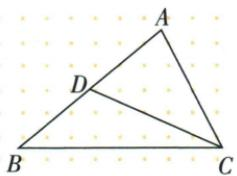

## 讲解

### 是什么

顶点连接对边中点的线段叫三角形中线。AD是ABC中线，D在BC内部且BD=DC=BC/2；这不说明AD垂直BC，也不说明它平分A角。中线将原三角形分成两个等面积三角形。

### 怎么来的

△ABD与△ACD从同一顶点A到底线BC，垂高相同，底BD=DC，所以面积分别BD×h/2和DC×h/2相等，各占原面积一半。原中点周长差题在另一边AB上取D，用AD=BD消周长等长部分，仍须分清中点属于哪条边。原连两中线题AD分原面积4为2和2，E在AD中点，使BE、CE各分一块2为1和1，最终BEC是两个1相加。等面积来自等底同高，而非两个小三角形全等。

### 什么时候能用

原三角形和所选对边必须明确，线段止于这条对边中点。BG经过中点G后延长到E，BE是射线方向上的更长段，不能替BG称ABD的中线。任意非退化三角形都有三条内部中线；只有等腰顶点到底边时中线才与高和角平分合一。

## 例题

### 中点周长差消去公共线段

> 来源ID Q19-02；第19章三角形；201-250/full.md 第1755–1766行。原答案与解析定位：201-250/full.md 第1768–1768行。

例2 如图, 点 D 是边 AB 的中点, $\triangle BCD$ 的周长比 $\triangle ACD$ 的周长大 3 cm, BC = 8 cm, 则边 AC 的长为 \_\_\_\_ cm.

**原资料答案与解析：**

答案 5

**展开解析（依据原详解补足理由与步骤）：**

D是AB中点，AD=BD；CD同时属于BCD和ACD。两周长相减：

$$P_{BCD}-P_{ACD}=(BC+BD+CD)-(AC+AD+CD)=BC-AC=3\ \mathrm{cm}.$$

代BC8得8−AC=3，两边加AC减3，AC=5 cm。中点消去AD、BD，公共边消去CD；题说“大3”，必须按BCD减ACD，不能反向。无需求CD，也不能把周长差误解成两三角面积差。

### 四条重要线段分别检查三角形与真实端点

> 来源ID Q19-04；第19章三角形；201-250/full.md 第1844–1844行。原答案与解析定位：201-250/full.md 第1846–1862行。

例1 如图, 在 $\triangle ABC$ 中, $\angle BAD=\angle CAD$ , $G$ 为 $AD$ 的中点, $BG$ 的延长线交 $AC$ 于点 $E$ , $F$ 为 $AB$ 上的一点, $CF$ 与 $AD$ 垂直, 交 $AD$ 于点 $H$ , 则下面结论: ① $AD$ 是 $\triangle ABE$ 的角平分线; ② $BE$ 是 $\triangle ABD$ 的边 $AD$ 上的中线; ③ $CH$ 是 $\triangle ACD$ 的边 $AD$ 上的高; ④ $AH$ 是 $\triangle ACF$ 的角平分线和高. 其中正确的有\_\_\_\_.(填序号)

**原资料答案与解析：**

解析 由 $\angle BAD = \angle CAD$ ，可知 $AD$ 平分 $\angle BAE$ ，但 $AD$ 不是 $\triangle ABE$ 内的线段，故①错误；

BE 经过 $\triangle ABD$ 的边 AD 的中点 G, 但 BE 不是 $\triangle ABD$ 内的线段, 故②错误;

$CH \perp AD$ 于 H, 由三角形的高的定义可知, CH 是 $\triangle ACD$ 的边 AD 上的高, 故③正确;

因为 $AH$ 平分 $\angle FAC$ 且 $H$ 在 $CF$ 上, 所以 $AH$ 是 $\triangle ACF$ 的角平分线, 又因为 $AH \perp CF$ , 所以 $AH$ 也是 $\triangle ACF$ 的高, 故④正确.

答案 ③④

**展开解析（依据原详解补足理由与步骤）：**

①AD方向确平分BAE，但△ABE角平分线应从A止于BE上的G，所以是AG，AD超出该三角形，错。②BE经过AD中点G，但△ABD以AD为底的中线应从B止于G，所以BG才是中线，BE超出原三角形，错。③C是△ACD顶点，H在AD所在直线且CH⊥AD，所以CH是AD上的高，对。④F在AB、H在CF，AH平分FAC且AH⊥CF，故AH同时是△ACF内部角平分线与高，对。答③④。角平分线和中线的终点须在相应有限对边上；高的垂足允许在对边延长线上。

### 连续两中线等底等高分块求2平方厘米

> 来源ID Q19-06；第19章三角形；201-250/full.md 第1898–1898行。原答案与解析定位：201-250/full.md 第1900–1906行。

例3 如图所示, 在 $\triangle ABC$ 中, $AD, CE$ 分别是 $\triangle ABC$ , $\triangle ACD$ 的中线, 若 $\triangle ABC$ 的面积是 $4 \mathrm{~cm}^{2}$ , 则 $\triangle BEC$ 的面积是 \_\_\_\_.

**原资料答案与解析：**

解析 因为 AD 是 $\triangle ABC$ 的中线, 所以 $S_{\triangle ABD} = S_{\triangle ACD} = \frac{1}{2} S_{\triangle ABC} = 2 \, cm^{2}$ .

因为 CE 是 $\triangle ACD$ 的中线, 所以 BE 是 $\triangle ABD$ 的中线, $S_{\triangle CDE} = \frac{1}{2} S_{\triangle ACD} = 1 \, cm^{2}$ ,

所以 $S_{\triangle BDE}=\frac{1}{2}S_{\triangle ABD}=1\ cm^{2}$ ，所以 $S_{\triangle BEC}=S_{\triangle BDE}+S_{\triangle CDE}=2\ cm^{2}$ .

答案 $2 \mathrm{~cm}^{2}$

**展开解析（依据原详解补足理由与步骤）：**

AD是ABC中线，BD=DC，所以ABD与ACD等底同高，各4/2=2 cm²。CE是ACD中线，E是AD中点，AE=ED；同一个E也使BE为ABD中线。因此CDE是ACD的一半，BDE是ABD的一半，各1 cm²。E到B、C连线组成BEC，D在BC上，故BEC由BDE、CDE无重叠组成，总1+1=2 cm²。另一核法：E在AD中点，E到BC的高为A到BC高的一半，因此同底BC的BEC面积亦为ABC一半。不能把连续两次减半1 cm²当最后答案，那只是小块CDE。

### 尺规两条中线交点重心及三等面积15

> 来源ID Q19-09；第19章三角形；201-250/full.md 第1950–1956行。原答案与解析定位：201-250/full.md 第1969–1981行。

例2 (2024 黑龙江绥化)已知: $\triangle ABC$ .

(1)尺规作图:画出 $\triangle ABC$ 的重心G.(保留作图痕迹,不要求写作法和证明)

(2)在(1)的条件下,连接 AG,BG. 已知 $\triangle ABG$ 的面积等于 $5 \, cm^{2}$ , 则 $\triangle ABC$ 的面积是 \_\_\_\_ $cm^{2}$ .

**原资料答案与解析：**

例2 解析（1）如图，点 G 即为所求作的点.

(2) 设 BC 边的中点为 M，则 $S_{\triangle ABM} = S_{\triangle ACM}, S_{\triangle BGM} = S_{\triangle CGM}, \therefore S_{\triangle ABG} = S_{\triangle ACG}$ ，同理得 $S_{\triangle ACG} = S_{\triangle CBG}$ ，又 $\because S_{\triangle ABG} = 5 \, cm^{2}, \therefore S_{\triangle ACG} = S_{\triangle CBG} = 5 \, cm^{2}, \therefore S_{\triangle ABC} = 15 \, cm^{2}.$

故答案为 15.

**展开解析（依据原详解补足理由与步骤）：**

（1）对BC分别以B、C为圆心、同一大于BC/2的半径作两侧相交弧，连两交点得BC垂直平分线，交BC于M；对AC同法取其中点N。连AM、BN，它们交于G，即重心，保留原两对弧和作图线，不靠目测中点。（2）AD或AM中线给ABM与ACM等面积，G在AM又给BGM与CGM等面积；分别相减得ABG=ACG。同理利用另一中线得ACG=BCG。三块无重叠组成ABC，各5 cm²，整体15 cm²。不能把G当BC中点或把一块5当半图；重心分成三个顶点三角形是三等份，三中线再分才是六等份。

## 易错

连续两次一半得到1的是某小块，不是原BEC整个目标；中线等面积不保证两块形状相同或周长相同。原BCD与ACD周长仍可相差3。
