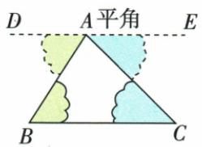
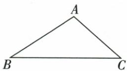
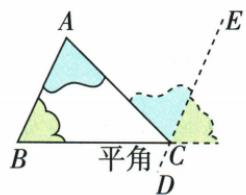

## 讲解

### 是什么

平面内非共线三点连接成非退化三角形，其三个内角都大于0°小于180°，和恒为180°。定理关于三个内部角，不把外角或把顶点标成全角360°混进和式。

### 怎么来的

过顶点A作与BC平行的直线，取其两向射线。AB为截线，把B角移成A处平行线一侧的内错角；AC为截线把C角移成另一侧的内错角。这两个移来的角与原A角相邻、不重叠，拼成平角180°，故A+B+C=180°。这使用先前已学的平行性质，不由测量三次角度猜总和。原同旁平分线题借半角和90°，在△MNG内从180°减去它得G90°；原反证题借恒定180°排除三角都>60°。

### 什么时候能用

适用于平面非退化三角形，不需等腰、直角或特殊尺寸。未知一内角可用180°减已知另两角；若已知两角和≥180°，就不能构成非退化三角形。用来从两对应角相等推第三角相等，是AAS判定的依据之一。

原本章给过A、过C两种辅助平行线证明和剪拼直观图：正式证明用内错角将另两内角移到同一顶点，再与原角拼平角。原题给两个内角分别为$80^\circ$、$25^\circ$时，第三角为$180^\circ-80^\circ-25^\circ=75^\circ$，三个角都小于$90^\circ$，所以是锐角三角形。原题角度比为$1:2:3$时，设三角分别为$x$、$2x$、$3x$，由$x+2x+3x=180^\circ$得$6x=180^\circ$，再同除6得$x=30^\circ$；三角为$30^\circ$、$60^\circ$、$90^\circ$，所以是直角三角形。原题$\angle A=\angle B/2=\angle C/6$时，令$\angle A=x$，则$\angle B=2x$、$\angle C=6x$；内角和给$9x=180^\circ$，所以$x=20^\circ$，三角为$20^\circ$、$40^\circ$、$120^\circ$，所以是钝角三角形。内角和也说明最多一个直角或钝角、至少一角≥60°，同时前章反证已给至少一角≤60°，两句不冲突。

## 例题

### 同旁内角内部平分线互相垂直

> 来源ID Q18-09；第18章命题的证明；201-250/full.md 第1072–1092行。原答案与解析定位：201-250/full.md 第1144–1168行。

例1 求证:如果两条平行线被第三条直线所截,那么同旁内角的平分线互相垂直.

证明 已知: 如图, 直线 AB、CD 被直线 EF 所截, 交点分别为 M、N, $AB \parallel CD$ , MG 平分 $\angle BMN$ , NG 平分 $\angle DNM$ .

求证: $MG \perp NG.$

**原资料答案与解析：**

证明：AB∥CD，所以∠BMN+∠DNM=180°（两直线平行，同旁内角互补）。MG平分∠BMN，NG平分∠DNM，所以

$$\angle GMN=\frac12\angle BMN,\qquad\angle GNM=\frac12\angle DNM.$$

因此

$$\angle GMN+\angle GNM=\frac12(\angle BMN+\angle DNM)=90^\circ.$$

由三角形内角和定理，∠G=180°−(∠GMN+∠GNM)=90°，所以MG⊥NG（垂直的定义）。原拆行公式合并恢复，原文本仍存证据CSV。

**展开解析（依据原详解补足理由与步骤）：**

题设为AB∥CD，EF在M、N分别截两线，MG和NG是相应同旁内角内部平分线。结论MG⊥NG。由同旁内角性质BMN+DNM=180°；半角定义给GMN=BMN/2、GNM=DNM/2，所以GMN+GNM=180°/2=90°。两内部平分线在所示同侧相交于G，△MNG内角和180°，故MGN=180°−90°=90°，于是MG⊥NG。

$$\angle GMN+\angle GNM=\frac12(\angle BMN+\angle DNM)=90^\circ,\qquad\angle MGN=180^\circ-90^\circ=90^\circ.$$

使用内部平分线和两角互补，而不是任意两角的平分线；若把一条内部平分线换成其反向延长，需先核实际两条所在直线关系，不把角图中的射线方向省掉。

### 反证至少一个角不大于60度

> 来源ID Q18-14；第18章命题的证明；201-250/full.md 第1289–1289行。原答案与解析定位：201-250/full.md 第1291–1295行。

例3 求证:三角形中至少有一个角不大于60°.

**原资料答案与解析：**

证明 已知 $\triangle ABC$ . 求证: $\angle A$ 、 $\angle B$ 、 $\angle C$ 中至少有一个角不大于 $60^{\circ}$ .

证明:假设 $\triangle ABC$ 中的 $\angle A、\angle B、\angle C$ 都大于 $60^{\circ}$ ，则 $\angle A+\angle B+\angle C>3\times60^{\circ}=180^{\circ}$

这与三角形内角和定理相矛盾,所以假设不成立,故三角形中至少有一个角不大于 $60^{\circ}$ .

**展开解析（依据原详解补足理由与步骤）：**

“至少一个≤60°”的否定是“三个全部>60°”，不是“至少一个>60°”，也不是“三个全部≥60°”。保留它们是同一非退化三角形三个内角，假设全大于60°后相加，A+B+C>60°+60°+60°=180°；内角和定理又给A+B+C=180°，矛盾。故原否定假设不成立，至少一角≤60°。等边三角形三角恰60°，说明结论中的等号不能删。

### 原60度反证过程选择方法

> 来源ID Q18-21；第18章命题的证明；201-250/full.md 第1511–1519行。原答案与解析定位：201-250/full.md 第1539–1541行。

例1（2023 湖南衡阳）我们可以用以下推理来证明“在一个三角形中，至少有一个内角小于或等于 $60^{\circ}$ ”. 假设三角形没有一个内角小于或等于 $60^{\circ}$ ，即三个内角都大于 $60^{\circ}$ ，则三角形的三个内角的和大于 $180^{\circ}$ . 这与“三角形的内角和等于 $180^{\circ}$ ”这个定理矛盾. 所以在一个三角形中，至少有一个内角小于或等于 $60^{\circ}$ . 上述推理使用的证明方法是（）

A. 反证法

B. 比较法

C. 综合法

D. 分析法

**原资料答案与解析：**

例1 解析 先假设原结论不成立,再推出矛盾,进而证明原命题是真命题,这是典型的反证法的证明思路.

答案 A

**展开解析（依据原详解补足理由与步骤）：**

原推理先假设结论“至少一角≤60°”不成立，得到三角全部>60°，再由总和>180°与定理180°矛盾，最后撤销假设。A反证法恰符合这一结构，正确。B比较法只能描述比较角大小，未概括本题先否定再矛盾的完整方法；C综合法通常从原已知直接顺推目标，本题增加了否定结论的假设；D分析法通常为找足以证明目标的条件而逆推，本題却是假设目标反面。选A。不能只看过程中有顺推就把整段命名综合法。

### 原66与54度高求30度

> 来源ID Q19-11；第19章三角形；201-250/full.md 第2017–2028行。原答案与解析定位：201-250/full.md 第2030–2030行。

例2 如图, 在 $\triangle ABC$ 中, $\angle ABC=66^{\circ}$ , $\angle ACB=54^{\circ}$ , $BE$ 是边 $AC$ 上的高, 则 $\angle ABE$ 的度数为\_.

**原资料答案与解析：**

答案 $30^{\circ}$

**展开解析（依据原详解补足理由与步骤）：**

ABC内角和给A=180°−66°−54°=60°。E在AC上，BE⊥AC，使AEB90°。在ABE中ABE=180°−90°−A60°=30°。不是直接用90°−B66°，那个24°对应另一部分EBC，而目标ABE的远端是A；用30+24=66回验可核角名。

### 三种角关系求最大角分类

> 来源ID Q19-14；第19章三角形；201-250/full.md 第2253–2255行。原答案与解析定位：201-250/full.md 第2257–2262行。

例2 符合下列条件的 $\triangle ABC$ 是锐角三角形、直角三角形还是钝角三角形？

(1) $\angle A = 80^{\circ}, \angle B = 25^{\circ}$ . (2) $\angle A: \angle B: \angle C = 1:2:3$ . (3) $\angle A = \frac{1}{2} \angle B = \frac{1}{6} \angle C$ .

**原资料答案与解析：**

解析（1）因为 $\angle A = 80^{\circ},\angle B = 25^{\circ}$ ，所以 $\angle C = 180^{\circ} - \angle A - \angle B = 180^{\circ} - 80^{\circ} - 25^{\circ} = 75^{\circ}.$

因为 $\angle A$ 是最大角且为锐角，所以 $\triangle ABC$ 是锐角三角形

(2) 设 $\angle A = x^{\circ}$ ，则 $\angle B = 2x^{\circ}, \angle C = 3x^{\circ}$ ，因为 $\angle A + \angle B + \angle C = 180^{\circ}$ ，所以 $x + 2x + 3x = 180$ ，解得 x = 30，所以最大角 $\angle C = 3x^{\circ} = 3 \times 30^{\circ} = 90^{\circ}$ ，所以 $\triangle ABC$ 是直角三角形.  
(3) 设 $\angle A = x^{\circ}$ , 则 $\angle B = 2x^{\circ}, \angle C = 6x^{\circ}$ , 所以 $x + 2x + 6x = 180$ , 解得 $x = 20$ , 所以最大角 $\angle C = 6x^{\circ} = 6 \times 20^{\circ} = 120^{\circ}$ , 所以 $\triangle ABC$ 是钝角三角形.

**展开解析（依据原详解补足理由与步骤）：**

（1）C=180°−80°−25°=75°，最大A80°<90°，锐角。（2）比例1:2:3，设A=x，B=2x、C=3x，6x=180°，x=30°，三角30、60、90，最大90，直角。（3）A=B/2=C/6说明B=2A、C=6A，不是A:B:C=1:1/2:1/6。设A=x，9x=180°，x=20°，三角20、40、120，最大120，钝角。分类看最大内角，单有一锐角无法判断整体，因为所有非退化三角形至少有两个锐角。

### 原内角和两种辅助平行证明

> 来源ID Q19-20；第19章三角形；201-250/full.md 第2062–2101行。原答案与解析定位：201-250/full.md 第2062–2101行。

# 3.三角形内角和定理的证明

过A作 $DE \parallel BC$ ，推出

$$
\angle B A C + \angle B + \angle C = 1 8 0 ^ {\circ}
$$

过C作 $DE \parallel AB$ ，推出

$$
\angle A + \angle B + \angle A C B = 1 8 0 ^ {\circ}
$$

**原资料答案与解析：**

# 3.三角形内角和定理的证明

过A作 $DE \parallel BC$ ，推出

$$
\angle B A C + \angle B + \angle C = 1 8 0 ^ {\circ}
$$

过C作 $DE \parallel AB$ ，推出

$$
\angle A + \angle B + \angle A C B = 1 8 0 ^ {\circ}
$$

**展开解析（依据原详解补足理由与步骤）：**

过A作DE∥BC，用AB截得到DAB=B，用AC截得到CAE=C；DAB、BAC、CAE拼为平角，所以A+B+C=180°。原另法过C作DE∥AB：BC截给相应移来的角等B，AC截给另一移来的角等A，与原C角拼平角，也得到同一结论。两种法都依平行性质及相邻角和，原剪拼三角图展示直观，不用量三角角度替代一般证明。

## 易错

原至少一角结论是≤60°，等边三角形恰全60°合法，不能强化为必有<60°。平分线题要先确保三个角属于同一△MNG，不能随拿图中三角就凑180°。
