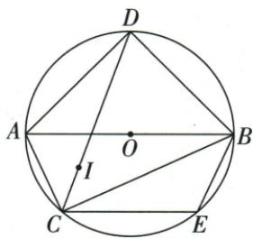

## 讲解

### 是什么

三角形一个内角的平分射线与对边交于一点，顶点到这点的有限线段叫三角形角平分线。它在三角形内部，终点必须在有限对边上。三个内角平分线交于内部一点，叫内心，它到三边所在直线的垂直距离相等。

### 怎么来的

从角的射线平分定义截取到对边的部分，保留两半角相等，但对象由无限射线变成有限线段，所以方向对而终点越界的AD也可能不是所问小三角形的平分线。共点理由可借等距离：两条内角平分线交于I，第一给I到AB、AC距离等，第二给I到AB、BC距离等，传递得I到CA、CB距离等。反向距离性质可用两直角三角形共同斜边、等垂距，勾股使另一直角边相等，再三边全等得到C处两角等；I在内部，故也在C内角平分线上。这说明第三条经过同一I，而非只由三条线画得近似相交判断。

### 什么时候能用

适用于非退化三角形内部。外角平分线可能交在外部，其交点不叫本三角形内心。原尺规F虽在三角形外，射线AF仍平分角，但三角形平分线取A到与BC交点为止。若问别的小三角形，重新核它的对边与终点。

内部到三条边线等距只有一个内心；允许边的所在整直线与外部区域，另三个旁心也满足，原图四交点保留。两外角平分AP、CP的交点P，通过三垂距传递可判MBN内平分，但不一定是原ABC内部内心。性质与判定都依实际角区域，不能仅凭三距等把四点混成一类。

内心I是两条内部角平分线的交点，位于三角内部；其到这两角相邻边的垂距相等，传递得三边垂距同一正数r。以I为圆心、r为半径，三条边所在直线均切圆，且切点落各有限边内：垂足在对应角内的边射线上，而相邻另一顶角也给同一边的垂足在反向射线上，合起来落线段内部。因此存在唯一内切圆，第三内部角平分线也过I。外心到顶点等，内心到边垂距等；原35半角计算、平移角周长4、CI延至圆的DI=AD=BD都各用内心角平分，与圆心身份不混。

## 例题

### 四条重要线段分别检查三角形与真实端点

> 来源ID Q19-04；第19章三角形；201-250/full.md 第1844–1844行。原答案与解析定位：201-250/full.md 第1846–1862行。

例1 如图, 在 $\triangle ABC$ 中, $\angle BAD=\angle CAD$ , $G$ 为 $AD$ 的中点, $BG$ 的延长线交 $AC$ 于点 $E$ , $F$ 为 $AB$ 上的一点, $CF$ 与 $AD$ 垂直, 交 $AD$ 于点 $H$ , 则下面结论: ① $AD$ 是 $\triangle ABE$ 的角平分线; ② $BE$ 是 $\triangle ABD$ 的边 $AD$ 上的中线; ③ $CH$ 是 $\triangle ACD$ 的边 $AD$ 上的高; ④ $AH$ 是 $\triangle ACF$ 的角平分线和高. 其中正确的有\_\_\_\_.(填序号)

**原资料答案与解析：**

解析 由 $\angle BAD = \angle CAD$ ，可知 $AD$ 平分 $\angle BAE$ ，但 $AD$ 不是 $\triangle ABE$ 内的线段，故①错误；

BE 经过 $\triangle ABD$ 的边 AD 的中点 G, 但 BE 不是 $\triangle ABD$ 内的线段, 故②错误;

$CH \perp AD$ 于 H, 由三角形的高的定义可知, CH 是 $\triangle ACD$ 的边 AD 上的高, 故③正确;

因为 $AH$ 平分 $\angle FAC$ 且 $H$ 在 $CF$ 上, 所以 $AH$ 是 $\triangle ACF$ 的角平分线, 又因为 $AH \perp CF$ , 所以 $AH$ 也是 $\triangle ACF$ 的高, 故④正确.

答案 ③④

**展开解析（依据原详解补足理由与步骤）：**

①AD方向确平分BAE，但△ABE角平分线应从A止于BE上的G，所以是AG，AD超出该三角形，错。②BE经过AD中点G，但△ABD以AD为底的中线应从B止于G，所以BG才是中线，BE超出原三角形，错。③C是△ACD顶点，H在AD所在直线且CH⊥AD，所以CH是AD上的高，对。④F在AB、H在CF，AH平分FAC且AH⊥CF，故AH同时是△ACF内部角平分线与高，对。答③④。角平分线和中线的终点须在相应有限对边上；高的垂足允许在对边延长线上。

### 角平分与平行先20度再整角差100度

> 来源ID Q19-05；第19章三角形；201-250/full.md 第1868–1868行。原答案与解析定位：201-250/full.md 第1870–1892行。

例2 如图, $DE \parallel BC$ , $CD$ 是 $\triangle ACB$ 的角平分线, $\angle B = 60^{\circ}$ , $\angle ACB = 40^{\circ}$ , 求 $\angle EDC$ 与 $\angle BDC$ 的度数.

**原资料答案与解析：**

解析 $\because CD$ 是 $\triangle ACB$ 的角平分线, $\angle ACB = 40^{\circ}$ , $\therefore \angle DCB = \frac{1}{2} \angle ACB = 20^{\circ}$ ,

$$
\because D E \parallel B C, \therefore \angle E D C = \angle D C B = 2 0 ^ {\circ}, \angle B D E + \angle B = 1 8 0 ^ {\circ},
$$

又∵ $\angle B=60^{\circ},\therefore \angle BDE=180^{\circ}-60^{\circ}=120^{\circ},$

$$
\therefore \angle B D C = \angle B D E - \angle E D C = 1 2 0 ^ {\circ} - 2 0 ^ {\circ} = 1 0 0 ^ {\circ}.
$$

**展开解析（依据原详解补足理由与步骤）：**

CD平分ACB40°，DCB20°。DE∥BC，以DC为截线得EDC=DCB=20°。再以AB为截线，BDE与B同旁互补，BDE=180°−60°=120°。原DC在BDE内部，所以BDC=BDE−EDC=120°−20°=100°。也可在△BCD用B60°、C20°求D100°，这是回验，不把图上E的位置或DC内部关系当可随便改变。两目标分别20°、100°。

### 原尺规角平分作图结合高求10度

> 来源ID Q19-08；第19章三角形；201-250/full.md 第1938–1946行。原答案与解析定位：201-250/full.md 第1960–1967行。

例1 (2024 江苏宿迁) 如图, 在 $\triangle ABC$ 中, $\angle B = 50^{\circ}$ , $\angle C = 30^{\circ}$ , $AD$ 是高, 以点 $A$ 为圆心, $AB$ 长为半径画弧, 交 $AC$ 于点 $E$ , 再分别以 $B, E$ 为圆心, 大于 $\frac{1}{2} BE$ 的长为半径画弧, 两弧在 $\angle BAC$ 的内部交于点 $F$ , 作射线 $AF$ , 则 $\angle DAF =$ \_\_\_\_°.

**原资料答案与解析：**

例1 解析∵AD是△ABC的高，
∴∠BDA=90°，又∵∠B=50°，
∠C=30°，∴∠BAD=40°，∠BAC
=100°.由作图可知AF是∠BAC
的平分线，∴∠BAF=50°，
∴∠DAF=10°.

答案 10

**展开解析（依据原详解补足理由与步骤）：**

以A圆心AB长取AC上的E，保证AB=AE；以B、E作两段同半径弧，内部交点F满足BF=EF；AF共同，△ABF与△AEF三边对应相等，SSS全等给BAF=FAE。因此AF是BAC内部平分射线。原B50°、C30°给BAC=180°−50°−30°=100°，BAF50°。AD高给BAD=90°−B50°=40°。原AF在BAC内且位于AD右侧，DAF=BAF−BAD=50°−40°=10°。作图并非量出50°；角平分来源是等半径与全等。F画在三角形外仍在角的内部区域，射线AF的三角形内部段需另止于BC。

### 三种原内外角平分线交角模型

> 来源ID Q19-22；第19章三角形；201-250/full.md 第2147–2187行。原答案与解析定位：201-250/full.md 第2147–2187行。

(1)“双内”模型(图3)

结论: $\angle P=90^{\circ}+\frac{1}{2}\angle A.$

(2)“一内一外”模型(图4)

结论： $\angle P = \frac{1}{2}\angle A.$

(3)“双外”模型(图5)

结论: $\angle P=90^{\circ}-\frac{1}{2}\angle A.$

  
图 3

图 4

图 5

**原资料答案与解析：**

(1)“双内”模型(图3)

结论: $\angle P=90^{\circ}+\frac{1}{2}\angle A.$

(2)“一内一外”模型(图4)

结论： $\angle P = \frac{1}{2}\angle A.$

(3)“双外”模型(图5)

结论: $\angle P=90^{\circ}-\frac{1}{2}\angle A.$

  
图 3

图 4

图 5

**展开解析（依据原详解补足理由与步骤）：**

设原三角形内角A、B、C，和180°。

双内：BP、CP分别内部平分，△BCP在B、C处为B/2、C/2，所以P=180°−(B+C)/2=90°+A/2。

一内一外：BP平分B内角，CP平分C外角180°−C。原P在C外侧，△BCP的C处内角=180°−(180°−C)/2=90°+C/2，故P=180°−B/2−(90°+C/2)=A/2。

双外：BP、CP分别平分两个外角，△BCP在B、C处为(180°−B)/2、(180°−C)/2，所以P=180°−[180°−(B+C)/2]=(B+C)/2=90°−A/2。每次明确△BCP使用的是哪个内角，不能把三种公式混在同一个图。原模型是书中给的无数字示意，不新增自编角值。

### 两条外角平分先三垂距传递再判第三平分

> 来源ID Q20-21；第20章全等三角形；201-250/full.md 第3326–3328行。原答案与解析定位：201-250/full.md 第3330–3340行。

例2 如图, $AP 、 CP$ 分别平分 $\angle MAC 、 \angle ACN$ . 求证: 点 $P$ 在 $\angle MBN$ 的平分线上.

**原资料答案与解析：**

证明 如图, 过点 P 分别作 $PD \perp MB$ 于 D, $PE \perp AC$ 于 E, $PF \perp BN$ 于 F.

∵ AP、CP 分别平分 ∠MAC、∠NCA，

$$
\therefore P D = P E, P E = P F, \therefore P D = P F.
$$

又∵ $PD \perp MB, PF \perp BN, \therefore$ 点 P 在 $\angle MBN$ 的平分线上.

**展开解析（依据原详解补足理由与步骤）：**

过P作PD⊥MB、PE⊥AC、PF⊥BN，垂足可在原三角边延长线上。AP平分MAC给PD=PE；CP平分ACN给PE=PF；等量传递得PD=PF。原P位于MBN内部，两垂距相等，按角平分线判定，BP平分MBN。必须补“在角内部”才能定位这一内平分射线；若只比较三边所在直线，外部旁心也可能等距，不能统一叫内心。

### 原三边所在直线等距四交点图

> 来源ID Q20-36；第20章全等三角形；201-250/full.md 第3225–3241行。原答案与解析定位：201-250/full.md 第3225–3241行。

1. 在三角形内部，到三角形三边的距离相等的点只有 1 个，就是三角形的三条角平分线的交点.

2. 到三角形三边所在直线的距离相等的点共有 4 个，是这个三角形的内角或外角的平分线的交点（如图）.

**原资料答案与解析：**

1. 在三角形内部，到三角形三边的距离相等的点只有 1 个，就是三角形的三条角平分线的交点.

2. 到三角形三边所在直线的距离相等的点共有 4 个，是这个三角形的内角或外角的平分线的交点（如图）.

**展开解析（依据原详解补足理由与步骤）：**

原图三个顶点角的内外平分线产生P₁内部内心和P₂、P₃、P₄三个外部旁心。任意一个点由两组平分线距离性质得到到两对边线等距，公共边线一传递便到第三边线也等距。内部到三边等距只有内心；允许三边所在整直线则另外三旁心也合法。角内部判定的范围在各相应内角或外角中重新核，不把每个外部点都说在原内角内部。图只提供定性四点示意，无额外数值练习。

### 内心半角35转顶70外心倍角140求底20

> 来源ID Q24-24；第24章圆；251-300/full.md 第3554–3566行。原答案与解析定位：251-300/full.md 第3568–3592行。

例4 如图, 点 O 是 $\triangle ABC$ 外接圆的圆心, 点 I 是 $\triangle ABC$ 的内心, 连接 OB, IA. 若 $\angle CAI = 35^{\circ}$ , 则 $\angle OBC$ 的度数为 \_\_\_\_.

**原资料答案与解析：**

解析 连接 OC, ∵ 点 I 是 $\triangle ABC$ 的内心, ∴ AI 平分 $\angle BAC$ ,

$$
\because \angle C A I = 3 5 ^ {\circ},
$$

$$
\therefore \angle B A C = 2 \angle C A I = 7 0 ^ {\circ},
$$

∵ 点 O 是 $\triangle ABC$ 外接圆的圆心，

$$
\therefore \angle B O C = 2 \angle B A C = 1 4 0 ^ {\circ},
$$

$$
\because O B = O C, \therefore \angle O B C = \angle O C B =
$$

$$
\frac {1}{2} \times (1 8 0 ^ {\circ} - \angle B O C) = 2 0 ^ {\circ}.
$$

答案 $20^{\circ}$

**展开解析（依据原详解补足理由与步骤）：**

I内心意味着AI内部平分∠BAC，因此∠BAC=2×35°=70°。O外心，所以OB=OC；按原图A在优弧BC，∠BOC=2∠BAC=140°。等腰△OBC两底角各为(180°−140°)/2=20°，故∠OBC=20°。不能把外心性质用成到边等距，也不能把35°未经倍回就搬成圆心角。

### 内心平移角两等腰替边阴影周长等原AB4

> 来源ID Q24-31；第24章圆；251-300/full.md 第3786–3788行。原答案与解析定位：251-300/full.md 第3790–3800行。

例7 如图, 点 I 为 $\triangle ABC$ 的内心, AB = 4 cm, AC = 3 cm, BC = 2 cm, 将 $\angle ACB$ 平移, 使其顶点与点 I 重合, 则图中阴影部分的周长为 \_\_\_\_.

**原资料答案与解析：**

解析 连接 $AI, BI, \because$ 点 $I$ 为 $\triangle ABC$ 的内心, $\therefore AI$ 和 $BI$ 分别平分 $\angle CAB$ 和 $\angle CBA$ ,

$\therefore \angle CAI = \angle DAI, \angle CBI = \angle EBI.$ 由平移的性质得 $DI \parallel AC, EI \parallel BC,$

$\therefore \angle CAI = \angle DIA, \angle CBI = \angle EIB, \therefore \angle DAI = \angle DIA, \angle EBI = \angle EIB, \therefore DA = DI, EB = EI,$

∴ $DE + DI + EI = DE + DA + EB = AB = 4 \, cm$ ，即图中阴影部分的周长为 $4 \, cm$ .

答案 $4 \mathrm{~cm}$

**展开解析（依据原详解补足理由与步骤）：**

连AI、BI，内心使∠CAI=∠DAI、∠CBI=∠EBI。平移保持方向，DI∥AC、EI∥BC；内错角给∠DIA=∠CAI、∠EIB=∠CBI。因此△ADI有∠DAI=∠DIA，AD=DI；△BEI有∠EBI=∠EIB，BE=EI。阴影△DIE周长DE+DI+EI=DE+AD+BE。原A-D-E-B顺序使这三段合AB=4 cm。AC=3、BC=2用于给定原三角形，不必强行代进周长。

### 内心角平分弧中点及外角证明DI等AD等BD

> 来源ID Q24-35；第24章圆；251-300/full.md 第3955–3969行。原答案与解析定位：251-300/full.md 第3864–3896行。

例4（2024 山东烟台节选）如图, $AB$ 是 $\odot O$ 的直径, $\triangle ABC$ 内接于 $\odot O$ , 点 $I$ 为 $\triangle ABC$ 的内心, 连接 $CI$ 并延长交 $\odot O$ 于点 $D.E$ 是 $\widehat{BC}$ 上任意一点, 连接 $AD, BD, BE, CE$ . 找出图中所有与 $DI$ 相等的线段, 并证明.

**原资料答案与解析：**

例4 解析 ${DI} = {AD} = {BD}$ .

证明: 连接 AI,

∵ 点 I 为 $\triangle ABC$ 的内心，

$$
\therefore \angle C A I = \angle B A I, \angle A C I = \angle B C I,
$$

$$
\therefore \widehat {A D} = \widehat {B D},
$$

$$
\therefore \angle D A B = \angle A C I, A D = B D,
$$

$$
\because \angle D A I = \angle D A B + \angle B A I, \angle D I A =
$$

$$
\angle A C I + \angle C A I,
$$

$$
\therefore \angle D A I = \angle D I A,
$$

$$
\therefore D I = A D = B D.
$$

**展开解析（依据原详解补足理由与步骤）：**

C-I-D按序且CI平分∠ACB，圆周角∠ACD=∠DCB对应两等弧AD、DB，故AD=BD。连AI，内心给∠CAI=∠BAI；同弧BD给∠DAB=∠DCB=∠ACI。按图∠DAI=∠DAB+∠BAI；又∠DIA是△CIA在I处的外角，等于∠ACI+∠CAI。两项分别相等，故∠DAI=∠DIA，△ADI等角对等边得DI=AD，于是DI=AD=BD。E为自由点，BE/CE等长度不能仅凭原条件恒等于DI；这里列出图中由条件保证的两条线段AD、BD。

### 原三角内切半径与面积公式模型

> 来源ID Q24-57；第24章圆；251-300/full.md 第3532–3538行。原答案与解析定位：251-300/full.md 第3532–3538行。

1. 定义：与三角形各边都相切的圆叫作三角形的内切圆。三角形的内切圆的圆心叫作三角形的内心，这个三角形叫作圆的外切三角形。

技巧总结 1. 若三角形的三边长分别为 a、b、c，内切圆的半径为 r，则此三角形的面积 $S=\frac{1}{2}(a+b+c)r$ .

2. 若直角三角形的两条直角边长分别为 a、b，斜边长为 c，则此直角三角形的内切圆的半径 $r=\frac{a+b-c}{2}$ .

2.三角形内心的性质：三角形的内心到三边的距离相等,是三条角平分线的交点.

**原资料答案与解析：**

1. 定义：与三角形各边都相切的圆叫作三角形的内切圆。三角形的内切圆的圆心叫作三角形的内心，这个三角形叫作圆的外切三角形。

技巧总结 1. 若三角形的三边长分别为 a、b、c，内切圆的半径为 r，则此三角形的面积 $S=\frac{1}{2}(a+b+c)r$ .

2. 若直角三角形的两条直角边长分别为 a、b，斜边长为 c，则此直角三角形的内切圆的半径 $r=\frac{a+b-c}{2}$ .

2.三角形内心的性质：三角形的内心到三边的距离相等,是三条角平分线的交点.

**展开解析（依据原详解补足理由与步骤）：**

内心向三边的垂距均为内切半径r，连内心与三个顶点分三角形，面积相加S=ar/2+br/2+cr/2=(a+b+c)r/2。直角三角形S=ab/2，于是r=ab/(a+b+c)。由c²=a²+b²，(a+b−c)(a+b+c)=(a+b)²−c²=2ab；两边除2(a+b+c)>0，得到(a+b−c)/2=ab/(a+b+c)=r。该原模型没有独立求三角内切半径的数值例题，不另造题。

## 易错

原ABE题AD超出BE，AG才是该小三角形角平分线；原ACF题AH恰止于CF，所以合法。不能因同方向就把长度不同的段都叫同一三角形角平分线。
