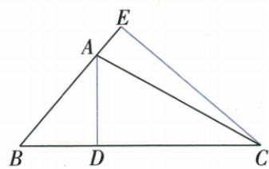

## 讲解

### 是什么

三角形面积等于所选底边长乘对面顶点到该底所在直线的垂直距离，再除2。换底时必须换成相应高。面积单位是长度单位的平方，原题未指定单位就不补造名称。点D在线段BC上时，连AD可将△ABC分成无重叠的ABD和ACD，面积相加。

### 怎么来的

把两个全等三角形沿边拼为平行四边形，拼成图形的底高等于原三角形底高，面积为底×高，原一个占一半，故bh/2。同一个三角形选不同边作底，面积本身不变，因此不同底高积必相等。原斜边高题面积一次3×4/2，另一次5×CD/2，说明除2两边相同可消；原D分底题用两个小面积之和等整面积7，则每小块的高分别取DE、DF。

### 什么时候能用

允许垂足在底边延长线上，仍是到整条底线的距离；底长取给定有限边。分割相加必须D在底边内部或端点，若D在外部须按面积差而非两块直接加。底高同量纲，算长度最后取正，面积不能等于负数。

中线连接对边中点，分出的两个三角形底相等、高相同，故各占原面积一半。原连续中线题中，$S_{\triangle ABC}=4\ \mathrm{cm}^2$，先由$AD$是中线得到$S_{\triangle ABD}=S_{\triangle ACD}=2\ \mathrm{cm}^2$；再由$E$是$AD$中点得到$S_{\triangle BDE}=S_{\triangle CDE}=1\ \mathrm{cm}^2$。目标$\triangle BEC$由这两小块组成，因此$S_{\triangle BEC}=1+1=2\ \mathrm{cm}^2$。第二次减半得到的1只是一小块面积，不能直接作为目标面积。

原两高题中，$CE\perp AB$的垂足在$AB$延长线上，但$CE$仍是到$AB$所在直线的垂直距离。同一个三角形面积不因换底而变，故$AB\times CE/2=BC\times AD/2$；两边同乘2，再代入原题给定长度，得$4\times6=8AD$，即$24=8AD$。两边同除8，得到$AD=3$，长度单位沿原题使用。

三条中线的交点为重心。连重心与三个顶点，组成的三个三角形各占整体面积的$1/3$；若三条中线全部画出，又分成六个小三角形。计算时应先确认题目所指的是三块中的一块还是六块中的一块。

## 例题

### 角平分线等距离配两小三角面积

> 来源ID Q18-11；第18章命题的证明；201-250/full.md 第1184–1192行。原答案与解析定位：201-250/full.md 第1194–1204行。

例3 如图, AD 平分 $\angle BAC, DE \perp AB$ 于点 E, $DF \perp AC$ 于点 F, $S_{\triangle ABC} = 7, DE = 2, AB = 4$ , 则 AC 的长是 \_\_\_\_.

**原资料答案与解析：**

解析 由题意得 DE = DF = 2,

$$
\therefore S _ {\triangle A B C} = \frac {1}{2} \times 4 \times 2 + \frac {1}{2} A C \cdot 2 = 7,
$$

$$
\therefore A C = 3.
$$

答案 3

**展开解析（依据原详解补足理由与步骤）：**

AD平分BAC，DE、DF分别垂直两边，D在角平分线上，所以到两边距离相等，DE=DF=2。这一结论的依据是△AED和△AFD均直角，共斜边AD且∠EAD=DAF，另一锐角也相等，由AAS全等得DE=DF。D在BC上，所以△ABC由△ABD与△ACD不重叠组成，面积相加。

$$7=\frac12\,AB\cdot DE+\frac12\,AC\cdot DF=\frac12\cdot4\cdot2+\frac12\cdot AC\cdot2=4+AC.$$

两边同减4，AC=3。所给2是到各自底边的垂直高，不是两条斜边；没有给单位时沿原题量纲使用，不擅补厘米。不能把D到BC的距离当这两个小三角形的高，因为D就在BC上。

### 直角三角形同面积换底求斜边高

> 来源ID Q18-15；第18章命题的证明；201-250/full.md 第1302–1311行。原答案与解析定位：201-250/full.md 第1313–1315行。

例4 如图, 在 $\triangle ABC$ 中, $\angle ACB = 90^{\circ}$ , AB = 5 cm, BC = 4 cm, CD ⊥ AB 于 D, 求 CD 的长.

**原资料答案与解析：**

解析 在 Rt△ABC 中, 由勾股定理得 $AC=\sqrt{AB^{2}-BC^{2}}=3\ cm$ .

由三角形的面积公式得 $S_{\triangle ABC}=\frac{1}{2}AC\cdot BC=\frac{1}{2}AB\cdot CD,\therefore CD=\frac{AC\cdot BC}{AB}=\frac{12}{5}\mathrm{~cm}.$

**展开解析（依据原详解补足理由与步骤）：**

ACB为直角，AB=5是斜边，BC=4是一条直角边。勾股AC²=AB²−BC²=25−16=9，长度取正，AC=3 cm。以AC为底，BC为高，面积=3×4/2=6 cm²；以AB为底，CD为对应垂高，面积=5CD/2。同一个三角形面积相等，5CD/2=6，两边乘2得5CD=12，再除5，CD=12/5 cm。

$$AC=\sqrt{5^2-4^2}=3\ \mathrm{cm},\qquad\frac12\cdot3\cdot4=\frac12\cdot5\cdot CD\Rightarrow CD=\frac{12}5\ \mathrm{cm}.$$

两种算法底高配对不同，不能把AB与BC当作相互垂直。

### 两正方形连接CF同底平行顶点换面积

> 来源ID Q18-16；第18章命题的证明；201-250/full.md 第1317–1332行。原答案与解析定位：201-250/full.md 第1334–1342行。

例5 如图, 四边形 ABCD 和四边形 CEFG 都是正方形, G 在 CD 上, BC = 10 cm, 求 $S_{四边形ABFD}$ .

**原资料答案与解析：**

解析 连接 CF, 易得 $CF \parallel BD, \therefore S_{\triangle BDF} = S_{\triangle BDC}, \therefore S_{四边形ABFD} = S_{正方形ABCD} = 10 \times 10 = 100 \, (\text{cm}^2)$ .

**展开解析（依据原详解补足理由与步骤）：**

连CF。正方形ABCD的对角线BD与BC成45°，因为△BCD两直角边BC=CD、C角90°，其另两角各45°。正方形CEFG的对角线CF与CE也成45°。原B、C、E共线，两个相等方向角给CF∥BD。因此点F、C到直线BD的垂直距离相等，△BDF、△BDC共底BD、等高，面积相等。原四边形ABFD按边界依次A-B-F-D，BD分为△ABD、△BDF，前一块保留，后一块替换成△BDC，就等于正方形ABCD面积10²=100 cm²。没有要求两个正方形边长相等；G只在CD上，不能把小正方形也当边长10。

### 连续两中线等底等高分块求2平方厘米

> 来源ID Q19-06；第19章三角形；201-250/full.md 第1898–1898行。原答案与解析定位：201-250/full.md 第1900–1906行。

例3 如图所示, 在 $\triangle ABC$ 中, $AD, CE$ 分别是 $\triangle ABC$ , $\triangle ACD$ 的中线, 若 $\triangle ABC$ 的面积是 $4 \mathrm{~cm}^{2}$ , 则 $\triangle BEC$ 的面积是 \_\_\_\_.

**原资料答案与解析：**

解析 因为 AD 是 $\triangle ABC$ 的中线, 所以 $S_{\triangle ABD} = S_{\triangle ACD} = \frac{1}{2} S_{\triangle ABC} = 2 \, cm^{2}$ .

因为 CE 是 $\triangle ACD$ 的中线, 所以 BE 是 $\triangle ABD$ 的中线, $S_{\triangle CDE} = \frac{1}{2} S_{\triangle ACD} = 1 \, cm^{2}$ ,

所以 $S_{\triangle BDE}=\frac{1}{2}S_{\triangle ABD}=1\ cm^{2}$ ，所以 $S_{\triangle BEC}=S_{\triangle BDE}+S_{\triangle CDE}=2\ cm^{2}$ .

答案 $2 \mathrm{~cm}^{2}$

**展开解析（依据原详解补足理由与步骤）：**

AD是ABC中线，BD=DC，所以ABD与ACD等底同高，各4/2=2 cm²。CE是ACD中线，E是AD中点，AE=ED；同一个E也使BE为ABD中线。因此CDE是ACD的一半，BDE是ABD的一半，各1 cm²。E到B、C连线组成BEC，D在BC上，故BEC由BDE、CDE无重叠组成，总1+1=2 cm²。另一核法：E在AD中点，E到BC的高为A到BC高的一半，因此同底BC的BEC面积亦为ABC一半。不能把连续两次减半1 cm²当最后答案，那只是小块CDE。

### 两条高同一个面积配对应底求3

> 来源ID Q19-07；第19章三角形；201-250/full.md 第1912–1912行。原答案与解析定位：201-250/full.md 第1914–1926行。

例4 如图所示,AD,CE是△ABC的两条高,AB=4,BC=8,CE=6,求AD的长.

**原资料答案与解析：**

解析 $S_{\triangle ABC} = \frac{1}{2} AB\cdot CE = \frac{1}{2} BC\cdot AD$ ，又 $\because AB = 4,BC = 8,CE = 6,$

$$
\therefore A D = \frac {A B \cdot C E}{B C} = \frac {4 \times 6}{8} = 3.
$$

**展开解析（依据原详解补足理由与步骤）：**

CE从C垂直AB所在直线，虽E在BA延长线上，它仍是AB对应高；AD是BC对应高。同一ABC面积两种写法：

$$\frac12 AB\cdot CE=\frac12 BC\cdot AD\Rightarrow4\cdot6=8\cdot AD\Rightarrow AD=\frac{24}8=3.$$

原图钝角A，CE位于外部，并不使面积式失效。不能把AB和AD配为底高，AD垂直的是BC；不增造原题未给的单位。

### 尺规两条中线交点重心及三等面积15

> 来源ID Q19-09；第19章三角形；201-250/full.md 第1950–1956行。原答案与解析定位：201-250/full.md 第1969–1981行。

例2 (2024 黑龙江绥化)已知: $\triangle ABC$ .

(1)尺规作图:画出 $\triangle ABC$ 的重心G.(保留作图痕迹,不要求写作法和证明)

(2)在(1)的条件下,连接 AG,BG. 已知 $\triangle ABG$ 的面积等于 $5 \, cm^{2}$ , 则 $\triangle ABC$ 的面积是 \_\_\_\_ $cm^{2}$ .

**原资料答案与解析：**

例2 解析（1）如图，点 G 即为所求作的点.

(2) 设 BC 边的中点为 M，则 $S_{\triangle ABM} = S_{\triangle ACM}, S_{\triangle BGM} = S_{\triangle CGM}, \therefore S_{\triangle ABG} = S_{\triangle ACG}$ ，同理得 $S_{\triangle ACG} = S_{\triangle CBG}$ ，又 $\because S_{\triangle ABG} = 5 \, cm^{2}, \therefore S_{\triangle ACG} = S_{\triangle CBG} = 5 \, cm^{2}, \therefore S_{\triangle ABC} = 15 \, cm^{2}.$

故答案为 15.

**展开解析（依据原详解补足理由与步骤）：**

（1）对BC分别以B、C为圆心、同一大于BC/2的半径作两侧相交弧，连两交点得BC垂直平分线，交BC于M；对AC同法取其中点N。连AM、BN，它们交于G，即重心，保留原两对弧和作图线，不靠目测中点。（2）AD或AM中线给ABM与ACM等面积，G在AM又给BGM与CGM等面积；分别相减得ABG=ACG。同理利用另一中线得ACG=BCG。三块无重叠组成ABC，各5 cm²，整体15 cm²。不能把G当BC中点或把一块5当半图；重心分成三个顶点三角形是三等份，三中线再分才是六等份。

## 易错

原AB5、BC4不垂直，不可算5×4/2；AC3、BC4才是相互垂直的底高。原角平分面积D在BC上，使整图相加成立，不能省点所属。
