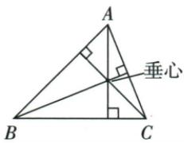
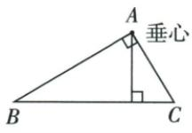
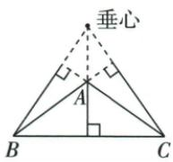
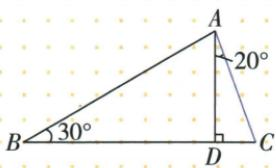
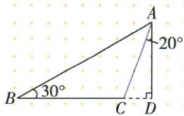

## 讲解

### 是什么

从三角形顶点向对边所在直线作垂线，顶点到垂足的线段是该边上的高。对边所在直线允许延伸；高可能在内部、与一条边重合或在外部。三条高所在直线交于一点叫垂心；钝角图中有限的三条高不必彼此相交，需说所在直线共点。

### 怎么来的

以BC为底、A向其直线作高AD。B与C都锐时，D夹在B、C之间，因为相应直角小三角形沿BC正向展开，投影落在两端之间；若C钝，D在C外侧，若B钝则在B外侧。直角三角形的两直角边互相垂直，所以它们自己就是另一边上的高，垂心位于直角顶点；锐角三个高脚都在相应边内部，钝角有两个高脚在延长线上，原三类配图显示垂心位置。原30°、20°题正是C锐或C钝导致AD在BAC内部或外部，从同一BAD60°取加或差，得到80°、40°。

原书锐角、直角、钝角高与垂心图：

### 什么时候能用

识高时先核指定顶点、目标底线与90°三个对象，垂足须属于该底所在直线。钝角图先延长相应较短边再作垂线。用高算面积时底高必须对应，CE垂AB而AD垂BC；两者都可能有效，外部高不会使bh/2失效。垂心位置是三角形高线性质，原资料无专门垂心求坐标题，不自编补练。

## 例题

### 高脚内部或外部时原角80与40双解

> 来源ID Q19-03；第19章三角形；201-250/full.md 第1772–1772行。原答案与解析定位：201-250/full.md 第1774–1804行。

例3 在 $\triangle ABC$ 中, AD 为边 BC 上的高, $\angle ABC = 30^{\circ}$ , $\angle CAD = 20^{\circ}$ , 则 $\angle BAC = \_\_\_\^\circ$ .

**原资料答案与解析：**

解析 当点 D 在线段 BC 上时, 如图 1, 因为 $\angle ABC = 30^{\circ}, AD \perp BC$ , 所以 $\angle BAD = 60^{\circ}$ . 所以 $\angle BAC = \angle BAD + \angle CAD = 60^{\circ} + 20^{\circ} = 80^{\circ}$ .

图 1

当点 D 在线段 BC 的延长线上时, 如图 2, 因为 $\angle ABC = 30^{\circ}$ , $AD \perp BC$ , 所以 $\angle BAD = 60^{\circ}$ . 所以 $\angle BAC = \angle BAD - \angle CAD = 60^{\circ} - 20^{\circ} = 40^{\circ}$ .

图 2

答案 40 或 80

注意 三角形的高可能在三角形内，也可能在三角形外，注意题目可能出现多解的情况.

**展开解析（依据原详解补足理由与步骤）：**

B30°为锐角，A的垂足D在从B沿BC的正方向，不会位于B另一侧；但D可在B、C之间，也可在C之外。两种原图在直角△ABD中BAD=180°−90°−30°=60°。

第一图D在BC内部，AD在BAC内部，BAC=BAD+DAC=60°+20°=80°。第二图B-C-D按序，AC在BAD内部，BAC=BAD−DAC=60°−20°=40°。两种都满足给定条件：第一C70°，第二C110°，内角均正并和180°。无位置附加条件，答案必须40°或80°。不能把“BC上的高”误读成“垂足一定在线段BC上”，定义中的BC是其所在直线。

### 四条重要线段分别检查三角形与真实端点

> 来源ID Q19-04；第19章三角形；201-250/full.md 第1844–1844行。原答案与解析定位：201-250/full.md 第1846–1862行。

例1 如图, 在 $\triangle ABC$ 中, $\angle BAD=\angle CAD$ , $G$ 为 $AD$ 的中点, $BG$ 的延长线交 $AC$ 于点 $E$ , $F$ 为 $AB$ 上的一点, $CF$ 与 $AD$ 垂直, 交 $AD$ 于点 $H$ , 则下面结论: ① $AD$ 是 $\triangle ABE$ 的角平分线; ② $BE$ 是 $\triangle ABD$ 的边 $AD$ 上的中线; ③ $CH$ 是 $\triangle ACD$ 的边 $AD$ 上的高; ④ $AH$ 是 $\triangle ACF$ 的角平分线和高. 其中正确的有\_\_\_\_.(填序号)

**原资料答案与解析：**

解析 由 $\angle BAD = \angle CAD$ ，可知 $AD$ 平分 $\angle BAE$ ，但 $AD$ 不是 $\triangle ABE$ 内的线段，故①错误；

BE 经过 $\triangle ABD$ 的边 AD 的中点 G, 但 BE 不是 $\triangle ABD$ 内的线段, 故②错误;

$CH \perp AD$ 于 H, 由三角形的高的定义可知, CH 是 $\triangle ACD$ 的边 AD 上的高, 故③正确;

因为 $AH$ 平分 $\angle FAC$ 且 $H$ 在 $CF$ 上, 所以 $AH$ 是 $\triangle ACF$ 的角平分线, 又因为 $AH \perp CF$ , 所以 $AH$ 也是 $\triangle ACF$ 的高, 故④正确.

答案 ③④

**展开解析（依据原详解补足理由与步骤）：**

①AD方向确平分BAE，但△ABE角平分线应从A止于BE上的G，所以是AG，AD超出该三角形，错。②BE经过AD中点G，但△ABD以AD为底的中线应从B止于G，所以BG才是中线，BE超出原三角形，错。③C是△ACD顶点，H在AD所在直线且CH⊥AD，所以CH是AD上的高，对。④F在AB、H在CF，AH平分FAC且AH⊥CF，故AH同时是△ACF内部角平分线与高，对。答③④。角平分线和中线的终点须在相应有限对边上；高的垂足允许在对边延长线上。

### 两条高同一个面积配对应底求3

> 来源ID Q19-07；第19章三角形；201-250/full.md 第1912–1912行。原答案与解析定位：201-250/full.md 第1914–1926行。

例4 如图所示,AD,CE是△ABC的两条高,AB=4,BC=8,CE=6,求AD的长.

**原资料答案与解析：**

解析 $S_{\triangle ABC} = \frac{1}{2} AB\cdot CE = \frac{1}{2} BC\cdot AD$ ，又 $\because AB = 4,BC = 8,CE = 6,$

$$
\therefore A D = \frac {A B \cdot C E}{B C} = \frac {4 \times 6}{8} = 3.
$$

**展开解析（依据原详解补足理由与步骤）：**

CE从C垂直AB所在直线，虽E在BA延长线上，它仍是AB对应高；AD是BC对应高。同一ABC面积两种写法：

$$\frac12 AB\cdot CE=\frac12 BC\cdot AD\Rightarrow4\cdot6=8\cdot AD\Rightarrow AD=\frac{24}8=3.$$

原图钝角A，CE位于外部，并不使面积式失效。不能把AB和AD配为底高，AD垂直的是BC；不增造原题未给的单位。

### 原66与54度高求30度

> 来源ID Q19-11；第19章三角形；201-250/full.md 第2017–2028行。原答案与解析定位：201-250/full.md 第2030–2030行。

例2 如图, 在 $\triangle ABC$ 中, $\angle ABC=66^{\circ}$ , $\angle ACB=54^{\circ}$ , $BE$ 是边 $AC$ 上的高, 则 $\angle ABE$ 的度数为\_.

**原资料答案与解析：**

答案 $30^{\circ}$

**展开解析（依据原详解补足理由与步骤）：**

ABC内角和给A=180°−66°−54°=60°。E在AC上，BE⊥AC，使AEB90°。在ABE中ABE=180°−90°−A60°=30°。不是直接用90°−B66°，那个24°对应另一部分EBC，而目标ABE的远端是A；用30+24=66回验可核角名。

### 高分80再角平分得20最后求100

> 来源ID Q19-17；第19章三角形；201-250/full.md 第2345–2353行。原答案与解析定位：201-250/full.md 第2307–2321行。

例2 (2024 四川凉山州) 如图, $\triangle ABC$ 中, $\angle BCD = 30^{\circ}$ , $\angle ACB = 80^{\circ}$ , $CD$ 是边 $AB$ 上的高, $AE$ 是 $\angle CAB$ 的平分线, 则 $\angle AEB$ 的度数是 \_\_\_\_.

**原资料答案与解析：**

例2 解析 $\because \angle ACB = 80^{\circ},$ $\angle BCD = 30^{\circ},\therefore \angle ACD = 50^{\circ}.$

又∵CD是边AB上的高，

$$
\therefore \angle C A D = 4 0 ^ {\circ}, \angle B = 6 0 ^ {\circ}.
$$

∵ AE 是 $\angle CAB$ 的平分线，

$$
\therefore \angle B A E = 2 0 ^ {\circ}, \therefore \angle A E B = 1 0 0 ^ {\circ}.
$$

答案 $100^{\circ}$

**展开解析（依据原详解补足理由与步骤）：**

原CD在ACB80°内部，BCD30°，ACD=80°−30°=50°。CD⊥AB，在ACD中CAD=90°−50°=40°；A-D-B共线，CAB40°。AE内部平分CAB，BAE20°。在BCD中B=90°−30°=60°，即ABE60°。△ABE内角和给AEB=180°−20°−60°=100°。中间50是C处、40是A处、20是A半角，目标是E处100，不能拿首个差当答案。

## 易错

原警示图CD从C垂AB，不能叫AC边上的高，因为起点应是B；原30/20题未限D在BC有限线段，不能只答80。
