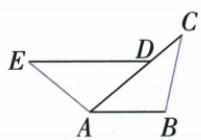
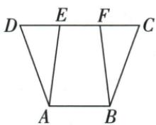
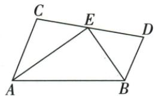
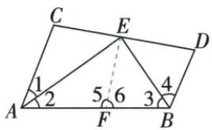
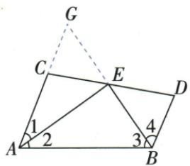

## 讲解

### 是什么

ASA指两角及它们所夹边分别对应相等；AAS指两角及其中一角的对边分别对应相等，即给边不在两给角之间。二者都可判全等，但记录判据时不能把非夹边误叫夹边。

### 怎么来的

ASA的夹边重合后，两端给定角确定指向第三点的两射线，非退化时交点唯一，因此形成完全同形同大的三角形，这是教材基本判据。AAS可化为ASA：两角对应相等，内角和180°使第三角也相等；给定边成为某一对已知角与新增第三角之间的夹边，于是用ASA。原开放题GED=CFD、EDG=FDC且DE=DF，DE、DF连接给定两角顶点，是ASA；若由EG=CF配上述两角，这条边不夹在这两角之间，就是AAS。原角平分距离题共有斜边AD、两对等角，用AAS，不把斜边说成两给角的夹边。

### 什么时候能用

两角要属同一对应顶点系统，边也按该对应配对。仅两角相等没有长度约束，只能确定形状，未确定大小，所以不能判全等。AAS补第三角时必须已有两个三角形内角和条件，不拿外角替内角。

原ASA书写例AB/DA夹在两已知角之间；原AAS同减EF得到DE/CF，是一给定角对边。AAS由两角相等先补第三角再用ASA，理由完整。直角旋转图利用两直角、同角余角及AB=AC等斜边，也是AAS，并非仅三角相等就全等；倍长垂线两次ASA各有自己的公共夹边或原等边。

## 例题

### 角平分线等距离配两小三角面积

> 来源ID Q18-11；第18章命题的证明；201-250/full.md 第1184–1192行。原答案与解析定位：201-250/full.md 第1194–1204行。

例3 如图, AD 平分 $\angle BAC, DE \perp AB$ 于点 E, $DF \perp AC$ 于点 F, $S_{\triangle ABC} = 7, DE = 2, AB = 4$ , 则 AC 的长是 \_\_\_\_.

**原资料答案与解析：**

解析 由题意得 DE = DF = 2,

$$
\therefore S _ {\triangle A B C} = \frac {1}{2} \times 4 \times 2 + \frac {1}{2} A C \cdot 2 = 7,
$$

$$
\therefore A C = 3.
$$

答案 3

**展开解析（依据原详解补足理由与步骤）：**

AD平分BAC，DE、DF分别垂直两边，D在角平分线上，所以到两边距离相等，DE=DF=2。这一结论的依据是△AED和△AFD均直角，共斜边AD且∠EAD=DAF，另一锐角也相等，由AAS全等得DE=DF。D在BC上，所以△ABC由△ABD与△ACD不重叠组成，面积相加。

$$7=\frac12\,AB\cdot DE+\frac12\,AC\cdot DF=\frac12\cdot4\cdot2+\frac12\cdot AC\cdot2=4+AC.$$

两边同减4，AC=3。所给2是到各自底边的垂直高，不是两条斜边；没有给单位时沿原题量纲使用，不擅补厘米。不能把D到BC的距离当这两个小三角形的高，因为D就在BC上。

### 开放三条件任选两条构成真命题并核三种

> 来源ID Q18-13；第18章命题的证明；201-250/full.md 第1263–1274行。原答案与解析定位：201-250/full.md 第1275–1283行。

例2 如图, $EG//AF$ ,请你从下面的三个条件中选出两个作为已知条件,剩下的一个作为结论,构成一个真命题(只需写出一种情况),并证明.①AB=AC;②DE=DF;③BE=CF.

已知: $EG \parallel AF$ , \_\_\_\_.求证: \_\_\_\_.

**原资料答案与解析：**

解析 ①②;③.(答案不唯一,任选两个作为条件,剩下的一个作为结论即为真命题)

证明：∵ $EG \parallel AF, \therefore \angle GED = \angle F, \angle BGE = \angle BCA.$ ∵ AB = AC, ∴ $\angle B = \angle BCA.$

$\therefore \angle B = \angle BGE.\therefore BE = EG.$ 在 $\triangle DEG$ 和 $\triangle DFC$ 中， $\angle GED = \angle F,DE = DF,\angle EDG = \angle FDC,$

$$
\therefore \triangle D E G \cong \triangle D F C, \therefore E G = C F. \therefore B E = C F.
$$

**展开解析（依据原详解补足理由与步骤）：**

原图E在AB、G与D在BC、F在AC的延长线上，D在EF上，EG∥AF。记x=BE、y=EG、z=CF。由EG∥AF，用BC作截线得BGE=BCA，AB=AC等价于B=BCA；由于原△ABC与△BEG都非退化，这进一步等价于BE=EG，即x=y。另EG∥CF，EF与BC交于D，GED=CFD，EDG=FDC对顶，所以△DEG与△DFC在已有两角对应相等时，DE=DF等价于EG=CF，即y=z（分别用ASA或AAS及对应边）。③就是x=z。三等量中的任意两条推出第三条：①②推出③、①③推出②、②③推出①，说明原“答案不唯一”。

按原详解正式写①②⇒③：AB=AC⇒B=BCA=BGE⇒BE=EG；两三角形中GED=CFD、EDG=FDC、DE=DF，由ASA全等（DE、DF夹在两给定角之间），得EG=CF；等量代换得BE=CF。其他两种也须利用相同三线角关系与等腰判定，不能只凭三个原句长得对称就断任两都行。

### ASA原书平行给夹边两端角

> 来源ID Q20-09；第20章全等三角形；201-250/full.md 第2756–2758行。原答案与解析定位：201-250/full.md 第2760–2766行。

书写示例: 如图, 已知 D 是 AC 上一点, $AB = DA$ , $DE \parallel AB$ , $\angle B = \angle DAE$ , 求证 BC = AE.

**原资料答案与解析：**

证明：∵ $DE \parallel AB, \therefore \angle CAB = \angle ADE.$

在 $\triangle ABC$ 和 $\triangle DAE$ 中， $\left\{\begin{aligned}\angle CAB&=\angle ADE,\\ AB&=DA,\\ \angle B&=\angle DAE,\end{aligned}\right.$

$$
\therefore \triangle A B C \cong \triangle D A E (\mathrm{ASA}), \therefore B C = A E.
$$

**展开解析（依据原详解补足理由与步骤）：**

D在AC上，DE∥AB，AC截两线给CAB=ADE。原给AB=DA以及B=DAE，边AB夹在CAB、ABC之间，DA夹在ADE、DAE之间，所以△ABC≌△DAE（ASA），B对应A、C对应E，得到BC=AE。两角不是随便配，夹边两端顶点顺序分别A-B与D-A。

### AAS原书同减EF补DE等CF

> 来源ID Q20-10；第20章全等三角形；201-250/full.md 第2772–2781行。原答案与解析定位：201-250/full.md 第2783–2789行。

书写示例:如图,已知 DF=CE, $\angle DAE=\angle CBF$ , $\angle D=\angle C$ , 求证 $\triangle AED\cong\triangle BFC$ .

**原资料答案与解析：**

证明：∵ DF=CE, ∴ DF-EF=CE-EF, 即 DE=CF,

在 $\triangle AED$ 和 $\triangle BFC$ 中， $\left\{\begin{aligned}\angle DAE&=\angle CBF,\\ \angle D&=\angle C,\\ DE&=CF,\end{aligned}\right.$

$$
\therefore \triangle A E D \cong \triangle B F C (\mathrm{AAS}).
$$

**展开解析（依据原详解补足理由与步骤）：**

原D-E-F-C共线，DF=CE，同减EF得DE=CF。△AED与△BFC有DAE=CBF、D=C、DE=CF。给边DE、CF不夹在两给角之间，但分别是A、B角的对边，所以AAS全等。若需化ASA，两三角第三角E、F由180°减两给角也相等，再用DE/CF与其端点两角即可。

### 两个原直角全等引出另两对与CF等EF双证

> 来源ID Q20-12；第20章全等三角形；201-250/full.md 第2856–2860行。原答案与解析定位：201-250/full.md 第2861–2896行。

例1 如图, 已知 Rt△ABC≌Rt△ADE, ∠ABC = ∠ADE = 90°, 连接 CD、EB.

(1) 图中还有几对全等三角形？请你一一列举.  
(2) 求证: CF = EF.

**原资料答案与解析：**

解析（1）还有2对全等三角形. $\triangle ADC\cong \triangle ABE,\triangle CDF\cong \triangle EBF.$

(2) 证法一: $\because \mathrm{Rt} \triangle ABC \cong \mathrm{Rt} \triangle ADE, \therefore AC = AE, \angle CAB = \angle EAD, AB = AD,$

$$
\therefore \angle C A B - \angle D A B = \angle E A D - \angle D A B, \text { 即 } \angle C A D = \angle E A B, \therefore \triangle A C D \cong \triangle A E B (\mathrm{SAS}),
$$

$$
\therefore C D = E B, \angle A D C = \angle A B E. \text {又} \because \angle A D E = \angle A B C, \therefore \angle C D F = \angle E B F.
$$

$$
\text { 又 } \because \angle D F C = \angle B F E, \therefore \triangle C D F \cong \triangle E B F (\mathrm{AAS}), \therefore C F = E F.
$$

证法二: 连接 $AF$ . ∵ Rt△ABC ≅ Rt△ADE, ∴ AB = AD, BC = DE.

在 Rt△ABF 和 Rt△ADF 中, AF = AF, AB = AD, ∴ Rt△ABF ≅ Rt△ADF(HL),

$$
\therefore B F = D F. \text {   又   } \because B C = D E, \therefore B C - B F = D E - D F, \text {   即   } C F = E F.
$$

**展开解析（依据原详解补足理由与步骤）：**

原Rt△ABC≌Rt△ADE，得AC=AE、AB=AD、BC=DE、CAB=EAD。原两整体角都含DAB，同减得CAD=EAB；所以△ACD与△AEB有两边及夹角对应等，SAS全等，CD=EB、ADC=ABE。原ADE=ABC90°，从ADC与ABE对应相等的整体中扣去90°，得CDF=EBF；DFC与BFE对顶，结合CD=EB得△CDF≌△EBF（AAS），故CF=EF。原除给定一对外还有这两对，三角形次序按对应可倒写。

原法二连AF，ABF、ADF的直角分别在B、D，AF共同斜边、AB=AD一腿，HL全等得BF=DF。原B-F-C、D-F-E点序与BC=DE，再同减相等小段BF/DF，得CF=BC−BF=DE−DF=EF。两方法的两组辅助三角形不同，均列真实条件，未用目标CF=EF作判据。

### 等腰直角转线三图同AAS与点序和差

> 来源ID Q20-14；第20章全等三角形；201-250/full.md 第2944–2957行。原答案与解析定位：201-250/full.md 第2959–2983行。

例3 如图1, 在 $\triangle ABC$ 中, $\angle BAC=90^{\circ}$ , $AB=AC$ , $AE$ 是过点 $A$ 的一条直线, 且 $B$ 、 $C$ 在 $AE$ 的异侧, $BD\perp AE$ 于 $D$ , $CE\perp AE$ 于 $E$ .

(1) 求证: $BD = DE + CE$ .   
(2) 若直线 AE 绕 A 点旋转到如图 2 所示的位置 (BD<CE)，其余条件不变，则 BD 与 DE, CE 满足什么数量关系？并证明.  
(3) 若直线 AE 绕 A 点旋转到如图 3 所示的位置 (BD > CE)，其余条件不变，则 BD 与 DE，CE 满足什么数量关系？请直接写出结果，不需证明.

  
图 1

  
图 2

  
图3

**原资料答案与解析：**

解析（1）证明：∵ $BD \perp AE, CE \perp AE, \therefore \angle ADB = \angle AEC = 90^{\circ}$

$$
\because \angle B A C = 9 0 ^ {\circ}, \angle A D B = 9 0 ^ {\circ}, \therefore \angle A B D + \angle B A D = \angle C A E + \angle B A D = 9 0 ^ {\circ}, \therefore \angle A B D = \angle C A E.
$$

在 $\triangle ABD$ 和 $\triangle CAE$ 中， $\left\{\begin{aligned}\angle ADB&=\angle CEA,\\ \angle ABD&=\angle CAE,\\ AB&=CA,\end{aligned}\right.$

$$
\therefore \triangle A B D \cong \triangle C A E (\text { AAS }), \therefore B D = A E, A D = C E. \because A E = D E + A D, \therefore B D = D E + C E.
$$

(2) $BD = DE - CE$ . 证明: $\because BD \perp AE, CE \perp AE, \therefore \angle ADB = \angle AEC = 90^{\circ}$ .

$$
\text { 又 } \angle B A C = 9 0 ^ {\circ}, \therefore \angle A B D + \angle B A D = \angle C A E + \angle B A D = 9 0 ^ {\circ}, \therefore \angle A B D = \angle C A E.
$$

在 $\triangle ABD$ 和 $\triangle CAE$ 中， $\left\{\begin{aligned}\angle ADB&=\angle CEA,\\ \angle ABD&=\angle CAE,\\ AB&=CA,\end{aligned}\right.$

$$
\therefore \triangle A B D \cong \triangle C A E (\text { AAS }) \therefore B D = E A, A D = C E \therefore B D = E A = D E - A D = D E - C E.
$$

(3) $BD = DE - CE$ .

**展开解析（依据原详解补足理由与步骤）：**

每图ADB、AEC均90°，AB=AC，另由BAC90°及同角余角相等得到ABD=CAE。于是△ABD≌△CAE（AAS），对应A-C、B-A、D-E，得到BD=AE、AD=CE。再逐图看共线次序：图1A-D-E，AE=AD+DE，故BD=CE+DE；图2D-A-E，AE=DE−AD，故BD=DE−CE；图3同样D-A-E，即BD=DE−CE。图2给BD<CE、图3给BD>CE只是两种长度分布，未改变D-A-E次序，所以同一差式均适用。第三问原不要求证明，仍说明来自同AAS与点序，不省掉关键理由。退化D=A或E=A需另讨论零段，本题原三图均非退化。

### 截长补短原两证证明AB等AC加BD

> 来源ID Q20-16；第20章全等三角形；201-250/full.md 第3021–3033行。原答案与解析定位：201-250/full.md 第3035–3093行。

例5 如图, $AC \parallel BD$ , $AE$ 、 $BE$ 分别平分 $\angle CAB$ 和 $\angle DBA$ , $CD$ 过点 $E$ . 求证: $AB = AC + BD$ .

**原资料答案与解析：**

证明 证法一(截长法): 如图, 在线段 AB 上截取 AF = AC, 连接 EF.

∵ AE, BE 分别平分 $\angle CAB$ 和 $\angle DBA$ , ∴ $\angle 1 = \angle 2$ , $\angle 3 = \angle 4$ .

在 $\triangle ACE$ 和 $\triangle AFE$ 中， $\left\{\begin{aligned}AC&=AF,\\ \angle1&=\angle2,\therefore\triangle ACE\cong\triangle AFE(SAS),\therefore\angle5=\angle C.\\ AE&=AE,\end{aligned}\right.$

$\because AC \parallel BD, \therefore \angle C + \angle D = 180^{\circ}$ . 又 $\because \angle 5 + \angle 6 = 180^{\circ}, \therefore \angle 6 = \angle D.$

在 $\triangle EFB$ 和 $\triangle EDB$ 中， $\left\{\begin{aligned}\angle6&=\angle D,\\ \angle3&=\angle4,\\ BE&=BE,\end{aligned}\right.$

$\therefore \triangle EFB \cong \triangle EDB(AAS), \therefore FB = BD. \therefore AB = AF + FB = AC + BD.$

证法二(补短法):如图,延长AC到点G,使AG=AB,连接EG.

∵ AE, BE 分别平分 $\angle CAB$ 和 $\angle DBA$ , ∴ $\angle 1 = \angle 2$ , $\angle 3 = \angle 4$ .

在 $\triangle AEG$ 和 $\triangle AEB$ 中， $\left\{\begin{aligned}AG&=AB,\\ \angle1&=\angle2,\therefore\triangle AEG\cong\triangle AEB(SAS).\\ AE&=AE,\end{aligned}\right.$

$\therefore EG = BE, \angle G = \angle 3.$ 又 $\because \angle 3 = \angle 4, \therefore \angle G = \angle 4.$ $\because AC \parallel BD, \therefore \angle GCE = \angle D.$

在 $\triangle CEG$ 和 $\triangle DEB$ 中， $\left\{\begin{aligned}\angle GCE&=\angle D,\\ \angle G&=\angle4,\\ EG&=EB,\end{aligned}\right.$ $\therefore\triangle CEG\cong\triangle DEB(AAS),$

$\therefore CG=BD,\because AB=AG=AC+CG,\therefore AB=AC+BD.$

**展开解析（依据原详解补足理由与步骤）：**

先说明作图存在性，避免以目标倒推AC<AB：记A半角α、B半角β，AC∥BD用AB截得两整角互补，所以α+β90°；△ABE内角和给AEB90°。C-E-D共线，CEA+AEB+BED=180°，故CEA+BED90°，两个非退化小角均正，CEA<90°。在射线AB截AF=AC，用AE共同和A处平分夹角，△AFE≌△ACE（SAS），于是AEF=CEA<90°；EF落在直角AEB内部，交基线AB只能落A、B之间，所以AF<AB，合法截点F存在，也就独立证明AC<AB。

截长法：第一全等给AFE=ACE；AC∥BD且C-E-D共线给ACE+BDE180°；A-F-B共线给AFE+EFB180°，故EFB=BDE。同B处平分得EBF=EBD，BE共同，AAS使△EFB≌△EDB，得到FB=DB；AB=AF+FB=AC+BD。

补短法：已知AC<AB，沿AC延到G使AG=AB，连EG。AE共同、A处夹角平分、AG=AB，SAS给△AEG≌△AEB，EG=EB、AGE=ABE；B处平分使ABE=EBD，因此AGE=EBD。AC∥BD及C-E-D共线使GCE=BDE；两角及非夹边EG=EB，△CEG≌△DEB（AAS），得CG=DB。AG=AC+CG、AG=AB，故同样AB=AC+BD。两证原详解完整保留，补足等角加减和截点存在，不以示意长短当证据。

### 延长垂线原两次ASA造BD两倍AE

> 来源ID Q20-17；第20章全等三角形；201-250/full.md 第3099–3107行。原答案与解析定位：201-250/full.md 第3109–3138行。

例6 如图, 在 $\triangle AOB$ 中, $OA = OB$ , $\angle AOB = 90^{\circ}$ , $BD$ 平分 $\angle ABO$ 交 $OA$ 于点 $D$ , $AE \perp BD$ 交 $BD$ 的延长线于点 $E$ . 求证: $BD = 2AE$ .

**原资料答案与解析：**

证明 延长 AE、BO 交于点 F，∵ $AE \perp BD$ ，∴ $\angle AEB = \angle FEB = 90^{\circ}$ .

∵ BD 平分 $\angle ABO, \therefore \angle 1 = \angle 2.$ 在 $\triangle ABE$ 和 $\triangle FBE$ 中， $\left\{\begin{aligned}\angle 1 &= \angle 2, \\ BE &= BE, \\ \angle AEB &= \angle FEB,\end{aligned}\right.$

$$
\therefore \triangle A B E \cong \triangle F B E (\mathrm{ASA}), \therefore A E = E F.
$$

$$
\because \angle A O B = \angle A E B = 9 0 ^ {\circ}, \therefore \angle 2 + \angle B D O = \angle F A O + \angle A D E = 9 0 ^ {\circ}.
$$

$\because \angle BDO = \angle ADE, \therefore \angle 2 = \angle FAO.$ 在 $\triangle BDO$ 和 $\triangle AFO$ 中， $\left\{ \begin{array}{l} \angle 2 = \angle FAO, \\ BO = AO, \\ \angle BOD = \angle AOF, \end{array} \right.$

$\therefore \triangle BDO \cong \triangle AFO(ASA), \therefore BD = AF.$ 又 $\because AE = EF, \therefore BD = 2AE.$

**展开解析（依据原详解补足理由与步骤）：**

延AE与BO的延长线交F。AE⊥BD，ABE与FBE在E均90°；BD平分ABO且F在BO方向延线上，ABE=FBE；BE公共夹边，所以ASA给△ABE≌△FBE，AE=EF。原A-E-F按序，所以AF=2AE。

在BDO中BOD90°，OBD+BDO90°；在ADE中AED90°，FAO（同DAE方向）+ADE90°；BDO与ADE对顶相等，故OBD=FAO。同OA=OB、BOD=AOF90°，两角及夹边BO=AO，ASA给△BDO≌△AFO，BD=AF=2AE。不能把垂距AE直接当BD一半而未建立两次对应，第一全等给AE=EF，第二才给BD=AF。

## 易错

原开放命题逆选从EG=CF推出DE=DF用AAS；原正向DE=DF是ASA。判据名称不同但都必须列完整三项，不能只写“两个角相等就全等”。
