## 讲解

### 是什么

两三角形三边分别对应相等，就全等，简记SSS。边名按已选顶点对应顺序，不能把同一边算三次或只核两条边。三边为正且能构成非退化三角形，条件自身先成立。

### 怎么来的

把一条对应边先重合，其两端固定，第三顶点到两端的距离分别是另外两条边长；以两端为圆心画两定半径圆，合格交点至多两处且互为关于基边的镜像。允许翻折后两处也能完全重合，因此三边固定了形状大小。这是本章基本判据，也解释三角形稳定性。原重叠段题已有AB=DC、AF=DE，先从BE=CF同加EF得BF=CE，才凑齐三边；原复制三角形用两端定半径弧直接实现SSS，而非按纸面轮廓描图。

### 什么时候能用

适合已知三边、公共边配两边、重叠段补第三边及三边作图。第三顶点若仅相切在基线上就是退化，原非退化三角形已排除边和差等号。完成全等后再提取对应角或对应目标边；不能先假设待证边等作为三边之一。

## 例题

### SSS原书重叠段先同加EF

> 来源ID Q20-07；第20章全等三角形；201-250/full.md 第2712–2716行。原答案与解析定位：201-250/full.md 第2714–2714行。

书写示例:如图,点 E、F 在 BC 上,AB=DC,AF=DE,$BE = CF$ ，求证 $\triangle ABF\cong \triangle DCE.$

证明：∵ BE = CF, ∴ $BE + EF = CF + EF$ , 即 BF = CE,在 $\triangle ABF$ 和 $\triangle DCE$ 中， $\left\{\begin{aligned}AB&=DC,\\ AF&=DE,\therefore\triangle ABF\cong\triangle DCE(SSS).\\ BF&=CE,\end{aligned}\right.$

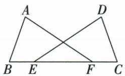

**原资料答案与解析：**

证明：∵ BE = CF, ∴ $BE + EF = CF + EF$ , 即 BF = CE,在 $\triangle ABF$ 和 $\triangle DCE$ 中， $\left\{\begin{aligned}AB&=DC,\\ AF&=DE,\therefore\triangle ABF\cong\triangle DCE(SSS).\\ BF&=CE,\end{aligned}\right.$

**展开解析（依据原详解补足理由与步骤）：**

原B-E-F-C依次在BC上，BE=CF，两边同加EF得BF=CE。△ABF与△DCE有AB=DC、AF=DE、BF=CE，三边分别对应相等，SSS全等。对应A-D、B-C、F-E。原表格将结论插入条件行中，正文按三项先列完整再给结论，不漏共用EF及点序。

### 作原全等三角形SAS SSS ASA三法完整核条件

> 来源ID Q20-28；第20章全等三角形；201-250/full.md 第3572–3574行。原答案与解析定位：201-250/full.md 第3576–3619行。

例2 如图,已知 $\triangle ABC$ ,求作 $\triangle A^{\prime}B^{\prime}C^{\prime}$ ,使 $\triangle A^{\prime}B^{\prime}C^{\prime}\cong\triangle ABC$ . (尺规作图,保留作图痕迹)

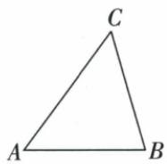

**原资料答案与解析：**

解析 作法一(应用 SAS):(1)作线段 $A'B' = AB$ ; (2)作 $\angle MA'B' = \angle A$ ; (3)在射线 $A'M$ 上截取 $A'C' = AC$ ; (4)连接 $B'C'$ , 则 $\triangle A'B'C'$ 就是所求作的三角形, 如图 1.

作法二(应用 SSS):(1)作线段 $A^{\prime}B^{\prime}=AB$ ;(2)以点 $A^{\prime}$ 为圆心,AC 的长为半径画弧;(3)以点 $B^{\prime}$ 为圆心,BC 的长为半径画弧,交前弧于点 $C^{\prime}$ ;(4)连接 $A^{\prime}C^{\prime}$ 、 $B^{\prime}C^{\prime}$ ,则 $\triangle A^{\prime}B^{\prime}C^{\prime}$ 就是所求作的三角形,如图 2.

作法三(应用 ASA):(1)作线段 $A^{\prime}B^{\prime}=AB$ ;(2)作 $\angle MA^{\prime}B^{\prime}=\angle A$ ;(3)在 $A^{\prime}B^{\prime}$ 的同侧,作 $\angle NB^{\prime}A^{\prime}=\angle B$ ,射线 $A^{\prime}M,B^{\prime}N$ 相交于点 $C^{\prime}$ ,则 $\triangle A^{\prime}B^{\prime}C^{\prime}$ 即为所求作的三角形,如图 3.

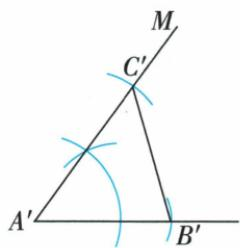

图 1

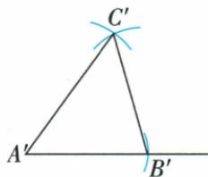

图 2

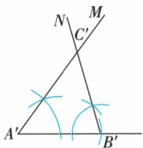

图 3

**展开解析（依据原详解补足理由与步骤）：**

原法一：截A′B′=AB，复制A角到A′，同侧射线取A′C′=AC，再连B′C′，两边夹角对应相等，SAS。原法二：以已作A′、B′为圆心分别取AC、BC半径，两弧交C′，三边对应相等，SSS；第三点在基边上、下两侧得到镜像，也仍全等。原法三：已作A′B′=AB，在其同侧复制A、B两端角，两射线交C′，夹边与两角对应，ASA；选同侧确保射线相遇形成原非退化三角形，不是一条延长线的错误交点。三法均需保圆规等距或复制角痕迹，不凭相似外观缩放。

### 四种原角平分作图痕迹逐个全等或平行核

> 来源ID Q20-32；第20章全等三角形；201-250/full.md 第3717–3733行。原答案与解析定位：201-250/full.md 第3703–3705行。

例2（2024 山东烟台）某班开展“用直尺和圆规作角平分线”的探究活动,各组展示作图痕迹如下,其中射线 OP 为 $\angle AOB$ 的平分线的有()

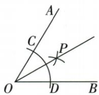

A.1 个

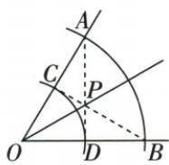

B.2 个

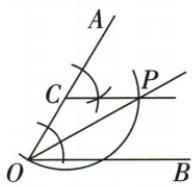

C.3 个

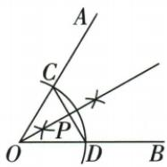

D.4 个

**原资料答案与解析：**

例2 解析 第一个图是尺规作已知角的平分线的常规方法;第二个图,通过多次证三角形全等,可推出 $\angle COP=\angle DOP$ ,故 $OP$ 平分 $\angle AOB$ ;第三个图,由作图知 $CP\parallel OB,\triangle OCP$ 是等腰三角形,可推出 $\angle COP=\angle BOP$ ,故 $OP$ 平分 $\angle AOB$ ;第四个图,由等腰三角形三线合一可推出 $OP$ 平分 $\angle AOB$ .

答案 D

**展开解析（依据原详解补足理由与步骤）：**

原四图均有效，选D4个；A1个、B2个、C3个都漏掉有效的另一构造。

图1同圆OC=OD、两等半径弧CP=DP、OP公共，SSS使OCP与ODP全等，COP=DOP。

图2两组同圆给OA=OB、OC=OD，原虚线AD、BC交P。△OAD与△OBC两边夹角SAS全等，得OAD=OBC、ODA=OCB。AC=OA−OC=OB−OD=BD，两端角经同线补角对应相等，ASA给△ACP≌△BDP，故CP=DP；再OC=OD、OP公共，SSS给△OCP≌△ODP，目标半角等。

图3复制的相应等角给CP∥OB，原以C圆心过O/P弧给CO=CP，因此OCP等腰，COP=CPO；OP截两平行线给CPO=BOP，等量代换得COP=BOP。

图4原OC=OD为等腰OCD，两弧确定OP⊥CD，P位于CD上（核原直角与作图痕迹）。等腰顶点的高与角平分线合一，COP=DOP；也可在两直角三角OCP、ODP用等斜边OC=OD及公共直角边OP，HL全等。每图使用其自己的等半径、平行或垂直条件，不能统一声称全都只是第一种常规画法。

### 原SSA与AAA两组反例图明确缺失判据

> 来源ID Q20-33；第20章全等三角形；201-250/full.md 第2698–2702；2820–2824行。原答案与解析定位：201-250/full.md 第2698–2702行；201-250/full.md 第2820–2824行。

“边边角”（或“SSA”）：两边和其中一边的对角分别相等的两个三角形全等. （×）

解读：如图，在 $\triangle ABP$ 和 $\triangle ACP$ 中， $\angle A = \angle A, AP = AP, BP = CP$ ，满足“SSA”，但它们不全等.

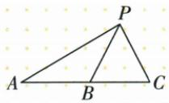

“角角角”（或 “AAA”）：三个角分别相等的两个三角形全等. （×）

解读：如图，在 $\triangle ABC$ 和 $\triangle ADE$ 中， $\angle A = \angle A, \angle ADE = \angle B, \angle AED = \angle C$ ，满足 “AAA”，但它们不全等（形状相同但大小不相等）.

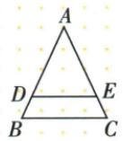

**原资料答案与解析：**

“边边角”（或“SSA”）：两边和其中一边的对角分别相等的两个三角形全等. （×）

解读：如图，在 $\triangle ABP$ 和 $\triangle ACP$ 中， $\angle A = \angle A, AP = AP, BP = CP$ ，满足“SSA”，但它们不全等.

“角角角”（或 “AAA”）：三个角分别相等的两个三角形全等. （×）

解读：如图，在 $\triangle ABC$ 和 $\triangle ADE$ 中， $\angle A = \angle A, \angle ADE = \angle B, \angle AED = \angle C$ ，满足 “AAA”，但它们不全等（形状相同但大小不相等）.

**展开解析（依据原详解补足理由与步骤）：**

原SSA图ABP与ACP共有AP及A角，BP=CP，但给定角A不夹在已给AP、BP之间，另一侧交点B、C可在同一射线上不同位置，不能固定第三边，原两三角不全等。原AAA图ABC与ADE三个对应角等，却一个是另一个放大或缩小，边未等，不能全等。原后段AAA图另接完整原文，结论只是相似或缺尺寸，不新增数值反例。直角三角形若等的是斜边与一腿，可以用HL；这是一组额外直角前提，不能当一般SSA合法。

## 易错

原SSA图两边等不能自动凑SSS，缺第三边；原AAA只有角等也未确定尺寸。原书写表格结论挤在条件内，正文先列三条件再写全等。
