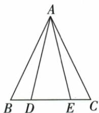
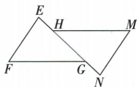
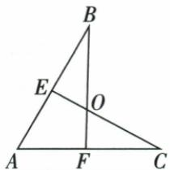
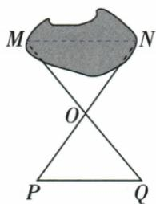
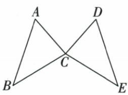

## 讲解

### 是什么

两三角形经平移、旋转或翻折能完全重合，叫全等，记△ABC≌△DEF，字母按对应顶点次序排列。对应A↔D、B↔E、C↔F，因此AB=DE、BC=EF、CA=FD，各对应角相等，面积也相等。形状相同但尺寸不同只可能相似，非全等。

### 怎么来的

完全重合使对应点位置重合，边长、角度及占据区域的面积相同，所以全等可以把难直接比较的线角变成对应量。反过来，为证明重合不一定要逐个验证六项，教材用若干足够约束的判据。原△ABD与△ACE必须按A-A、B-C、D-E配：AB=AC、BD=CE、夹角B=C推出全等，故目标AD=AE。若字母随意写成△ABD≌△AEC，会把AB对应AE、BD对应EC，和已知不匹配。

### 什么时候能用

用于证明对应边角相等和等面积。判据先验证非退化三角形及对应位置，再给全等符号，最后提取对应量；不能倒用待证对应边作为判据。位置可相离、重叠或镜像，纸上朝向不同不使全等失效；缩放却会改变长度，所以不能把只知角等当全等。

全等声明的字母顺序最可靠：ABC≌CDE时原C对应E，即使图中共点C也不能配为同角。原E-H-G-N重叠段把EG=NH化为EH+HG=HG+NG，同减再求HG2.2。共顶点角等可同时扣公共小角，但不保证每个分割小角都等。完整对应角边可继续推出相应高、中线、平分段、周长面积相等；这些属于对应全图，不是任意选一条共线段。

## 例题

### 开放三条件任选两条构成真命题并核三种

> 来源ID Q18-13；第18章命题的证明；201-250/full.md 第1263–1274行。原答案与解析定位：201-250/full.md 第1275–1283行。

例2 如图, $EG//AF$ ,请你从下面的三个条件中选出两个作为已知条件,剩下的一个作为结论,构成一个真命题(只需写出一种情况),并证明.①AB=AC;②DE=DF;③BE=CF.

已知: $EG \parallel AF$ , \_\_\_\_.求证: \_\_\_\_.

**原资料答案与解析：**

解析 ①②;③.(答案不唯一,任选两个作为条件,剩下的一个作为结论即为真命题)

证明：∵ $EG \parallel AF, \therefore \angle GED = \angle F, \angle BGE = \angle BCA.$ ∵ AB = AC, ∴ $\angle B = \angle BCA.$

$\therefore \angle B = \angle BGE.\therefore BE = EG.$ 在 $\triangle DEG$ 和 $\triangle DFC$ 中， $\angle GED = \angle F,DE = DF,\angle EDG = \angle FDC,$

$$
\therefore \triangle D E G \cong \triangle D F C, \therefore E G = C F. \therefore B E = C F.
$$

**展开解析（依据原详解补足理由与步骤）：**

原图E在AB、G与D在BC、F在AC的延长线上，D在EF上，EG∥AF。记x=BE、y=EG、z=CF。由EG∥AF，用BC作截线得BGE=BCA，AB=AC等价于B=BCA；由于原△ABC与△BEG都非退化，这进一步等价于BE=EG，即x=y。另EG∥CF，EF与BC交于D，GED=CFD，EDG=FDC对顶，所以△DEG与△DFC在已有两角对应相等时，DE=DF等价于EG=CF，即y=z（分别用ASA或AAS及对应边）。③就是x=z。三等量中的任意两条推出第三条：①②推出③、①③推出②、②③推出①，说明原“答案不唯一”。

按原详解正式写①②⇒③：AB=AC⇒B=BCA=BGE⇒BE=EG；两三角形中GED=CFD、EDG=FDC、DE=DF，由ASA全等（DE、DF夹在两给定角之间），得EG=CF；等量代换得BE=CF。其他两种也须利用相同三线角关系与等腰判定，不能只凭三个原句长得对称就断任两都行。

### 等腰底边对称点两种方法证明线段等

> 来源ID Q18-19；第18章命题的证明；201-250/full.md 第1425–1434行。原答案与解析定位：201-250/full.md 第1436–1471行。

例8 如图, 点 D, E 在 $\triangle ABC$ 的边 BC 上, AB = AC, BD = CE. 求证: AD = AE.

**原资料答案与解析：**

证明 证法一:∵ AB=AC,∴ ∠B=∠C.又∵ BD=CE,∴ △ABD≌△ACE,∴ AD=AE.

证法二: 过点 A 作 $AF \perp BC$ ，垂足为 $F \therefore AB = AC, \therefore BF = CF.$

∵ BD=CE, ∴ BF-BD=CF-CE, 即 DF=EF. ∴ AF 垂直平分 DE, ∴ AD=AE.

(注:还可用等腰三角形的判定证明 AD=AE)

**展开解析（依据原详解补足理由与步骤）：**

法一：AB=AC使B=C（等腰底角），D、E均在BC且原B-D-E-C顺序，所以ABD=ACE；再有AB=AC、BD=CE，这两边及夹角对应相等，由SAS得△ABD≌△ACE，对应AD=AE。把对应顺序写为A↔A、B↔C、D↔E。

法二：过A作AF⊥BC，由等腰三角形三线合一F为BC中点，BF=CF。BD=CE且按原点序D、E在F两侧（可由等长两端段与D在E左侧推出），所以DF=BF−BD、EF=CF−CE，二者相等。AF垂直平分DE，点A到D、E距离相等，AD=AE；也可在直角△AFD、△AFE中AF共同、DF=EF、夹角90°，直接SAS全等得到AD=AE，不需未说明的垂平线定理。若D=E退化，目标直接成立，两个三角形的使用需单独看非退化情况。原提取此处混进其他两题辅助图，已按实际图对象重新归属，原证据不改。

### 共顶点全等对应及角差四句辨析

> 来源ID Q20-01；第20章全等三角形；201-250/full.md 第2457–2472行。原答案与解析定位：201-250/full.md 第2474–2480行。

例 如图所示, $\triangle ABC\cong\triangle AEF$ ,
AB=AE, $\angle B=\angle E$ ,下列结论正确
的是\_\_\_\_.(填序号)

①AC = AF;   
② $\angle FAB = \angle EAB;$   
③EF=BC;   
④ $\angle EAB = \angle FAC.$

**原资料答案与解析：**

解析 由题意得 AC 与 AF, EF 与 BC 是对应边, 所以 AC = AF, EF = BC, 所以①③正确.

由题意得 $\angle BAC$ 和 $\angle EAF$ 是对应角,所以 $\angle BAC=\angle EAF$ ,所以 $\angle EAB=\angle FAC$ ,所以④正确.

根据已知条件无法确定∠FAB与∠EAB是否相等,所以②不一定正确.

答案 ①③④

**展开解析（依据原详解补足理由与步骤）：**

由△ABC≌△AEF，对应A-A、B-E、C-F。①AC=AF是对应边，真；③BC=EF也真。A处对应角BAC=EAF，原射线依次AE、AB、AF、AC；两个整体都包含BAF，共减BAF得EAB=FAC，④真。②FAB即公共小角BAF，已知并未给它等于EAB，不能从两个整体角等便断每个相邻小块都相等，故不一定真。答①③④。全等字母顺序是主要对应依据，不能只因两线共顶点A就任意匹配。

### 重叠共线段对应边相等求2点2厘米

> 来源ID Q20-02；第20章全等三角形；201-250/full.md 第2532–2545行。原答案与解析定位：201-250/full.md 第2547–2551行。

例1 如图, $\triangle EFG \cong \triangle NMH$ , $E、H、G、N$ 在同一条直线上, 若 $EH = 1.1 \mathrm{~cm}, NH = 3.3 \mathrm{~cm}$ , 求线段 $HG$ 的长.

**原资料答案与解析：**

解析 $\because \triangle EFG \cong \triangle NMH, \therefore EG$ 和 $NH$ 是对应边，

$$
\begin{array}{l} \therefore E G = N H, \text {即} E H + H G = H G + N G, \therefore E H = N G, \\ \because E H = 1.1 \mathrm{cm}, \therefore N G = 1.1 \mathrm{cm}. \text {又} N H = 3.3 \mathrm{cm}, \therefore H G = N H - N G = 3.3 - 1.1 = 2.2 (\mathrm{cm}). \\ \end{array}
$$

**展开解析（依据原详解补足理由与步骤）：**

△EFG≌△NMH使E-N、F-M、G-H，EG对应NH。原E-H-G-N共线按序，EG=EH+HG，NH=NG+HG，两边同减HG得到EH=NG=1.1 cm。再在NH上分段，HG=NH−NG=3.3−1.1=2.2 cm。也可直接EG=NH=3.3，HG=EG−EH=2.2。小数按原保留，不把3.3当整条EN；加减来自原点序，不适用于任意四点排列。

### 全等对应26度借两次外角求112度

> 来源ID Q20-03；第20章全等三角形；201-250/full.md 第2562–2570行。原答案与解析定位：201-250/full.md 第2572–2576行。

例2 如图, $\triangle AFB \cong \triangle AEC$ , $\angle A = 60^{\circ}$ , $\angle B = 26^{\circ}$ , 求 $\angle BOC$ 的度数.

**原资料答案与解析：**

解析 $\because \triangle AFB \cong \triangle AEC, \angle B = 26^{\circ}, \therefore \angle C = \angle B = 26^{\circ}$ ,

$$
\therefore \angle B E C = \angle A + \angle C = 6 0 ^ {\circ} + 2 6 ^ {\circ} = 8 6 ^ {\circ}, \therefore \angle B O C = \angle B E C + \angle B = 8 6 ^ {\circ} + 2 6 ^ {\circ} = 1 1 2 ^ {\circ}.
$$

**展开解析（依据原详解补足理由与步骤）：**

△AFB≌△AEC，B对应C，所以ECA=FBA=26°。原A、E、B共线，BEC是△AEC在E的外角，BEC=A60°+C26°=86°。原B、O、F共线且E、O、C共线，BOC是△BOE在O的外角，因此BOC=BEO86°+EBO26°=112°。每次明确哪一个小三角形的外角，不能把原给的A、B错当整个大三角ABC的两个内角。

### 池塘对应边测距四选项

> 来源ID Q20-04；第20章全等三角形；201-250/full.md 第2582–2602行。原答案与解析定位：201-250/full.md 第2604–2606行。

例3 如图,小强利用全等三角形的知识测量池塘两端 M、N 的距离,若 $\triangle PQO \cong \triangle NMO$ , 则只需测出 ( )

A.PO 的长

B.PQ 的长

C.MO 的长

D.MQ 的长

**原资料答案与解析：**

解析 由全等三角形的对应边相等可知,要想测得 NM 的长,只需测出其对应边 PQ 的长.

答案 B

**展开解析（依据原详解补足理由与步骤）：**

△PQO≌△NMO给P-N、Q-M、O-O，因此PQ↔NM，选B测PQ。A的PO对应NO，得池塘一端到O而非两端距；C测MO对应QO，也不是NM；D的MQ跨两个三角形，不是NM对应边。只需已给全等便可转移距离，题未要求另证怎样构造该全等，不自编仪器读数。实际两端不可直接走到，测可达对应边的长度即可。

### 60与40求第三角再取同顶点对应80

> 来源ID Q20-05；第20章全等三角形；201-250/full.md 第2614–2634行。原答案与解析定位：201-250/full.md 第2650–2664行。

例1（2024山东济南）如图，已知 $\triangle ABC \cong \triangle DEC, \angle A = 60^{\circ}, \angle B = 40^{\circ}$ ，则 $\angle DCE$ 的度数为 （）

A. ${40}^{ \circ  }$

B. $60^{\circ}$

C. ${80}^{ \circ  }$

D. $100^{\circ}$

**原资料答案与解析：**

例1 解析 $\because \angle ACB + \angle A + \angle B =$

$$
1 8 0 ^ {\circ}, \therefore \angle A C B = 8 0 ^ {\circ},
$$

$$
\because \triangle A B C \cong \triangle D E C,
$$

$$
\therefore \angle D C E = \angle A C B = 8 0 ^ {\circ}.
$$

答案 C

**展开解析（依据原详解补足理由与步骤）：**

△ABC≌△DEC给A-D、B-E、C-C，所以DCE对应ACB。原ACB=180°−60°−40°=80°，故DCE80°。A40°对应原B及E，不是C；B60°对应原A及D；C80°正确；D100°是80°的补角，但原目标是对应内角没有要求取邻补。选C。共享顶点C在本题恰对应，不等于其他题共点都对应。

### 共C却非对应C的35与45求100

> 来源ID Q20-06；第20章全等三角形；201-250/full.md 第2636–2644行。原答案与解析定位：201-250/full.md 第2666–2668行。

例2（2024 四川成都）如图， $\triangle ABC \cong \triangle CDE$ ，若 $\angle D = 35^{\circ}$ ， $\angle ACB = 45^{\circ}$ ，则 $\angle DCE$ 的度数为 \_\_\_\_.

**原资料答案与解析：**

例2 解析 $\because \triangle ABC \cong \triangle CDE,$ $\angle ACB = 45^{\circ},\therefore \angle CED = \angle ACB =$ $45^{\circ},\therefore \angle DCE = 180^{\circ} - \angle D-$ $\angle CED = 180^{\circ} - 35^{\circ} - 45^{\circ} = 100^{\circ}.$

答案 $100^{\circ}$

**展开解析（依据原详解补足理由与步骤）：**

△ABC≌△CDE给A-C、B-D、C-E。原ACB45°应移到CED45°，不是直接移到DCE。新三角CDE内角和：DCE=180°−D35°−E45°=100°。两三角共享点C，但原C对应新E，按字母顺序核而非位置猜。

### 两个原直角全等引出另两对与CF等EF双证

> 来源ID Q20-12；第20章全等三角形；201-250/full.md 第2856–2860行。原答案与解析定位：201-250/full.md 第2861–2896行。

例1 如图, 已知 Rt△ABC≌Rt△ADE, ∠ABC = ∠ADE = 90°, 连接 CD、EB.

(1) 图中还有几对全等三角形？请你一一列举.  
(2) 求证: CF = EF.

**原资料答案与解析：**

解析（1）还有2对全等三角形. $\triangle ADC\cong \triangle ABE,\triangle CDF\cong \triangle EBF.$

(2) 证法一: $\because \mathrm{Rt} \triangle ABC \cong \mathrm{Rt} \triangle ADE, \therefore AC = AE, \angle CAB = \angle EAD, AB = AD,$

$$
\therefore \angle C A B - \angle D A B = \angle E A D - \angle D A B, \text { 即 } \angle C A D = \angle E A B, \therefore \triangle A C D \cong \triangle A E B (\mathrm{SAS}),
$$

$$
\therefore C D = E B, \angle A D C = \angle A B E. \text {又} \because \angle A D E = \angle A B C, \therefore \angle C D F = \angle E B F.
$$

$$
\text { 又 } \because \angle D F C = \angle B F E, \therefore \triangle C D F \cong \triangle E B F (\mathrm{AAS}), \therefore C F = E F.
$$

证法二: 连接 $AF$ . ∵ Rt△ABC ≅ Rt△ADE, ∴ AB = AD, BC = DE.

在 Rt△ABF 和 Rt△ADF 中, AF = AF, AB = AD, ∴ Rt△ABF ≅ Rt△ADF(HL),

$$
\therefore B F = D F. \text {   又   } \because B C = D E, \therefore B C - B F = D E - D F, \text {   即   } C F = E F.
$$

**展开解析（依据原详解补足理由与步骤）：**

原Rt△ABC≌Rt△ADE，得AC=AE、AB=AD、BC=DE、CAB=EAD。原两整体角都含DAB，同减得CAD=EAB；所以△ACD与△AEB有两边及夹角对应等，SAS全等，CD=EB、ADC=ABE。原ADE=ABC90°，从ADC与ABE对应相等的整体中扣去90°，得CDF=EBF；DFC与BFE对顶，结合CD=EB得△CDF≌△EBF（AAS），故CF=EF。原除给定一对外还有这两对，三角形次序按对应可倒写。

原法二连AF，ABF、ADF的直角分别在B、D，AF共同斜边、AB=AD一腿，HL全等得BF=DF。原B-F-C、D-F-E点序与BC=DE，再同减相等小段BF/DF，得CF=BC−BF=DE−DF=EF。两方法的两组辅助三角形不同，均列真实条件，未用目标CF=EF作判据。

### 边6等腰直角截取等边全等转面积9

> 来源ID Q20-19；第20章全等三角形；201-250/full.md 第3168–3189行。原答案与解析定位：201-250/full.md 第3199–3205行。

例2 (2024 广东广州) 如图, 在 $\triangle ABC$ 中, $\angle A = 90^{\circ}$ , AB = AC = 6, D 为边 BC 的中点, 点 E, F 分别在边 AB, AC 上, AE = CF, 则四边形 AEDF 的面积为 ( )

A.18

B. $9\sqrt{2}$

C.9

D. $6\sqrt{2}$

**原资料答案与解析：**

例2 解析 连接 AD, 由题意得 $\angle DAE = \angle C = 45^{\circ}, AD = CD$ , 又 AE = CF, 所以 $\triangle DAE \cong \triangle DCF$ , 所以 $S_{四边形AEDF}=S_{\triangle DAE}+S_{\triangle DAF}=S_{\triangle DCF}+$

$$
S _ {\triangle D A F} = \frac {1}{2} S _ {\triangle A B C} = \frac {1}{2} \times \frac {1}{2} \times 6 \times 6 = 9.
$$

答案 C

**展开解析（依据原详解补足理由与步骤）：**

AB=AC6、A90°，原等腰直角，B=C45°。D为BC中点，等腰三线合一使AD⊥BC且平分A，DAE45°；斜边中点D到A、C等距，也可用△ADC两锐角均45°得到AD=CD。AE=CF，DAE=DCF45°，AD=CD，SAS使△DAE≌△DCF。目标AEDF由DAE、DAF两块构成，替DAE为DCF后成为ACD；AD中线分ABC为两等面积，面积=半×(6×6/2)=9。A18是整个ABC，错；B9√2把斜线长度误入面积，错；C9正确；D6√2是原斜边BC的长度数值，量纲和图形均不是所求面积，错。选C。边上E/F在端点时四边形可能退化，原按非退化图讨论全等，极端面积仍可按同底高直接核为9，不假装退化三角形满足通常判据。

## 易错

原开放三条件题须写△DEG≌△DFC，D对应D、E对应F、G对应C，才有EG=FC；原等边三角形边长可不同，角全60°仅保证相似。
