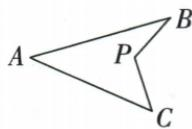
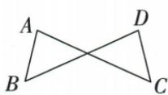

## 讲解

### 是什么

原飞镖图A-B-P-C形成凹四边形，P处图示小角等于A、B、C三角之和；P作为凹内角时是360°减该小角，记号不可混用。原8字图两三角形共交叉顶点，两对外端角和相等。二者来自三角内角和及反向线的位置条件。

### 怎么来的

飞镖连AP，把两三角形内角和相加，左端A+B+C加P处反射角360°−P，右端360°，消360°得P=A+B+C。原数值例也可沿A-E-B、D-B-C共线先得△DEB角B50°，再把大三角B角转为邻补130°，求C20°，显示模型每一项来源。8字交点O，两三角分别给A+B=180°−AOB、C+D=180°−COD，交点对顶角等，使两和等。模型名称只是记图便于识别，证明依角和与真实线关系。

### 什么时候能用

飞镖要有给定凹形边界和小角含义；把凹内角本身记P会得到另一式，不可直接用同一公式。8字要两对边在交点反向共线，不能只看图轮廓像8。原本章8字只提供无数值模型示图，没有独立数字例题；本文保原模型推导，不补造数值练习。

## 例题

### 原飞镖图借两三角与补角求20度

> 来源ID Q19-12；第19章三角形；201-250/full.md 第2195–2207行。原答案与解析定位：201-250/full.md 第2209–2219行。

例3 如图, $\triangle ABC$ 中, $\angle A = 30^{\circ}$ , $D$ 是 $CB$ 延长线上的一点, $\angle AED = 90^{\circ}, \angle D = 40^{\circ}$ , 则 $\angle C$ 的度数为

**原资料答案与解析：**

解析 由“飞镖”模型的结论得

$$
\angle A E D = \angle A + \angle D + \angle C,
$$

$$
\therefore \angle C = \angle A E D - \angle A - \angle D = 2 0 ^ {\circ}.
$$

答案 $20^{\circ}$

**展开解析（依据原详解补足理由与步骤）：**

原D-B-C共线，A-E-B共线。AED90°，EA与EB反向，所以DEB90°。△DEB中DBE=180°−90°−D40°=50°；DB与BC反向，ABC=180°−DBE50°=130°。△ABC内角和给C=180°−A30°−B130°=20°。合并这些式子也得AED=A+D+C，即原飞镖模型。先找到两个三角形与反向边，说明为什么三个原角可相加；不能只引用模型名称跳过推理。

### 原飞镖与8字模型两次内角和推导

> 来源ID Q19-21；第19章三角形；201-250/full.md 第2131–2145行。原答案与解析定位：201-250/full.md 第2131–2145行。

# 技巧总结 1.“飞镖”模型(图1)④

结论： $\angle P = \angle A + \angle B + \angle C.$

2.“8”字模型(图2)

结论： $\angle A + \angle B = \angle C + \angle D.$

3. 角平分线模型(图 3\~图 5 中 BP, CP 均为角的平分线)

  
图1

  
图2

**原资料答案与解析：**

# 技巧总结 1.“飞镖”模型(图1)④

结论： $\angle P = \angle A + \angle B + \angle C.$

2.“8”字模型(图2)

结论： $\angle A + \angle B = \angle C + \angle D.$

3. 角平分线模型(图 3\~图 5 中 BP, CP 均为角的平分线)

  
图1

  
图2

**展开解析（依据原详解补足理由与步骤）：**

飞镖原四点按A-B-P-C形成凹形，小角BPC记P。连AP，两个三角形ABP、ACP的内角和相加为360°。A处两角合成A，另两顶角是B、C；P处两内部角合成围绕P的反射角360°−P。因此A+B+C+(360°−P)=360°，得P=A+B+C。这里P是图示凹顶点的小角，不能把反射内角也记同一个P。

8字图设两线交点O，△ABO与△CDO分别给A+B=180°−AOB、C+D=180°−COD。AOB与COD对顶相等，两式右端相等，所以A+B=C+D。必须保两交点边的反向共线关系，不是任意四角看起来8字就有此式。

## 易错

原飞镖的90°在AED，A30、D40、C未知三角和才90；不说明凹角是小角或反射角会弄反加减。
