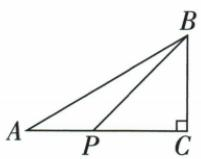
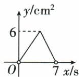
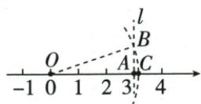
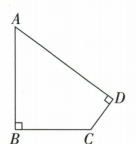

## 讲解

### 是什么

直角三角形两条夹直角的边长a、b，直角对面的斜边c满足a²+b²=c²。边长须同单位，平方项是面积单位；由斜边平方求边要取正平方根。斜边是对着直角，不凭图看起来最长的画法确定。

$$
a^2+b^2=c^2\quad(a,b\text{为直角边},\ c\text{为斜边})
$$

### 怎么来的

用四个边a、b、斜边c相同的直角三角形，直角依次放边长a+b的大正方形四角，沿每条外边的两段恰a与b。剩余中心四边均为c；中心每角为180°减两个锐角，而直角三角形两锐角和90°，故中心角90°，确为边c正方形。大面积由四三角形与中心组成，无重叠： (a+b)²=4×ab/2+c²。左边按完全平方展开a²+2ab+b²，右边三角形总2ab+c²，两边减2ab，得a²+b²=c²。这证明依赖直角条件，不是任何三角形都如此。

### 什么时候能用

已确认直角且求边长、距离、面积中的边量可用。求直角边平方需c²−另一边²非负且实际非退化为正。若未给直角，不以勾股等式替代证明；后续勾股逆定理另讲，不能把充分必要的方向混用。原动点题还给a+b与ab，先用完全平方求a²+b²，再求斜边，无需分别先求a、b。

本章两种拼图和原青朱、欧氏割补都保留，完全平方消2ab逐项说明。求斜边平方用两腿平方和，求腿用斜边平方减另一腿平方，边长正取正根。原双墙同梯长与草拉长不变用两平方等式消同x²，原身高先求竖差再总高作差。勾股推得以三边作同类图形的面积亦满足小两面积和等大面积：正方形系数1，圆以边作直径系数π/4，等边三角形系数√3/4，三者只因同一个系数乘边平方；不能把不同形状不同系数的面积混加。

## 例题

### 运动面积峰值与总路程求直角三角形斜边

> 来源ID Q13-16；第13章一次函数；101-150/full.md 第3809–3823行。原答案与解析定位：101-150/full.md 第3748–3762行。

例6（2024 四川广元）如图①, 在 $\triangle ABC$ 中, $\angle ACB = 90^{\circ}$ , 点 P 从点 A 出发沿 $A \rightarrow C \rightarrow B$ 以 1 cm/s 的速度匀速运动至点 B, 图②是点 P 运动时, $\triangle ABP$ 的面积 $y(\mathrm{cm}^{2})$ 随时间 $x(\mathrm{s})$ 变化的函数图象, 则该三角形的斜边 AB 的长为 ( )

  
①

  
②

A.5

B.7

C. $3\sqrt{2}$

D. $2\sqrt{3}$

**原资料答案与解析：**

例6 解析 当点 P 运动到 C 处时, $\triangle ABP$ 的面积 = 6, 即 $\frac{1}{2} AC \cdot BC = 6$ , 即 $AC \cdot BC = 12$ . 又由图象可知, 点 P 从点 A 出发沿 $A \rightarrow C \rightarrow B$ 以 1 cm/s 的速度匀速运动至点 B 的时间为 7 s, 即 $AC + BC = 7$ , $\therefore (AC + BC)^{2} = 49$ ,

$$
\therefore A C ^ {2} + B C ^ {2} + 2 A C \cdot B C = 4 9,
$$

$$
\therefore A C ^ {2} + B C ^ {2} = 2 5.
$$

$$
\because A C ^ {2} + B C ^ {2} = A B ^ {2}, \therefore A B = 5.
$$

答案A

**展开解析（依据原详解补足理由与步骤）：**

P沿AC再CB、速度1厘米/秒，7秒走完给AC+BC=7厘米。面积图在C处峰值6平方厘米，△ABC直角在C，AC×BC/2=6，所以AC×BC=12平方厘米。展开(AC+BC)²=AC²+2AC×BC+BC²，代7和12得49=AC²+BC²+24；两边减24，AC²+BC²=25。勾股定理给AB²=25，AB是正长度，所以AB=5厘米，选A。B=7是折线路程，不是斜边；C=3√2平方18、D=2√3平方12，均不等25。不是从图像外形直接量斜边。

### 直角两已知边3与4未给斜边的双分支

> 来源ID Q22-02；第22章勾股定理；201-250/full.md 第4419–4419行。原答案与解析定位：201-250/full.md 第4421–4425行。

例2 在 Rt△ABC 中, AC = 3, AB = 4, 则 BC 的长为 \_\_\_\_.

**原资料答案与解析：**

解析 在 Rt△ABC 中, 当 BC 为斜边时, $BC = \sqrt{AB^{2} + AC^{2}} = \sqrt{4^{2} + 3^{2}} = 5$ ; 当 BC 为直角边时, BC = $\sqrt{AB^{2} - AC^{2}} = \sqrt{4^{2} - 3^{2}} = \sqrt{7}$ .

答案 5 或 $\sqrt{7}$

注意 本题没有说明哪个角是直角、哪条边是斜边，所以要分情况讨论.

**展开解析（依据原详解补足理由与步骤）：**

若BC斜边，两给边为腿，BC²=3²+4²=25，正长BC5；若AB4为斜边，BC²=4²−3²=7，BC=√7。AC3不能为斜边，因为斜边严格长于AB4。两分支均满足正长度与三边关系，答案5或√7。原未规定直角在哪，不能从字母C或随手画图指定。

### 弦图差4斜边20不解两边先求积和面积96

> 来源ID Q22-03；第22章勾股定理；201-250/full.md 第4429–4439行。原答案与解析定位：201-250/full.md 第4441–4445行。

例3 我国汉代数学家赵爽证明勾股定理时创制了一幅“弦图”，后人称之为“赵爽弦图”，它是由4个全等的直角三角形和一个小正方形组成的。如图，直角三角形的直角边长为 $a, b$ ，斜边长为 $c$ ，若 $b - a = 4, c = 20$ ，则每个直角三角形的面积为 \_\_\_\_。

**原资料答案与解析：**

解析 根据题意可得 $a^{2}+b^{2}=c^{2}=$ $20^{2},\because b-a=4,$

∴ $2ab = a^{2} + b^{2} - (b - a)^{2} = 20^{2} - 4^{2} = 384$ , ∴ 每个直角三角形的面积为 $\frac{1}{2}ab = \frac{1}{2} \times \frac{1}{2} \times 384 = 96$ .

答案 96

**展开解析（依据原详解补足理由与步骤）：**

原斜边$c=20$，勾股关系给$a^2+b^2=c^2=400$。原$b-a=4$，两边平方并用完全平方公式展开，得到$(b-a)^2=b^2-2ab+a^2=16$。

用第一式减去第二式，$a^2$与$b^2$分别抵消：$2ab=400-16=384$。两边除2，得$ab=192$；每个直角三角形面积为$ab/2=192/2=96$。

也可直接看原图：外正方形边为$c$，面积400；中心正方形边为$b-a$，面积16。二者相减的384是四个全等直角三角形总面积，求单块再除4，$384/4=96$。两种方法结果一致，均未要求先分别求出$a,b$。

### 感应门高度2点5斜距1点5水平1点2求身高1点6

> 来源ID Q22-04；第22章勾股定理；201-250/full.md 第4449–4451行。原答案与解析定位：201-250/full.md 第4453–4455行。

例4 如图,某自动感应门的正上方A处装着一个感应器,离地面的高度AB为2.5米,一名学生站在C处时,感应门自动打开了,此时这名学生离感应门的距离BC为1.2米,他的头顶离感应器的距离AD为1.5米,则这名学生的身高CD为\_\_\_\_米.

**原资料答案与解析：**

解析 过点 D 作 $DE \perp AB$ 于 E，则 DE = BC = 1.2 米。在 Rt $\triangle ADE$ 中， $AE = \sqrt{AD^{2} - DE^{2}} = 0.9$ 米，∴ CD = BE = AB - AE = 1.6 米。

答案 1.6

**展开解析（依据原详解补足理由与步骤）：**

过头顶D向竖门AB作水平DE，DE∥BC、CD∥AB，B-E-D-C是矩形，DE=BC1.2、BE=CD。ADE直角在E、AD1.5是斜边，AE²=1.5²−1.2²=2.25−1.44=0.81，AE0.9。A-E-B按序，CD=BE=AB−AE=2.5−0.9=1.6 m。0.9是头顶到感应器的竖直差，不是身高；不能用斜距1.5直接减总高。

### 梯子两墙同斜边2点4和2列方程得0点7米

> 来源ID Q22-07；第22章勾股定理；201-250/full.md 第4625–4627行。原答案与解析定位：201-250/full.md 第4629–4639行。

例3 某小区两面直立的墙壁之间为安全通道,一架梯子的底端 A 在两面墙壁的底端 B,E 之间,BE=2.2 m,当这架梯子斜靠在左墙时,梯子顶端 D 到地面的距离 DE 为 2.4 m,保持梯子底端 A 不动,将梯子斜靠在右墙上,梯子顶端 C 到地面的距离 CB 为 2 m,则梯子底端 A 到左墙的距离 AE 为 \_\_\_\_ m.

**原资料答案与解析：**

解析 设 AE = x m，则 $AB = (2.2 - x)$ m.

在 Rt△ADE 中, $AE^{2}+DE^{2}=AD^{2}$ ,

在 Rt△ABC 中, $AB^{2}+BC^{2}=AC^{2}$ ,

由题意知 $AD = AC, \therefore AE^2 + DE^2 = AB^2 + BC^2$ ，即 $x^2 + 2.4^2 = (2.2 - x)^2 + 2^2$ ，解得 $x = 0.7$ .

故梯子底端 A 到左墙的距离 AE 为 0.7 m.

答案 0.7

**展开解析（依据原详解补足理由与步骤）：**

设$AE=x$ m。原$A$在$E,B$之间，所以$AB=2.2-x$且$0<x<2.2$。同一架梯子的长度不变，$AD=AC$；墙面与地面垂直，勾股给$AD^2=x^2+2.4^2$、$AC^2=(2.2-x)^2+2^2$。两斜边相等，因此

$$x^2+5.76=4.84-4.4x+x^2+4.$$

两边同减$x^2$，得$5.76=8.84-4.4x$；两边同加$4.4x$、同减5.76，得$4.4x=3.08$；同除4.4，得到$x=0.7$。所以$AE=0.7$ m，$AB=2.2-0.7=1.5$ m。回验两斜边平方分别为$0.7^2+2.4^2=6.25$、$1.5^2+2^2=6.25$，相等且位置条件成立。

### 网格三边根号8根号13根号17同步选三点

> 来源ID Q22-08；第22章勾股定理；201-250/full.md 第4645–4653行。原答案与解析定位：201-250/full.md 第4655–4669行。

例4 在如图所示的正方形网格中,已知每个小正方形的边长都是1.请在网格中画出格点三角形 $ABC$ , 使 $AB = 2\sqrt{2}, BC = \sqrt{13}, AC = \sqrt{17}$ . (格点三角形的顶点均为网格线的交点)

**原资料答案与解析：**

解析 $\because (2\sqrt{2})^2 = 2^2 + 2^2, \therefore AB$ 可以看作是以 2 为直角边长的等腰直角三角形的斜边.

$\because (\sqrt{13})^2 = 2^2 + 3^2, \therefore BC$ 可以看作是以2、3为直角边长的直角三角形的斜边.

$\because (\sqrt{17})^{2}=4^{2}+1^{2},\therefore AC$ 可以看作是以4、1为直角边长的直角三角形的斜边.

所求作的 $\triangle ABC$ 如图所示.

**展开解析（依据原详解补足理由与步骤）：**

原答案图以A为相对原点，B比A右2上2，C比A右4下1；不是新作数字题，而是读原图格点偏移。AB²=2²+2²=8，AB2√2；BC从B右2下3，BC²=2²+3²=13；AC²=4²+1²=17。三组共用同一A/B/C才同时满足，不可三个长度各画一段却端点不相连。格宽1，水平垂直偏移计“格”不是计格线根数。

### 数轴正根10先作3和1直角再圆规移长

> 来源ID Q22-09；第22章勾股定理；201-250/full.md 第4675–4675行。原答案与解析定位：201-250/full.md 第4677–4685行。

例5 在数轴上作出表示 $\sqrt{10}$ 的点.

**原资料答案与解析：**

解析 如图所示.

(1) 画出数轴, 记原点为 O, 在数轴上找出表示 3 的点 A, 则 OA = 3;

(2) 过点 A 作直线 l 垂直于数轴, 在 l 上取点 B, 使 AB = 1;

(3) 连接 OB, 以点 O 为圆心, OB 的长为半径作弧, 弧与数轴的正半轴交于点 C, 点 C 即为表示 $\sqrt{10}$ 的点.

**展开解析（依据原详解补足理由与步骤）：**

数轴原O0、A3，A向垂线取AB1，所以OAB直角，OB²=3²+1²=10，OB=√10。O圆心OB半径弧与正半轴交C，OC=OB，所以C坐标为正√10。负半轴交点坐标−√10，也同距离，但原求正√10必须选正支；无需以3.16近似量取代准确作图。

### 土地20与15先共享斜边25再7求24加面积234

> 来源ID Q22-10；第22章勾股定理；251-300/full.md 第1–1行。原答案与解析定位：251-300/full.md 第3–11行。

例6 有一块土地,其形状如图所示, $\angle B=\angle D=90^{\circ},AB=20$ 米,BC=15米,CD=7米, 请计算这块土地的面积.

**原资料答案与解析：**

解析 连接 AC, 则 $S_{四边形ABCD}=S_{\triangle ABC}+S_{\triangle ADC}$ .

在 Rt△ABC 中， $AC^{2}=AB^{2}+BC^{2}$ ，所以 $AC=\sqrt{20^{2}+15^{2}}=25$ （米）.

在 Rt△ACD 中， $AD^{2}=AC^{2}-CD^{2}$ ，所以 $AD=\sqrt{25^{2}-7^{2}}=24$ （米）.

所以 $S_{四边形ABCD}=\frac{1}{2}AB\cdot BC+\frac{1}{2}AD\cdot CD=\frac{1}{2}\times20\times15+\frac{1}{2}\times24\times7=234$ (平方米).

答: 这块土地的面积为 234 平方米.

**展开解析（依据原详解补足理由与步骤）：**

原漏示图从PDF实际第1页取回。连AC，原四边形凸，AC分成ABC、ADC两内部块相加。B90给AC²=20²+15²=625，AC25。D90，AC同斜边、CD7，AD²=25²−7²=625−49=576，AD24。面积ABC=20×15/2=150，ADC=24×7/2=84，总234 m²。AC不是两块面积的高，不用25×某边来凑。

### 油罐侧壁一周展开12乘5直线最短13米

> 来源ID Q22-11；第22章勾股定理；251-300/full.md 第17–19行。原答案与解析定位：251-300/full.md 第21–27行。

例7 有一个圆柱形油罐,如图所示,计划从点 A 起环绕油罐建盘梯,正好到点 A 正上方的点 B 处.现要先沿该油罐外壁画一条指示线,再沿指示线进行建造,问指示线最短是多少米?（已知油罐的底面周长是 12 m,高 AB 是 5 m）

**原资料答案与解析：**

解析 将圆柱的侧面沿 $AB$ 剪开铺平（如图所示），则四边形 $AA'B'B$ 为长方形， $A'B' = AB = 5\mathrm{m}, AA' = BB' = 12\mathrm{m}, \angle BAA' = \angle A' = \angle A'B'B = \angle B = 90^\circ$ .

沿 $AB'$ 画指示线，指示线最短.在 $\mathrm{Rt}\triangle AA'B'$ 中， $AB' = \sqrt{AA'^2 + A'B'^2} = \sqrt{12^2 + 5^2} = 13(\mathrm{m})$

答:指示线最短是13 m.

**展开解析（依据原详解补足理由与步骤）：**

题要求沿外壁环绕一周从A到正上方B，沿同一母线剪开，侧面展开为宽12高5矩形。走一周的终点是另一条复制边上的B′，并非原同侧B；平面两点间线段AB′最短，它在矩形内，卷回恰一周合规。AB′²=12²+5²=169，最短13 m。竖直AB5只走0周，不符合环绕；连接空间A/B的内部弦也非表面路线。若圈数另变宽变，不擅加题干圈数。

### 矩形3乘5翻折B到F等长方程求EF五比三

> 来源ID Q22-12；第22章勾股定理；251-300/full.md 第33–43行。原答案与解析定位：251-300/full.md 第45–51行。

例8 如图,折叠矩形 ABCD 的一边 BC,使点 B 落在 AD 边上的点 F 处,已知 AB=3,BC=5,求 EF 的长.

**原资料答案与解析：**

解析 由题意得 Rt△FEC≌Rt△BEC, ∴ EF=BE, FC=BC=5.

在 Rt△CDF 中，CD=AB=3，∴ $DF=\sqrt{CF^{2}-CD^{2}}=\sqrt{5^{2}-3^{2}}=4$ ，∴ AF=1.

设 $EF = x$ ，则 $EB = x, AE = 3 - x.$ 在 $\mathrm{Rt}\triangle AEF$ 中， $EF^2 = AE^2 + AF^2$

$\therefore x^{2} = (3 - x)^{2} + 1^{2}$ ，解得 $x = \frac{5}{3}$ 即 $EF$ 的长为 $\frac{5}{3}$

**展开解析（依据原详解补足理由与步骤）：**

折痕$EC$固定$E,C$，$B$折到$F$，折叠保长给$BE=EF$、$BC=FC=5$，原$\angle EBC=90^\circ$移为$\angle EFC=90^\circ$。矩形中$CD=AB=3$且$\angle CDF=90^\circ$，勾股给$DF^2=CF^2-CD^2=25-9=16$。取正长度得$DF=4$；由$AD=BC=5$和$A,F,D$顺序，$AF=AD-DF=1$。

设$EF=x$，则$EB=x$、$AE=3-x$，且$0<x<3$。$\triangle AEF$在$A$处直角，所以$x^2=(3-x)^2+1^2$。展开平方得$x^2=9-6x+x^2+1$；两边同减$x^2$，得$0=10-6x$。两边同加$6x$，得$6x=10$，再同除6，得到$EF=x=5/3$。

回验$AE=4/3$、$AF=1$、$EF=5/3$，满足$(4/3)^2+1^2=25/9=(5/3)^2$；$x$也在$(0,3)$内。原折后直角在$F$，不能把折痕交点$E$当成直角顶点。

### 弦图小面积5两腿和平方21求大面积13

> 来源ID Q22-14；第22章勾股定理；251-300/full.md 第100–110行。原答案与解析定位：251-300/full.md 第92–94行。

例2（2024 江苏南通）“赵爽弦图”巧妙利用面积关系证明了勾股定理.如图所示的“赵爽弦图”是由四个全等直角三角形和中间的小正方形拼成的一个大正方形.设直角三角形的两条直角边长分别为 $m, n (m > n)$ . 若小正方形面积为5，$(m+n)^2=21$， 则大正方形面积为

A.12

B.13

C.14

D.15

**原资料答案与解析：**

例2 解析 ∵ 小正方形面积为 $5, \therefore (m-n)^{2}=5$ , 即 $m^{2}-2mn+n^{2}=5$ , 又 $\because (m+n)^{2}=21$ , 即 $m^{2}+2mn+n^{2}=21$ , $\therefore m^{2}+n^{2}=13$ , ∴ 大正方形面积为 13.

答案B

**展开解析（依据原详解补足理由与步骤）：**

原扫描实际分段第2页题干给出中心小正方形面积5，以及$(m+n)^2=21$；OCR漏掉的这一条件已据原页恢复。图中两直角边$m>n$，中心边长$m-n$，所以$(m-n)^2=5$；外正方形边是斜边，所求面积由勾股定理为$m^2+n^2$。

按完全平方公式展开两个已知式：$m^2-2mn+n^2=5$，$m^2+2mn+n^2=21$。逐项相加，$-2mn$与$+2mn$抵消，得$2m^2+2n^2=26$；提取2得$2(m^2+n^2)=26$，两边除2，$m^2+n^2=13$，选B。

选项A的12使两倍面积为24，C的14使其为28，D的15使其为30，均不等于两个原已知式相加所得26，因此都不满足条件。不能把21直接当作外面积，21只是两直角边和的平方。

独立回验还可用两式相减：$4mn=21-5=16$，所以$mn=4$。四块三角形总面积为$4\times mn/2=2mn=8$，加中心面积5，外面积仍为$8+5=13$。

### 葭生池中露1半池5总长不变深12四选项

> 来源ID Q22-15；第22章勾股定理；251-300/full.md 第112–131行。原答案与解析定位：251-300/full.md 第96–98行。

例3（2024四川巴中）“今有方池一丈，葭生其中央，出水一尺，引葭赴岸，适与岸齐.问：水深几何？”这是我国数学史上的“葭生池中”问题，即 $AC = 5, DC = 1, BD = BA$ ，则 $BC =$ （

A.8

B.10

C.12

D.13

**原资料答案与解析：**

例3 解析 设 BC = x，则 BA = BD = x + 1，在 Rt△ABC 中， $BC^{2} + AC^{2} = AB^{2}$ ，即 $x^{2} + 5^{2} = (x + 1)^{2}$ ，解得 x = 12，即 BC = 12.

答案 C

**展开解析（依据原详解补足理由与步骤）：**

设水深BC=x>0，露水DC1，直立BD=x+1；拉到岸边A仍同长BA=BD。C处直角、AC5，故x²+25=(x+1)²=x²+2x+1；同减x²、减1得24=2x，x12，C正确。回验斜长13、5²+12²13²。A8代左89右81不等，B10代125/121不等，D13代194/196不等。古文原一丈一尺不在此另外编单位历史考证，数值按原给AC5、DC1。

### 原勾股两拼图与青朱欧几里得面积证明

> 来源ID Q22-20；第22章勾股定理；201-250/full.md 第4457–4502行。原答案与解析定位：201-250/full.md 第4457–4502行。

原理:运用拼图的方式,即利用两种不同的方法计算同一个图形的面积来验证勾股定理.

验证过程:图②是由4个全等的直角三角形(如图①所示)和1个以直角三角形的斜边长c为边长的小正方形拼成的一个以 $(a+b)$ 为边长的大正方形,则大正方形的面积可表示为 $(a+b)^{2}$ ,又可表示为 $\frac{1}{2}ab\cdot4+c^{2}$ ,所以 $(a+b)^{2}=\frac{1}{2}ab\cdot4+c^{2}$ ,整理得 $a^{2}+b^{2}=c^{2}$ .

用 4 个与图①完全相同的直角三角形, 还可以拼成如图③所示的图形, 与上面的方法类似, 也能证明勾股定理. ④

  
图①

图②

  
图③

# 知识解读 常见的验证勾股定理的其他方法

1. 刘徽“青朱出入图”：

如图1, 设大正方形的面积为 S, 则 $S = c^{2}$ . 根据“出入相补(又称以盈补虚)”的原理, 又有 $S = a^{2} + b^{2}$ , 所以 $a^{2} + b^{2} = c^{2}$ .

2. 毕达哥拉斯拼图：

由图2得大正方形的面积 $=c^{2}+4\times\frac{1}{2}ab$ ，由图3得大正方形的面积 $=a^{2}+b^{2}+4\times\frac{1}{2}ab$ ，比较两式易得 $a^{2}+b^{2}=c^{2}$ 。
可推出 $S_{正方形ACHF}+S_{正方形BCGK}=S_{正方形ADEB}$ ，当分别以AC，BC，AB为边（或直径）作等边三角形（或圆）时，面积分别记为S。

3. 欧几里得证法：

图4中 $S_{\triangle CAD} = S_{\triangle FAB}, \because S_{\triangle CAD} = \frac{1}{2} \cdot c \cdot DL = \frac{1}{2} \cdot S_{\text{矩形}ADLM}, S_{\triangle FAB} = \frac{1}{2} a^2,$ $\therefore S_{\text{矩形}ADLM} = a^2$ ，同理可得 $S_{\text{矩形}MLEB} = b^2, \therefore S_{\text{正方形}ADEB} = a^2 + b^2$ ，即 $a^2 + b^2 = c^2.$

**原资料答案与解析：**

原理:运用拼图的方式,即利用两种不同的方法计算同一个图形的面积来验证勾股定理.

验证过程:图②是由4个全等的直角三角形(如图①所示)和1个以直角三角形的斜边长c为边长的小正方形拼成的一个以 $(a+b)$ 为边长的大正方形,则大正方形的面积可表示为 $(a+b)^{2}$ ,又可表示为 $\frac{1}{2}ab\cdot4+c^{2}$ ,所以 $(a+b)^{2}=\frac{1}{2}ab\cdot4+c^{2}$ ,整理得 $a^{2}+b^{2}=c^{2}$ .

用 4 个与图①完全相同的直角三角形, 还可以拼成如图③所示的图形, 与上面的方法类似, 也能证明勾股定理. ④

  
图①

图②

  
图③

# 知识解读 常见的验证勾股定理的其他方法

1. 刘徽“青朱出入图”：

如图1, 设大正方形的面积为 S, 则 $S = c^{2}$ . 根据“出入相补(又称以盈补虚)”的原理, 又有 $S = a^{2} + b^{2}$ , 所以 $a^{2} + b^{2} = c^{2}$ .

2. 毕达哥拉斯拼图：

由图2得大正方形的面积 $=c^{2}+4\times\frac{1}{2}ab$ ，由图3得大正方形的面积 $=a^{2}+b^{2}+4\times\frac{1}{2}ab$ ，比较两式易得 $a^{2}+b^{2}=c^{2}$ 。
可推出 $S_{正方形ACHF}+S_{正方形BCGK}=S_{正方形ADEB}$ ，当分别以AC，BC，AB为边（或直径）作等边三角形（或圆）时，面积分别记为S。

3. 欧几里得证法：

图4中 $S_{\triangle CAD} = S_{\triangle FAB}, \because S_{\triangle CAD} = \frac{1}{2} \cdot c \cdot DL = \frac{1}{2} \cdot S_{\text{矩形}ADLM}, S_{\triangle FAB} = \frac{1}{2} a^2,$ $\therefore S_{\text{矩形}ADLM} = a^2$ ，同理可得 $S_{\text{矩形}MLEB} = b^2, \therefore S_{\text{正方形}ADEB} = a^2 + b^2$ ，即 $a^2 + b^2 = c^2.$

**展开解析（依据原详解补足理由与步骤）：**

**四角拼图。** 原外正方形边为$a+b$，四个相同直角三角形各面积$ab/2$。中间四条边都是斜边$c$；每个中间角等于180°减去两个互余锐角，故为90°，中心确为边$c$的正方形。面积相加得到$(a+b)^2=4\times ab/2+c^2$。展开左边、合并右边，$a^2+2ab+b^2=2ab+c^2$；两边减$2ab$，得$a^2+b^2=c^2$。

**弦图。** 原外正方形边为$c$，四块三角形总面积$2ab$，中心方边为$|b-a|$。因此$c^2=2ab+(b-a)^2$。按完全平方展开，$c^2=2ab+b^2-2ab+a^2$，两项交叉积相消，得$c^2=a^2+b^2$。若两腿相等，中心区域面积为0，面积等式仍成立，不把它叫非退化的小正方形。

**青朱出入图。** 原图把边$a$、$b$的两个正方形按标线分割，把同色的“出”部分移到相应“入”部分。这是搬移原色块而非缩放，色块面积与总面积保持；拼补后的外形是边$c$的正方形。因此搬移前总面积$a^2+b^2$等于搬移后的$c^2$。图中标线与同色对应是割补依据，不能把不同大小的图形仅凭颜色相同就说等面积。

**等面积双拼图。** 原两图的外正方形边都为$a+b$，又都放入相同的四个直角三角形。第一图余下边$c$的正方形，第二图余下边$a$与边$b$的两个正方形。两幅总面积相等，扣掉同样的四块三角形，余下面积相等，所以$c^2=a^2+b^2$。

**欧几里得图。** 原图在AC、BC、AB外侧分别作正方形。比较△CAD与△FAB：$CA=FA=a$、$AD=AB=c$，且∠CAD与∠FAB均由同一个∠CAB再加90°组成。因此两边及其夹角对应相等，按SAS全等，两三角形面积相等。

△CAD以AD为底，C到直线AD的高为DL，故其面积为矩形ADLM的一半。△FAB以FA为底；原$BC\parallel FA$，且$CA\perp FA$，所以B到直线FA的高与C到FA的高相同，均为CA，面积为$FA\times CA/2=a^2/2$。由两三角形面积相等，矩形ADLM面积为$a^2$。这里使用的是$BC\parallel FA$，不是$BC\parallel FH$。

另一侧按同样的正方形垂直、等边与SAS对应，得矩形MLEB面积为$b^2$。两个矩形不重叠并组成边AB长$c$的正方形ADEB，所以$c^2=a^2+b^2$。原材料的历史名称照原文保留，未额外认证历史“最早”身份。

## 易错

原折线路程a+b=7不是直线斜边c，原面积6是ab/2，ab为12；将面积6直接放入a²+b²会混面积与边平方的关系。
