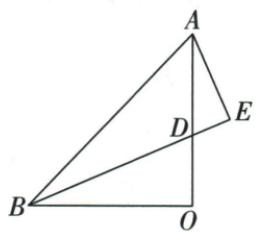
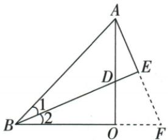

## 讲解

### 是什么

图中有角平分线及与其垂直的线段，可沿该垂段延到角另一边所在直线，形成两小直角三角形：平分给一角等、垂直给直角等、公共平分段给夹边。ASA全等将垂段两侧长度变相等。

### 怎么来的

原BD平分ABO，AE⊥BD，延AE与BO交F，ABE/FBE有B处两半角等、E处两直角等、BE公共，ASA给AE=EF，于是AF=2AE。但目标是BD，尚需第二层：原OA=OB、O两直角、B处半角与FAO同为相等角的余角，ASA使BDO与AFO全等，得到BD=AF，才最终BD=2AE。第一层负责倍长，第二层负责将倍长段转移到目标。

### 什么时候能用

交另一边所在直线时可需延长，必须明确F的位置及A-E-F次序；若不能构成原非退化两小三角形就不机械用。公共边是BE，不是未知AE/EF；不能拿要证AE=EF作为第一层条件。原此法保角平分与90°，不是随便延一段就得到等腰。

## 例题

### 延长垂线原两次ASA造BD两倍AE

> 来源ID Q20-17；第20章全等三角形；201-250/full.md 第3099–3107行。原答案与解析定位：201-250/full.md 第3109–3138行。

例6 如图, 在 $\triangle AOB$ 中, $OA = OB$ , $\angle AOB = 90^{\circ}$ , $BD$ 平分 $\angle ABO$ 交 $OA$ 于点 $D$ , $AE \perp BD$ 交 $BD$ 的延长线于点 $E$ . 求证: $BD = 2AE$ .

**原资料答案与解析：**

证明 延长 AE、BO 交于点 F，∵ $AE \perp BD$ ，∴ $\angle AEB = \angle FEB = 90^{\circ}$ .

∵ BD 平分 $\angle ABO, \therefore \angle 1 = \angle 2.$ 在 $\triangle ABE$ 和 $\triangle FBE$ 中， $\left\{\begin{aligned}\angle 1 &= \angle 2, \\ BE &= BE, \\ \angle AEB &= \angle FEB,\end{aligned}\right.$

$$
\therefore \triangle A B E \cong \triangle F B E (\mathrm{ASA}), \therefore A E = E F.
$$

$$
\because \angle A O B = \angle A E B = 9 0 ^ {\circ}, \therefore \angle 2 + \angle B D O = \angle F A O + \angle A D E = 9 0 ^ {\circ}.
$$

$\because \angle BDO = \angle ADE, \therefore \angle 2 = \angle FAO.$ 在 $\triangle BDO$ 和 $\triangle AFO$ 中， $\left\{ \begin{array}{l} \angle 2 = \angle FAO, \\ BO = AO, \\ \angle BOD = \angle AOF, \end{array} \right.$

$\therefore \triangle BDO \cong \triangle AFO(ASA), \therefore BD = AF.$ 又 $\because AE = EF, \therefore BD = 2AE.$

**展开解析（依据原详解补足理由与步骤）：**

延AE与BO的延长线交F。AE⊥BD，ABE与FBE在E均90°；BD平分ABO且F在BO方向延线上，ABE=FBE；BE公共夹边，所以ASA给△ABE≌△FBE，AE=EF。原A-E-F按序，所以AF=2AE。

在BDO中BOD90°，OBD+BDO90°；在ADE中AED90°，FAO（同DAE方向）+ADE90°；BDO与ADE对顶相等，故OBD=FAO。同OA=OB、BOD=AOF90°，两角及夹边BO=AO，ASA给△BDO≌△AFO，BD=AF=2AE。不能把垂距AE直接当BD一半而未建立两次对应，第一全等给AE=EF，第二才给BD=AF。

## 易错

原一次ASA只证AE=EF，没证BD=AF；直接跳BD=2AE漏第二全等的来源。
