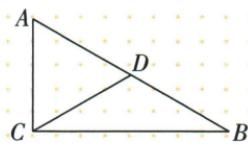
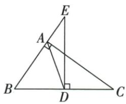
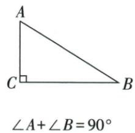
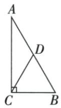
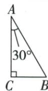

## 讲解

### 是什么

直角三角形斜边中点到三个顶点等距，所以从直角顶点引到斜边中点的中线等于斜边一半，也等于两半斜边。逆向任一三角形某边中线等于这条边一半，则该边所对角为直角。不是任意一条中线，也不是任意已知边的一半。

### 怎么来的

设$\angle ACB=90^\circ$，$M$为斜边$AB$中点。延长$CM$到$D$，使$MD=MC$，连接$AD$、$BD$。中点给$AM=BM$，构造给$CM=DM$，对顶角给$\angle AMC=\angle BMD$，因此$\triangle AMC\cong\triangle BMD$（SAS），得$AC=BD$、$\angle CAM=\angle DBM$；后一组内错角相等说明$AC\parallel BD$。

同理，$\triangle CMB$与$\triangle DMA$有$CM=DM$、$MB=MA$及对顶夹角相等，由SAS全等，得$CB=DA$、$\angle CBM=\angle DAM$，进而$CB\parallel AD$。原$AC\perp CB$，所以$AC\perp AD$，即$\angle CAD=90^\circ$。

现在比较的是$\triangle ACB$与$\triangle CAD$：$AC=CA$是公共边，$CB=AD$由上一组全等得到，两边之间的夹角$\angle ACB$、$\angle CAD$都为$90^\circ$。SAS给$\triangle ACB\cong\triangle CAD$，所以它们的对应边$AB=CD$。原$C,M,D$顺次共线且$CM=MD$，故$CD=2CM$；将$CD$替换成$AB$，得到$CM=AB/2$。不能比较不含$CD$的$\triangle DAB$后，直接声称$CD$是它的对应边。

反向：若$M$是$AB$中点且$CM=AB/2$，则$MA=MB=MC$。以$M$为圆心、$MA$为半径的圆通过$A,B,C$，$AB$为直径。直径所对圆周角定理给$\angle ACB=90^\circ$。这里非退化三角形条件排除了$C=A$或$C=B$；中点与“自己所对边的一半”两条件都不可省。

等距$MA=MB=MC$还可构成两个等腰三角形，用于移相等底角；它本身不说明$CM$平分顶角或垂直斜边。

### 什么时候能用

先确认直角与目标中线对应的是斜边。原6题CD6给AB12；原35角题AD等BD后才角算70。逆向条件必须中点已知且该中线与其自己所对边半长比，若只是某两段偶然二比一，不能判直角。中线有限、三角非退化。

## 例题

### 直角斜边中点中线6反求斜边12和30对边6

> 来源ID Q22-01；第22章勾股定理；201-250/full.md 第4397–4403行。原答案与解析定位：201-250/full.md 第4405–4411行。

例1 如图, 在 Rt $\triangle ABC$ 中, $\angle ACB = 90^{\circ}, D$ 是 $AB$ 的中点, $CD = 6$ .

(1)AB的长为

(2) 若 $\angle A = 60^{\circ}$ ，则 AC 的长为 \_\_\_\_.

**原资料答案与解析：**

解析（1）∵ $\angle ACB = 90^{\circ}$ ，D 是 AB 的中点，∴ AB = 2CD = 12.

(2) $\because\angle A=60^{\circ},\therefore\angle B=30^{\circ},$

又∵∠ACB=90°,∴AC= $\frac{1}{2}$ AB=6.

答案 (1)12 (2)6

**展开解析（依据原详解补足理由与步骤）：**

(1)原C直角，D为斜边AB中点，CD=AB/2，AB=2×6=12。(2)A60则B=180−90−60=30，AC恰对B30，所以AC=AB/2=6。AB/2同时等AD、BD、CD，但一般不等直角边，本问AC6还用了30°条件。

### 斜边中点三等边由35转70

> 来源ID Q22-05；第22章勾股定理；201-250/full.md 第4583–4583行。原答案与解析定位：201-250/full.md 第4585–4599行。

例1 如图, 在 Rt△ABC 中, ∠BAC=90°, AD 是 BC 边上的中线, ED⊥BC, 交 BA 的延长线于点 E, 若 ∠E=35°, 求 ∠BDA 的度数.

**原资料答案与解析：**

解析 $\because \angle E = 35^{\circ}, ED \perp BC, \therefore \angle B = 55^{\circ}.$

$\because \angle BAC=90^{\circ}, AD$ 是 BC 边上的中线, $\therefore DA=DB,$

$$
\therefore \angle D A B = \angle B = 5 5 ^ {\circ}, \therefore \angle B D A = 1 8 0 ^ {\circ} - 5 5 ^ {\circ} - 5 5 ^ {\circ} = 7 0 ^ {\circ}.
$$

**展开解析（依据原详解补足理由与步骤）：**

原ED⊥BC，E35，BED直角内角和给B55。A90、AD为斜边BC中线，AD=BD=CD；ABD等腰使DAB=B55。BDA180−55−55=70°。三等段来自斜边中线而非AD平分A；原中线一般不平分A或垂直BC。

### 原斜边中线与30半斜边正逆性质模型

> 来源ID Q22-19；第22章勾股定理；201-250/full.md 第4348–4379行。原答案与解析定位：201-250/full.md 第4348–4379行。

1. 性质1: 直角三角形的两个锐角互余. 如图1所示, 在 $\triangle ABC$ 中, $\angle C = 90^{\circ}$ , 则 $\angle A + \angle B = 90^{\circ}$ .

相关结论:有两个角互余的三角形是直角三角形.在 $\triangle ABC$ 中,若 $\angle A+\angle B=90^{\circ}$ ,则 $\angle C=90^{\circ}$ .

2. 性质 2: 直角三角形斜边上的中线等于斜边的一半. 如图 2 所示, 在 $\triangle ABC$ 中, $\angle ACB = 90^{\circ}$ , $CD$ 为 $AB$ 边上的中线, 则 $CD = \frac{1}{2} AB$ .

图 1

$CD$ 是中线, $CD = \frac{1}{2} AB$

图2

技巧总结 1. 在直角三角形中, $30^{\circ}$ 角所对的直角边等于斜边的一半. 如图所示, 在 $\triangle ABC$ 中, $\angle C = 90^{\circ}, \angle A = 30^{\circ}$ , 则 $BC = \frac{1}{2} AB$ .

2. 在直角三角形中, 如果它的一条直角边等于斜边的一半, 那么这条直角边所对的锐角等于 $30^{\circ}$ .

3. 如果三角形一边上的中线等于这条边的一半, 那么这个三角形是直角三角形.

**原资料答案与解析：**

1. 性质1: 直角三角形的两个锐角互余. 如图1所示, 在 $\triangle ABC$ 中, $\angle C = 90^{\circ}$ , 则 $\angle A + \angle B = 90^{\circ}$ .

相关结论:有两个角互余的三角形是直角三角形.在 $\triangle ABC$ 中,若 $\angle A+\angle B=90^{\circ}$ ,则 $\angle C=90^{\circ}$ .

2. 性质 2: 直角三角形斜边上的中线等于斜边的一半. 如图 2 所示, 在 $\triangle ABC$ 中, $\angle ACB = 90^{\circ}$ , $CD$ 为 $AB$ 边上的中线, 则 $CD = \frac{1}{2} AB$ .

图 1

$CD$ 是中线, $CD = \frac{1}{2} AB$

图2

技巧总结 1. 在直角三角形中, $30^{\circ}$ 角所对的直角边等于斜边的一半. 如图所示, 在 $\triangle ABC$ 中, $\angle C = 90^{\circ}, \angle A = 30^{\circ}$ , 则 $BC = \frac{1}{2} AB$ .

2. 在直角三角形中, 如果它的一条直角边等于斜边的一半, 那么这条直角边所对的锐角等于 $30^{\circ}$ .

3. 如果三角形一边上的中线等于这条边的一半, 那么这个三角形是直角三角形.

**展开解析（依据原详解补足理由与步骤）：**

两锐角互余由180扣90，逆向两角和90则第三角90。斜边中点M到三顶点均等：补出关于M对称顶点D，ACB/DBA用中点两边与对顶SAS得另一边平行等长，补成矩形；矩形对角AB/CD等长且互相平分，CM=AB/2。也可用以AB为直径圆的圆周角逆向定位C，原本章用全等与等腰证明。逆向中线CM=AB/2让MA=MB=MC，即C在AB直径圆上，圆周角给C90。30性质沿直角边AC镜像B成D，BCD同线、AB=AD、BAD60，等腰一60成为等边，BD=AB，而BD=2BC，因此BC=AB/2。反向腿半斜边同样镜像得等边60、半顶角30，均须已知直角。

## 易错

原等腰三线合一只有等腰顶点及底边配对才用，普通直角三角形斜边中线不一定垂直斜边或平分90。
