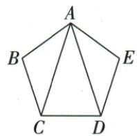
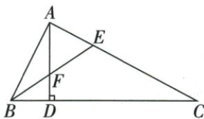
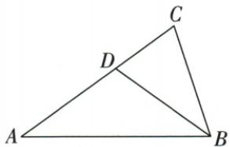

## 讲解

### 是什么

有两边相等的三角形是等腰三角形，等边为腰，两腰夹角为顶角，第三边为底，其两端角为底角。两腰相等⇒底角相等；在同一三角形中两角相等⇒对边相等。顶点到底边的中线、内部角平分线与高在等腰情形合为同一条线。

### 怎么来的

设AB=AC，取底BC中点F，连AF。△ABF、△ACF有AB=AC、BF=CF、AF共同，按SSS基本判据全等，因此B=C、BAF=FAC、AFB=AFC；后两个在B-F-C直线上邻补，均90°。也可先作顶角平分线，以AB=AC、共同AF、夹角BAF=FAC用SAS，全等后反推BF=CF与垂直。若给B=C，作A的内部平分线，在两小三角形用两角相等与公共边AAS全等，得AB=AC。原双中位线题GF=GE使两底角等，原对称点题从AB=AC得BF=CF，均由这些完整关系支持。

### 什么时候能用

等角对等边只在同一三角形中使用；不同三角形的一对等角不能直接推出两条边等长。三线合一特指从等腰顶点作到底边的这三条线，不是三角形任何中线都垂直某边。等边三角形是特殊等腰，三个角皆60°；一般等腰顶角不必60°。

本章腰/底与顶/底分类均落实原题，3/3/6因严格三边关系删。三线合一限定两腰共同顶点到对底边，不适用于普通腰中线和底角平分。证明从原等腰ABC取D为BC中点，AB=AC、BD=CD、AD公共SSS得两小三角全等，顶半角等且ADB/ADC等邻补各90。反向若先给顶平分，AB=AC和AD公共配SAS也得到底中点与直角；若先给底高，HL给同样关系。三种线实际是同一段。两腰上对应中线、高及底角平分通过这条对称轴互相对应相等，但各自并不三线重合。原多重等腰角题每组等边在所属三角形取对角，再以外角传递。

## 例题

### 三条逆命题交换条件并分别判断

> 来源ID Q18-06；第18章命题的证明；201-250/full.md 第1009–1011行。原答案与解析定位：201-250/full.md 第1013–1017行。

例4 写出下列命题的逆命题,并判断这些逆命题的真假.

(1)在一个三角形中,等角对等边.(2)四边相等的四边形是菱形.(3)如果x=3,那么 $x^{2}=9$ .

**原资料答案与解析：**

解析（1）逆命题为“在一个三角形中，等边对等角”，逆命题是真命题.

(2)原命题的题设是“四边形的四边相等”,结论是“四边形是菱形”,故逆命题的题设是“四边形是菱形”,结论是“四边形的四边相等”,所以逆命题为“菱形的四边相等”,逆命题是真命题.

(3) 逆命题为“如果 $x^{2} = 9$ ，那么 $x = 3$ ”，逆命题是假命题。

**展开解析（依据原详解补足理由与步骤）：**

（1）共同范围“在一个三角形中”保留，条件与结论交换成“等边对等角”，真，可由等腰三角形性质。（2）原四边形四边相等⇒菱形；逆为菱形⇒四边相等，由定义真。（3）逆为x²=9⇒x=3，假，因为x²−9=(x−3)(x+3)=0，得到x=3或x=−3；负根也满足题设却不符合结论。这里−3由原方程完整解集推出，是原题解析中的反例，不另编题。原命题x=3⇒x²=9真，但它的逆并不自动真。

### 开放三条件任选两条构成真命题并核三种

> 来源ID Q18-13；第18章命题的证明；201-250/full.md 第1263–1274行。原答案与解析定位：201-250/full.md 第1275–1283行。

例2 如图, $EG//AF$ ,请你从下面的三个条件中选出两个作为已知条件,剩下的一个作为结论,构成一个真命题(只需写出一种情况),并证明.①AB=AC;②DE=DF;③BE=CF.

已知: $EG \parallel AF$ , \_\_\_\_.求证: \_\_\_\_.

**原资料答案与解析：**

解析 ①②;③.(答案不唯一,任选两个作为条件,剩下的一个作为结论即为真命题)

证明：∵ $EG \parallel AF, \therefore \angle GED = \angle F, \angle BGE = \angle BCA.$ ∵ AB = AC, ∴ $\angle B = \angle BCA.$

$\therefore \angle B = \angle BGE.\therefore BE = EG.$ 在 $\triangle DEG$ 和 $\triangle DFC$ 中， $\angle GED = \angle F,DE = DF,\angle EDG = \angle FDC,$

$$
\therefore \triangle D E G \cong \triangle D F C, \therefore E G = C F. \therefore B E = C F.
$$

**展开解析（依据原详解补足理由与步骤）：**

原图E在AB、G与D在BC、F在AC的延长线上，D在EF上，EG∥AF。记x=BE、y=EG、z=CF。由EG∥AF，用BC作截线得BGE=BCA，AB=AC等价于B=BCA；由于原△ABC与△BEG都非退化，这进一步等价于BE=EG，即x=y。另EG∥CF，EF与BC交于D，GED=CFD，EDG=FDC对顶，所以△DEG与△DFC在已有两角对应相等时，DE=DF等价于EG=CF，即y=z（分别用ASA或AAS及对应边）。③就是x=z。三等量中的任意两条推出第三条：①②推出③、①③推出②、②③推出①，说明原“答案不唯一”。

按原详解正式写①②⇒③：AB=AC⇒B=BCA=BGE⇒BE=EG；两三角形中GED=CFD、EDG=FDC、DE=DF，由ASA全等（DE、DF夹在两给定角之间），得EG=CF；等量代换得BE=CF。其他两种也须利用相同三线角关系与等腰判定，不能只凭三个原句长得对称就断任两都行。

### 双中点作共同对角线中点构造等腰

> 来源ID Q18-17；第18章命题的证明；201-250/full.md 第1348–1363行。原答案与解析定位：201-250/full.md 第1365–1377行。

例6 如图,在四边形ABCD中,AB=CD,E、F分别是BC、AD的中点,BA、CD的延长线分别与EF的延长线交于点M、N.求证: $\angle BME=\angle CNE$ .

**原资料答案与解析：**

证明 连接 $BD$ , 取 $BD$ 的中点 $G$ , 连接 $GE, GF$ , 如图.

在 $\triangle ABD$ 中， $\because G、F$ 分别是 $BD、AD$ 的中点， $\therefore GF=\frac{1}{2}AB,GF//AB.$

同理可得 $GE = \frac{1}{2} CD, GE \parallel CD$ . $\because AB = CD, \therefore GF = GE. \therefore \angle GEF = \angle GFE.$

$$
\because G F \parallel B M, \therefore \angle G F E = \angle B M E.
$$

$$
\because G E \parallel C N, \therefore \angle G E F = \angle C N E. \therefore \angle B M E = \angle C N E.
$$

**展开解析（依据原详解补足理由与步骤）：**

原图F在AD中点、E在BC中点，AB=CD，但AB与CD未必平行。连BD取其中点G，再连GF、GE。在△ABD中，F、G是两边中点，GF∥AB、GF=AB/2；在△BCD中，G、E是两边中点，GE∥CD、GE=CD/2。AB=CD使GF=GE，△GFE为等腰，所以GEF=GFE。原BM在AB所在直线、CN在CD所在直线、E/F/M/N共线，用GF∥BM和GE∥CN把这两个底角分别移为BME、CNE，得目标相等。辅助点取在同一对角线上，是为了同时进入两原三角形并把两个相等原边都减半；不是随意连任意一点就有中位线。

### 等腰底边对称点两种方法证明线段等

> 来源ID Q18-19；第18章命题的证明；201-250/full.md 第1425–1434行。原答案与解析定位：201-250/full.md 第1436–1471行。

例8 如图, 点 D, E 在 $\triangle ABC$ 的边 BC 上, AB = AC, BD = CE. 求证: AD = AE.

**原资料答案与解析：**

证明 证法一:∵ AB=AC,∴ ∠B=∠C.又∵ BD=CE,∴ △ABD≌△ACE,∴ AD=AE.

证法二: 过点 A 作 $AF \perp BC$ ，垂足为 $F \therefore AB = AC, \therefore BF = CF.$

∵ BD=CE, ∴ BF-BD=CF-CE, 即 DF=EF. ∴ AF 垂直平分 DE, ∴ AD=AE.

(注:还可用等腰三角形的判定证明 AD=AE)

**展开解析（依据原详解补足理由与步骤）：**

法一：AB=AC使B=C（等腰底角），D、E均在BC且原B-D-E-C顺序，所以ABD=ACE；再有AB=AC、BD=CE，这两边及夹角对应相等，由SAS得△ABD≌△ACE，对应AD=AE。把对应顺序写为A↔A、B↔C、D↔E。

法二：过A作AF⊥BC，由等腰三角形三线合一F为BC中点，BF=CF。BD=CE且按原点序D、E在F两侧（可由等长两端段与D在E左侧推出），所以DF=BF−BD、EF=CF−CE，二者相等。AF垂直平分DE，点A到D、E距离相等，AD=AE；也可在直角△AFD、△AFE中AF共同、DF=EF、夹角90°，直接SAS全等得到AD=AE，不需未说明的垂平线定理。若D=E退化，目标直接成立，两个三角形的使用需单独看非退化情况。原提取此处混进其他两题辅助图，已按实际图对象重新归属，原证据不改。

### 等腰两边5和7及3和6的全部分支

> 来源ID Q21-07；第21章等腰三角形；201-250/full.md 第4043–4045行。原答案与解析定位：201-250/full.md 第4047–4055行。

例1 (1)已知等腰三角形的一边长是5,另一边长是7,该三角形的周长是\_\_\_\_.

(2)已知等腰三角形的一边长是3,另一边长是6,该三角形的周长是\_\_\_\_.

**原资料答案与解析：**

解析（1）当腰长为5时，三角形的周长为 $5\times2+7=17$ ;

当腰长为 7 时,三角形的周长为 $7 \times 2 + 5 = 19$ .

∴该三角形的周长为17或19.

(2)底边长为6的等腰三角形腰长必定大于3,故该三角形的腰长为6,底边长为3.所以该三角形的周长为 $6\times2+3=15$ .

答案 (1)17 或 19 (2)15

**展开解析（依据原详解补足理由与步骤）：**

(1)5作腰，三边5、5、7，5+5>7成立，周长17；7作腰，三边7、7、5，7+5>7成立，周长19。两分支均满足，答17或19。(2)3作腰给3+3=6，是退化不能成三角；6作腰三边6、6、3，6+3>6，周长15。分支先按腰/底列全，再核严格三边关系；不能把相等当成允许端点。

### 两个等腰外角77再二分38点5

> 来源ID Q21-09；第21章等腰三角形；201-250/full.md 第4121–4121行。原答案与解析定位：201-250/full.md 第4123–4131行。

例1 如图, 在 $\triangle ABC$ 中, $AB=AD=DC$ , $\angle BAD=26^{\circ}$ , 求 $\angle B$ 和 $\angle C$ 的度数.

**原资料答案与解析：**

解析 $\because AB = AD, \therefore \angle B = \angle ADB. \because \angle B + \angle ADB = 180^{\circ} - \angle BAD = 180^{\circ} - 26^{\circ} = 154^{\circ},$

$$
\therefore \angle B = \angle A D B = \frac {1}{2} \times 1 5 4 ^ {\circ} = 7 7 ^ {\circ} \therefore \angle C + \angle D A C = \angle A D B = 7 7 ^ {\circ}.
$$

又∵AD=DC,∴∠C=∠DAC= $\frac{1}{2}\times77^{\circ}=38.5^{\circ}$ .

**展开解析（依据原详解补足理由与步骤）：**

AB=AD，等腰ABD底角B=ADB，内角和使两底角和180−26=154，所以B=77°。D在BC内部，ADB是ADC在D的外角，C+DAC=ADB=77°。又AD=DC，ADC等腰底角C=DAC，所以C=77/2=38.5°。77不是ADC的内角ADC，不能再180−77求目标。

### 三组等边将五份角和解36

> 来源ID Q21-10；第21章等腰三角形；201-250/full.md 第4133–4133行。原答案与解析定位：201-250/full.md 第4135–4143行。

例2 如图, 在 $\triangle ABC$ 中, AB = AC, D 为 BC 上的一点, 且 DA = DC, BD = BA, 求 $\angle B$ 的度数.

**原资料答案与解析：**

解析 设 $\angle C = x^{\circ}$ , 由 $DA = DC$ 可得 $\angle DAC = \angle C = x^{\circ}$ ,

$$
\therefore \angle A D B = \angle C + \angle D A C = 2 x ^ {\circ} \because B D = B A, \therefore \angle B A D = \angle A D B = 2 x ^ {\circ}.
$$

由 $AB = AC$ 可得 $\angle B = \angle C = x^{\circ}$ . 根据三角形内角和定理, 得 $x + x + 3x = 180$ , 解得 $x = 36$ . $\therefore \angle B = 36^{\circ}$ .

**展开解析（依据原详解补足理由与步骤）：**

设C=x°。DA=DC使DAC=x；D在BC内部，ADB为ADC外角给ADB=2x。BD=BA使ABD的底角BAD=ADB=2x。AB=AC使B=C=x。大角A=BAD+DAC=3x，大三角内角和x+x+3x=180，5x=180，x=36，B36°。每组等边先在自己的三角形配对边所对角，不能从不同三角形等边直接配同名角。

### 两跨三角先SAS再等腰公共底角相加

> 来源ID Q21-11；第21章等腰三角形；201-250/full.md 第4150–4150行。原答案与解析定位：201-250/full.md 第4152–4166行。

例3 如图, 已知 $AB = AE$ , $\angle B = \angle E$ , $BC = DE$ , 求证: $\angle BCD = \angle EDC$ .

**原资料答案与解析：**

证明 在 $\triangle ABC$ 和 $\triangle AED$ 中， $\left\{ \begin{array}{l} AB = AE, \\ \angle B = \angle E, \therefore \triangle ABC \cong \triangle AED, \therefore AC = AD, \angle ACB = \angle ADE. \\ BC = DE, \end{array} \right.$

$\therefore \angle ACD = \angle ADC \therefore \angle ACD + \angle ACB = \angle ADC + \angle ADE$ 即 $\angle BCD = \angle EDC.$

**展开解析（依据原详解补足理由与步骤）：**

ABC与AED中AB=AE、B=E为给边夹角、BC=ED，SAS全等得AC=AD与ACB=ADE。ACD中AC=AD，等边对等角使ACD=ADC。原目标BCD= BCA+ACD，EDC=EDA+ADC，两对等角相加得到目标相等。原角不在同一三角形，不能直接说“等腰”省掉第一层跨三角SAS。

### 直角高与底角平分将两外角配等腰AEF

> 来源ID Q21-12；第21章等腰三角形；201-250/full.md 第4172–4172行。原答案与解析定位：201-250/full.md 第4174–4191行。

例4 如图, 在 $\triangle ABC$ 中, $\angle BAC = 90^{\circ}$ , $AD \perp BC$ 于点 $D$ , $BE$ 交 $AD$ 于点 $F$ , 交 $AC$ 于点 $E$ . 若 $BE$ 平分 $\angle ABC$ , 试判断 $\triangle AEF$ 的形状, 并说明理由.

**原资料答案与解析：**

解析 $\triangle AEF$ 是等腰三角形.

理由：∵ $AD \perp BC, \angle BAC = 90^{\circ}, \therefore \angle BAD + \angle CAD = \angle C + \angle CAD = 90^{\circ}$ ,

$\therefore \angle BAD = \angle C.\because BE$ 平分 $\angle ABC,\therefore \angle ABE = \angle CBE,\because \angle AFE = \angle ABE + \angle BAD,\angle AEF = \angle CBE + \angle C,$

$\therefore \angle AFE = \angle AEF, \therefore AE = AF, \therefore \triangle AEF$ 是等腰三角形.

**展开解析（依据原详解补足理由与步骤）：**

AEF是等腰，AE=AF。AD⊥BC使ACD直角，C+CAD=90；BAC直角使BAD+CAD=90，共减CAD得BAD=C。BE内部平分B给ABE=CBE。原B-F-E、A-F-D按序，AFE是ABF外角，AFE=ABE+BAD；AEF是BCE在E外角，AEF=CBE+C。两加数分别相等，故AFE=AEF，同一AEF内等角对等边得AE=AF。斜边或距的等距性质不是本证入口。

### 角平分与平行搬一半角判BED等腰

> 来源ID Q21-13；第21章等腰三角形；201-250/full.md 第4197–4199行。原答案与解析定位：201-250/full.md 第4201–4213行。

例5 如图,在 $\triangle ABC$ 中,已知 $BD$ 是 $\angle ABC$ 的平分线,且 $DE \parallel BC$ .

求证: $\triangle BED$ 是等腰三角形.

**原资料答案与解析：**

证明 $\because BD$ 是 $\angle ABC$ 的平分线, $\therefore \angle EBD = \angle DBC$ . $\because DE \parallel BC$ , $\therefore \angle EDB = \angle DBC$ .

$\therefore \angle EBD = \angle EDB, \therefore BE = DE, \therefore \triangle BED$ 是等腰三角形.

**展开解析（依据原详解补足理由与步骤）：**

原E在AB、D在AC。BD平分ABC给EBD=DBC；DE∥BC用BD截得EDB=DBC；两角共同等于DBC，EBD=EDB。BED同一三角形中这两角的对边DE、BE相等，故等腰。已知夹角平分不直接给BE=DE，必须借平行搬角再用等角对等边。

### 等边边3中点等腰两层30得CE三比二

> 来源ID Q21-14；第21章等腰三角形；201-250/full.md 第4221–4221行。原答案与解析定位：201-250/full.md 第4223–4243行。

例6 如图,等边三角形 ABC 的边长为 3,D 是 AC 的中点,点 E 在 BC 的延长线上,若 DE=DB,求 CE 的长.

**原资料答案与解析：**

解析 $\because \triangle ABC$ 是等边三角形, $D$ 是 $AC$ 的中点,

$\therefore \angle ABC = \angle ACB = 60^{\circ}, BD$ 为 $\angle ABC$ 的平分线，

$\therefore \angle DBE = \frac{1}{2}\angle ABC = 30^{\circ}.$ 又 $DE = DB,\therefore \angle E = \angle DBE = 30^{\circ}.$

$\because \angle ACB = \angle CDE + \angle E, \therefore \angle CDE = \angle ACB - \angle E = 30^{\circ} \therefore \angle CDE = \angle E, \therefore CE = CD.$

∵ 等边三角形 ABC 的边长为 3, D 是 AC 的中点, ∴ $CE = CD = \frac{1}{2} AC = \frac{3}{2}$ .

**展开解析（依据原详解补足理由与步骤）：**

ABC等边，B=C60°；D为AC中点，等腰ABC顶B三线合一使BD平分B，DBE30°（B-C-E同向）。DB=DE使DBE=BED30°。ACB60°是CDE在C的外角，CDE+E=60，CDE30°。CDE同三角两角30相等，CE=CD=AC/2=3/2。原D在AC中点而不是BC中点，不把BD当对应另一底边的中线。

### 共顶点双等腰SAS及等边特例推出AE平行BC

> 来源ID Q21-15；第21章等腰三角形；201-250/full.md 第4245–4262行。原答案与解析定位：201-250/full.md 第4264–4273行。

例7 如图 1, $\triangle ABC$ 是等腰三角形, AC = BC, D 是 AB 边上一点, 以 CD 为边作等腰三角形 CDE, 使点 E, A 在直线 DC 的同侧, $\angle BCA = \angle DCE$ , CD = CE, 连接 AE.

(1) 求证: $\triangle DBC \cong \triangle EAC.$   
(2)如图2,若 $\triangle ABC$ 、 $\triangle CDE$ 都是等边三角形,(1)中结论是否仍然成立?请直接写出你的判断,无需证明.  
(3)在(2)的条件下,AE与BC有怎样的位置关系?请写出理由.

图1

  
图2

**原资料答案与解析：**

解析 (1) 证明: $\because \angle BCA = \angle DCE, \therefore \angle BCD = \angle ACE.$

在 $\triangle DBC$ 和 $\triangle EAC$ 中， $\left\{ \begin{array}{l} BC = AC, \\ \angle BCD = \angle ACE, \therefore \triangle DBC \cong \triangle EAC. \\ CD = CE, \end{array} \right.$

(2)(1)中结论仍然成立.   
(3) $AE \parallel BC.$

理由：∵ $\triangle ABC$ 是等边三角形，∴ $\angle B = \angle ACB = 60^{\circ}$ ,

由(2)中结论知 $\triangle DBC \cong \triangle EAC, \therefore \angle CAE = \angle B = 60^{\circ} = \angle ACB, \therefore AE // BC.$

**展开解析（依据原详解补足理由与步骤）：**

(1)BC=AC、CD=CE；原BCD+DCA=BCA，ACE+DCA=DCE，给BCA=DCE共减DCA得BCD=ACE。这恰是两等边之间夹角，故DBC≌EAC（SAS），对应D-E、B-A、C-C。(2)两三角改等边时原等腰两对边及等角前提仍满足，结论仍成立，不需要新加已知。(3)原等边B=ACB60，第一结论对应给CAE=B60；CAE与ACB为AC截AE、BC的内错角，因此AE∥BC。不只凭图的水平外观判平行。

### 36顶角内部平分连两等腰移边2

> 来源ID Q21-16；第21章等腰三角形；201-250/full.md 第4296–4304行。原答案与解析定位：201-250/full.md 第4286–4288行。

例1 (2024 重庆 B) 如图, 在 $\triangle ABC$ 中, $AB = AC$ , $\angle A = 36^{\circ}$ , $BD$ 平分 $\angle ABC$ 交 $AC$ 于点 $D$ . 若 $BC = 2$ , 则 $AD$ 的长度为 \_\_\_\_.

**原资料答案与解析：**

例1 解析 $\because AB = AC, \angle A = 36^{\circ}, \therefore \angle ABC = \angle C = 72^{\circ}, \because BD$ 平分 $\angle ABC, \therefore \angle CBD = \angle ABD = 36^{\circ}, \therefore \angle CDB = \angle A + \angle ABD = 72^{\circ} = \angle C, \angle ABD = \angle A, \therefore AD = BD = BC = 2.$

答案2

**展开解析（依据原详解补足理由与步骤）：**

AB=AC，B=C=(180−36)/2=72°；BD内部平分B使ABD=CBD36°。原A-D-C共线，CDB是ABD在D的外角，CDB=A36+ABD36=72=C，所以BCD内CD B角与C角等给BD=BC=2。ABD内A=ABD36给BD=AD。因此AD=BD=BC=2。两次等角对边各在不同三角形，顺序移等边，不把BD直接叫等腰底高。

## 易错

原D、E对称点只等长BD=CE还需原AB=AC；若底图不是等腰，不能取高脚F便断BF=CF。原开放条件把等腰性质与判定两个方向分清，否则会偷用待证AB=AC。
