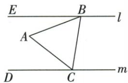

## 讲解

### 是什么

三边相等的非退化三角形叫等边三角形或正三角形。三个内角均60°，任选顶点都可作为等腰顶点，因此各顶角平分线、对边中线与高各自重合；其所在三条直线都是对称轴。等边是等腰的特例，不能把“等腰”理解为恰好两边相等而排除三边等。

### 怎么来的

由AB=AC得B=C，由AB=BC得C=A，三角都等，再内角和180各除3得60。反向三角都等可分别用等角对等边推出三边等。等腰且一角60也充分：若60为顶角，另两底角各(180−60)/2=60；若60为底角，另一底角60，顶角180−120=60。两种位置都成立。任选边作底，等腰三线合一使该底中垂与对顶平分同一直线；因此三边中垂、三中线、三高与三平分交点重合，四心重合来自线本身重合，不凭图中心观感。

### 什么时候能用

原120角经延长补角和平行给三60可判等边，不能只因一个普通三角有60便判。用特殊60连平行仍需指明截线角对；等边中点题三线合一要在对应顶点和对边，不能把任意内部线都叫中线。边长正、三点不共线，退化不存在三60。

## 例题

### 120外延和平行半角60判等边

> 来源ID Q21-08；第21章等腰三角形；201-250/full.md 第4063–4065行。原答案与解析定位：201-250/full.md 第4067–4077行。

例2 如图, 在 $\triangle ABC$ 中, $\angle ACB=120^{\circ}$ , $CD$ 平分 $\angle ACB$ , $AE \parallel DC$ , $AE$ 交 $BC$ 的延长线于点 $E$ , 证明 $\triangle ACE$ 是等边三角形.

**原资料答案与解析：**

证明 $\because \angle ACB = 120^{\circ}, CD$ 平分 $\angle ACB, \therefore \angle ACE = 60^{\circ}, \angle ACD = \angle BCD = \frac{1}{2} \angle ACB = 60^{\circ}$ .

$$
\begin{array}{r l} & \because A E \parallel D C, \therefore \angle A C D = \angle C A E, \\ & \angle B C D = \angle E, \end{array}
$$

$$
\therefore \angle C A E = \angle E = \angle A C E = 6 0 ^ {\circ},
$$

∴ $\triangle ACE$ 是等边三角形.

**展开解析（依据原详解补足理由与步骤）：**

原B-C-E共线，ACE与ACB邻补，ACE=180−120=60°。CD平分120给ACD=BCD=60°。AE∥DC，以AC截得CAE=ACD=60°，以BCE截得E=BCD=60°。ACE三内角60，等角对等边得三边相等，故等边。每个60来源不同，不把原大三角ABC称为等边。

### 等边边3中点等腰两层30得CE三比二

> 来源ID Q21-14；第21章等腰三角形；201-250/full.md 第4221–4221行。原答案与解析定位：201-250/full.md 第4223–4243行。

例6 如图,等边三角形 ABC 的边长为 3,D 是 AC 的中点,点 E 在 BC 的延长线上,若 DE=DB,求 CE 的长.

**原资料答案与解析：**

解析 $\because \triangle ABC$ 是等边三角形, $D$ 是 $AC$ 的中点,

$\therefore \angle ABC = \angle ACB = 60^{\circ}, BD$ 为 $\angle ABC$ 的平分线，

$\therefore \angle DBE = \frac{1}{2}\angle ABC = 30^{\circ}.$ 又 $DE = DB,\therefore \angle E = \angle DBE = 30^{\circ}.$

$\because \angle ACB = \angle CDE + \angle E, \therefore \angle CDE = \angle ACB - \angle E = 30^{\circ} \therefore \angle CDE = \angle E, \therefore CE = CD.$

∵ 等边三角形 ABC 的边长为 3, D 是 AC 的中点, ∴ $CE = CD = \frac{1}{2} AC = \frac{3}{2}$ .

**展开解析（依据原详解补足理由与步骤）：**

ABC等边，B=C60°；D为AC中点，等腰ABC顶B三线合一使BD平分B，DBE30°（B-C-E同向）。DB=DE使DBE=BED30°。ACB60°是CDE在C的外角，CDE+E=60，CDE30°。CDE同三角两角30相等，CE=CD=AC/2=3/2。原D在AC中点而不是BC中点，不把BD当对应另一底边的中线。

### 共顶点双等腰SAS及等边特例推出AE平行BC

> 来源ID Q21-15；第21章等腰三角形；201-250/full.md 第4245–4262行。原答案与解析定位：201-250/full.md 第4264–4273行。

例7 如图 1, $\triangle ABC$ 是等腰三角形, AC = BC, D 是 AB 边上一点, 以 CD 为边作等腰三角形 CDE, 使点 E, A 在直线 DC 的同侧, $\angle BCA = \angle DCE$ , CD = CE, 连接 AE.

(1) 求证: $\triangle DBC \cong \triangle EAC.$   
(2)如图2,若 $\triangle ABC$ 、 $\triangle CDE$ 都是等边三角形,(1)中结论是否仍然成立?请直接写出你的判断,无需证明.  
(3)在(2)的条件下,AE与BC有怎样的位置关系?请写出理由.

图1

  
图2

**原资料答案与解析：**

解析 (1) 证明: $\because \angle BCA = \angle DCE, \therefore \angle BCD = \angle ACE.$

在 $\triangle DBC$ 和 $\triangle EAC$ 中， $\left\{ \begin{array}{l} BC = AC, \\ \angle BCD = \angle ACE, \therefore \triangle DBC \cong \triangle EAC. \\ CD = CE, \end{array} \right.$

(2)(1)中结论仍然成立.   
(3) $AE \parallel BC.$

理由：∵ $\triangle ABC$ 是等边三角形，∴ $\angle B = \angle ACB = 60^{\circ}$ ,

由(2)中结论知 $\triangle DBC \cong \triangle EAC, \therefore \angle CAE = \angle B = 60^{\circ} = \angle ACB, \therefore AE // BC.$

**展开解析（依据原详解补足理由与步骤）：**

(1)BC=AC、CD=CE；原BCD+DCA=BCA，ACE+DCA=DCE，给BCA=DCE共减DCA得BCD=ACE。这恰是两等边之间夹角，故DBC≌EAC（SAS），对应D-E、B-A、C-C。(2)两三角改等边时原等腰两对边及等角前提仍满足，结论仍成立，不需要新加已知。(3)原等边B=ACB60，第一结论对应给CAE=B60；CAE与ACB为AC截AE、BC的内错角，因此AE∥BC。不只凭图的水平外观判平行。

### 等边60与同旁内角21求39四项

> 来源ID Q21-17；第21章等腰三角形；201-250/full.md 第4308–4330行。原答案与解析定位：201-250/full.md 第4290–4292行。

例2（2024山东泰安）如图，直线 $l / / m$ ，等边三角形ABC的两个顶点 $B,C$ 分别落在直线 $l,m$ 上，若 $\angle ABE = 21^{\circ}$ ，则 $\angle ACD$ 的度数是（）

A. ${45}^{ \circ  }$

B. $39^{\circ}$

C.29°

D. ${21}^{ \circ  }$

**原资料答案与解析：**

例2 解析 $\because l \parallel m, \therefore \angle CBE + \angle BCD = 180^{\circ}, \therefore \triangle ABC$ 是等边三角形, $\therefore \angle ABC = \angle ACB = 60^{\circ}, \therefore \angle ACD = 180^{\circ} - 60^{\circ} - 60^{\circ} - 21^{\circ} = 39^{\circ}.$

答案B

**展开解析（依据原详解补足理由与步骤）：**

原E-B在l、D-C在m，l∥m以BC截给CBE+BCD=180。原CBE=ABC60+ABE21=81，所以BCD99；BCD= BCA60+ACD，目标ACD99−60=39°，B正确。A45误套等腰直角，本题等边角60；C29不满足两次角和，可回验60+21+60+29=170而非180；D21误把AB和AC当同一截线的角，两线不同，原需扣两次60。回验B60+21+60+39=180。

## 易错

原给等腰又一60时顶/底两分支最终一致，但一般未指明的角要分类。等边三条轴都是直线，非三条任意连中心到顶点的有限段。
